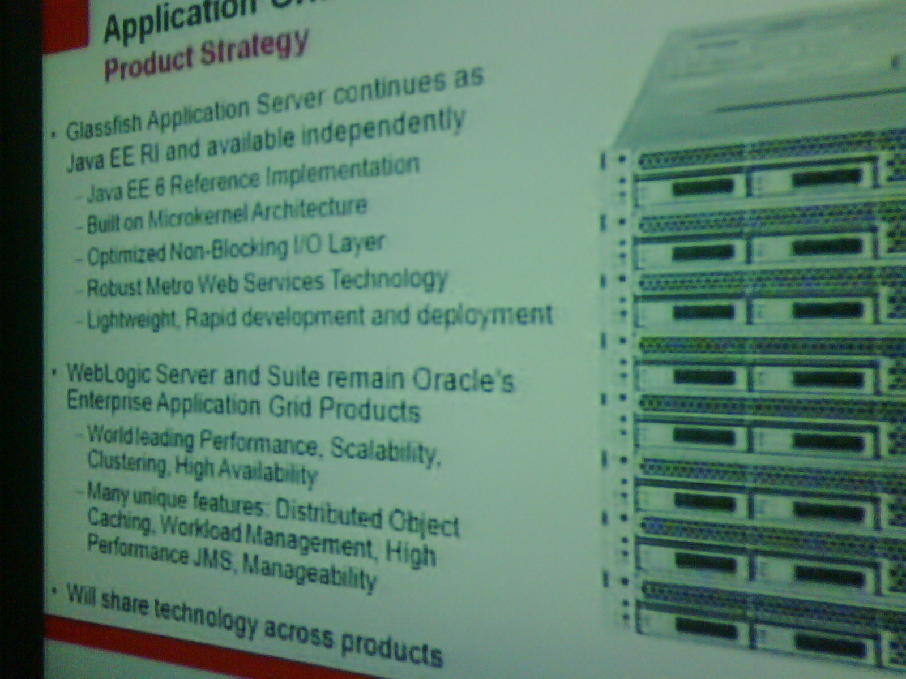
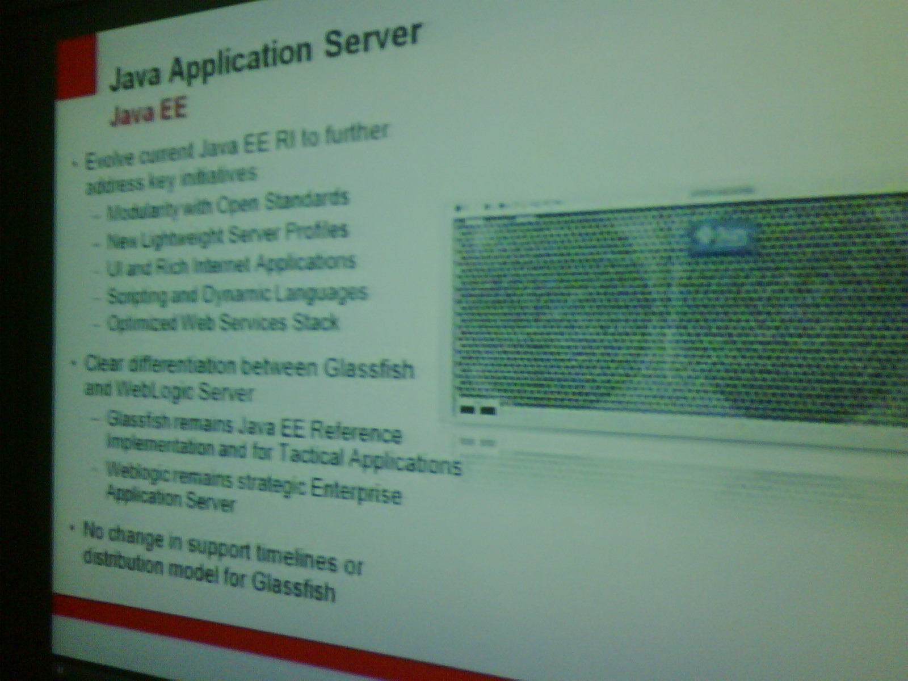
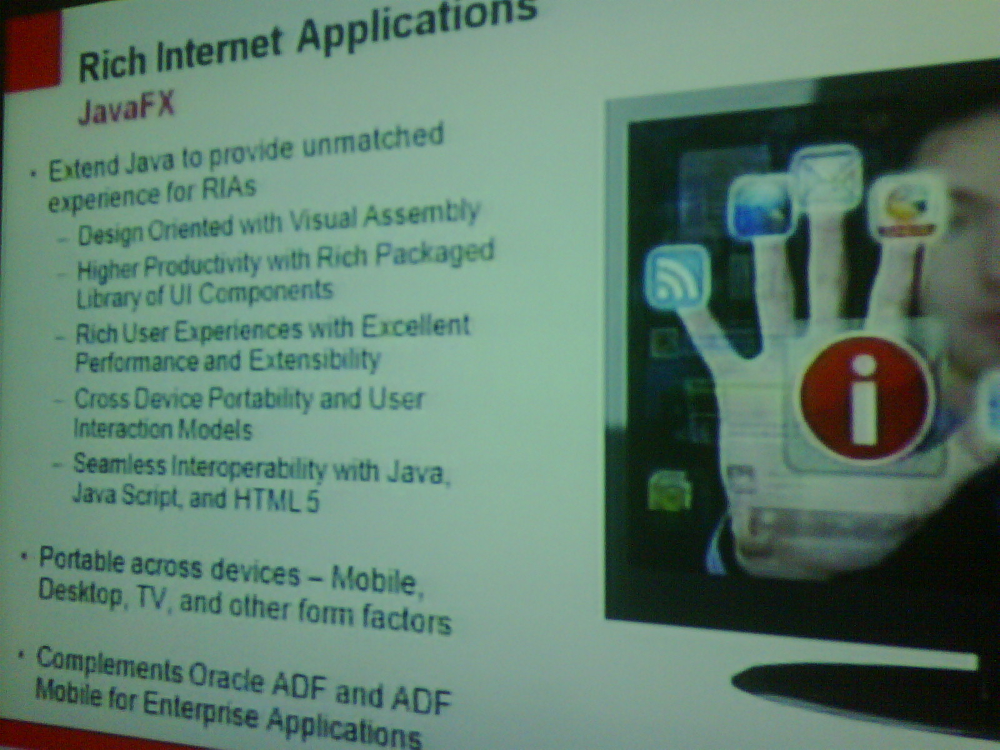
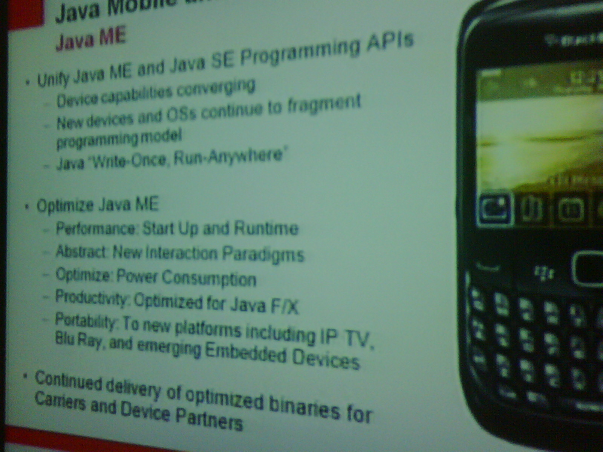

I am going to update this posting during/after the webcast and try to collect the relevant information (even the ones, that are relevant to me about java, GF, JEE:))
 
 
 5:19 PM (via Jason Lee) <a href="http://twitter.com/jasondlee/status/8284611389" target="_blank">twitter</a>
 
<blockquote>
 JavaOne 2010 WILL happen. Yea. :) No CommunityOne, though :|
  
</blockquote>
 
 5:29 PM (via Arun Gupta) <a href="http://twitter.com/arungupta/status/8284926018">twitter</a>
 
<blockquote>
 "JavaOne is an incredible brand and experience", co-located with Oracle Open World in 3rd week of Sep this, no Community One.
  
</blockquote>
 
 5:32 PM (via Arun Gupta) <a href="http://twitter.com/arungupta/status/8285043353">twitter</a>
 
<blockquote>
 java.net will continue to live, logo will be updated, love Java Champions program, invest more in infrastructure/community 
  
</blockquote>
 
 5:52 (via Eddie Awad) <a href="http://twitter.com/eddieawad/status/8285691998">twitter</a>
 
<blockquote>
 Ellison said that he expected Sun’s chief executive, Jonathan Schwartz, to resign
  
</blockquote>many more news and updates came up during the webcast.
 
 Most of the Java relevant ones were collected on a <a href="http://www.oracle.com/technology/community/sun-oracle-community-continuity.html" target="_blank">Oracle FaQ page.</a>
 
 <b>Sun Developer Network, java.sun.com</b>
 
 For the near future, all these sites will remain in their current form.
 
 <b>JavaOne in 2010</b>
 
 JavaOne will be co-located with Oracle Develop during Oracle OpenWorld in San Francisco from September 19-23, 2010. 
 
 <b>Project Kenai</b>
 
 Project Kenai, will be discontinued for public use.
 
 <b>NetBeans.org</b>
 
 NetBeans.org will continue to be available at the usual URL.
 
 
 Slides from the Java relevant part of Thomas Kurian:
 <b>The Appserver Slide</b>
 
 
 <b>The Development Slide:</b>
 
 
 <b>The Java EE Slide:</b>
 
 
 <b>The Java FX Slide:</b>
 
 
 <b>The Java ME Slide:</b>
 
 
 <b>The Java SE Slide:</b>
 
 
 <b>Java in the world:</b>
 