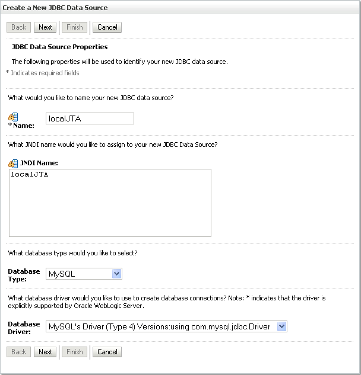

I came across a nice post from <a href="http://viralpatel.net/blogs/2010/02/create-url-shortner-in-java-struts2-hibernate.html" target="_blank">viralpatel.net</a>. They are showing how to implement a simple url-shortener called "shorty". Really nice. But the technology decision was not that awesome. I am ok with Hibernate. But Struts? No. Thanks :) That reminds me of good old times. And they are gone.
 
 
 Let's modernize the software stack a bit. We give it a try with the help of: 
 
 - Oracle WebLogic 10.3.2.0
 
 - EclipseLink 1.2.0 (1.2.0.v20091016-r5565)
 
 - Spring 2.5.6 
 
 - MySQL 5.4
 
 - Maven
 
 - Eclipse
 
 
 First approach was to migrate shorty completely to the new platform. After playing around a bit, I discovered some things to take care of running it on wls. Therefore I'll stick to the basic JTA/JPA/WLS parts and I am not going to re-implement the complete webtier. I am not using Spring 3.x here, because it still does not exist on ibiblio.org :)
 
 <b>Create your project with maven</b>
 
 First step is to have a simple project setup. Maven is the best place to start. Create a new maven project:
 <code> 
  mvn archetype:create \ 
  -DgroupId=my.example.com \ 
  -DartifactId=shortywls \ 
  -DarchetypeArtifactId=maven-archetype-webapp  </code>
 
 Next is to update the dependencies. We basically need some Java EE 5 jars, spring and some web components. An explicit EclipseLink dependency is not needed, cause we are going to stick to the JPA 1.0. Using Wls 10.3.2.0 makes this your default JPA provider! Add the following lines to your pom.xml
 <code> 
  &lt;dependencies&gt;  
  &lt;dependency&gt; 
  &lt;groupId&gt;javaee&lt;/groupId&gt; 
  &lt;artifactId&gt;javaee-api&lt;/artifactId&gt; 
  &lt;version&gt;5&lt;/version&gt; 
  &lt;scope&gt;provided&lt;/scope&gt; 
  &lt;/dependency&gt; 
  &lt;dependency&gt; 
  &lt;groupId&gt;org.springframework&lt;/groupId&gt; 
  &lt;artifactId&gt;spring&lt;/artifactId&gt; 
  &lt;version&gt;2.5.6&lt;/version&gt; 
  &lt;/dependency&gt; 
  &lt;dependency&gt; 
  &lt;groupId&gt;org.springframework&lt;/groupId&gt; 
  &lt;artifactId&gt;spring-web&lt;/artifactId&gt; 
  &lt;version&gt;2.5.6&lt;/version&gt; 
  &lt;/dependency&gt; 
  &lt;dependency&gt; 
  &lt;groupId&gt;org.springframework&lt;/groupId&gt; 
  &lt;artifactId&gt;spring-webmvc&lt;/artifactId&gt; 
  &lt;version&gt;2.5.6&lt;/version&gt; 
  &lt;/dependency&gt; 
  &lt;dependency&gt; 
  &lt;groupId&gt;org.springframework&lt;/groupId&gt; 
  &lt;artifactId&gt;spring-webmvc&lt;/artifactId&gt; 
  &lt;version&gt;2.5.6&lt;/version&gt; 
  &lt;/dependency&gt; 
  &lt;dependency&gt; 
  &lt;groupId&gt;javax.servlet&lt;/groupId&gt; 
  &lt;artifactId&gt;jstl&lt;/artifactId&gt; 
  &lt;version&gt;1.1.2&lt;/version&gt; 
  &lt;/dependency&gt; 
  &lt;dependency&gt; 
  &lt;groupId&gt;taglibs&lt;/groupId&gt; 
  &lt;artifactId&gt;standard&lt;/artifactId&gt; 
  &lt;version&gt;1.1.2&lt;/version&gt; 
  &lt;/dependency&gt; 
  &lt;/dependencies&gt; </code>
 
 We are missing a place where to put our java files. Change to your newly created project directory and add a src\main\java folder to it. Now you are ready to go. This is the point, where it is best to start developing in your favorite IDE. If you are using eclipse, let maven do the preparation. 
 <code> 
  maven eclipse:eclipse </code>
 
 After that, you only have to import the newly created project into Eclipse.
 
 <b>Setup your Weblogic domain</b>
 
 Before we actually start implementing, we have to configure our infrastructure a bit. First is to create your weblogic domain. Use whatever you like. I love to take advantage of the Configuration Wizard (win). Find it in the start menue or browse to %WLS_HOME%\wlserver_10.3\common\bin\config.exe If your have entered the basics, create the domain and fire it up. Next is to access the Weblogic Server Administration Console (http://localhost:7001/console). Make shure, you have your MySQL instance up an running and have a database and a user with all needed rights created prior to the next steps. Now browse to -Summary of Services -JDBC -JDBC Data Sources and choose "New".
 
 Enter a Name and JNDI name for your new DataSource and choose MySQL as Database Type and the appropriate Driver. Click "Next" and choose the transaction options. Another "Next" click guids you to the connection properties. Enter your database name, hostname and port together with your username. A last "Next" click adds a "Test Configuration" to the button line on the top. Klick it and make shure, the Message says: "Connection test succeeded." After that, you have to restart your instance. Do this, even if the console tries to make you believe that this is not necessary.
 
 
 
 
 If you are wondering, why we did not add either a dependency to the mysql-jconnector or a jar to the domain/server directory. This is quite simple. The Wls already ships with a mysql-connector-java-commercial-5.0.3-bin.jar. You can find it here %WLS_HOME%\wlserver_10.3\server\ext\jdbc\mysql.
 
 <b>configuring shortywls</b>
 
 Let's start over with JPA configuration. Add a persistence.xml to src\main\resources. 
 
 Insert the EclipseLink PersistenceProvider and your jta-data-source reference. If you like to know, what EclipseLink is doing also add the needed logging.level. Don't forget to tell EclipseLink about it's target server. In our case "WebLogic_10".
 <code> 
  &lt;persistence-unit name="shortyWeb" transaction-type="JTA"&gt; 
  &lt;provider&gt;org.eclipse.persistence.jpa.PersistenceProvider&lt;/provider&gt; 
  &lt;jta-data-source&gt;localJTA&lt;/jta-data-source&gt; 
  &lt;class&gt;shorty.domain.Link&lt;/class&gt; 
  &lt;properties&gt; 
  &lt;property name="eclipselink.target-server" value="WebLogic_10" /&gt; 
  &lt;property name="eclipselink.logging.level" value="FINEST" /&gt; 
  &lt;/properties&gt; 
  &lt;/persistence-unit&gt; </code>
 
 That's all. We are done with JPA :) The next bigger part is to do the basic configuration for spring. First step is to add the needed spring features to the web.xml located in src\main\webapp\WEB-INF. First is the place for your applicationContext.xml followed by the ContextLoaderListener and the Spring DispatcherServlet. Completed by the servlet mapping. Don't forget to add a shortyAppDispatcher-servlet.xml to your src\main\webapp\WEB-INF.
 <code> 
  &lt;context-param&gt; 
  &lt;param-name&gt;contextConfigLocation&lt;/param-name&gt; 
  &lt;param-value&gt;/WEB-INF/applicationContext.xml&lt;/param-value&gt; 
  &lt;/context-param&gt; 
  &lt;listener&gt; 
  &lt;listener-class&gt;org.springframework.web.context.ContextLoaderListener&lt;/listener-class&gt; 
  &lt;/listener&gt; 
  &lt;servlet&gt; 
  &lt;servlet-name&gt;shortyAppDispatcher&lt;/servlet-name&gt; 
  &lt;servlet-class&gt;org.springframework.web.servlet.DispatcherServlet&lt;/servlet-class&gt; 
  &lt;load-on-startup&gt;1&lt;/load-on-startup&gt; 
  &lt;/servlet&gt; 
  &lt;servlet-mapping&gt; 
  &lt;servlet-name&gt;shortyAppDispatcher&lt;/servlet-name&gt; 
  &lt;url-pattern&gt;*.htm&lt;/url-pattern&gt; 
  &lt;/servlet-mapping&gt; </code>
 
 If this is done, you have to take a closer look at the specific spring configuration. Add the configured applicationContext.xml to src\main\webapp\WEB-INF. That's where all the magic happens. I'll focus on the JPA/JTA parts here. The rest is basic spring configuration, you can find a great documentation on the <a href="http://static.springsource.org/spring/docs/2.5.x/reference/index.html" target="_blank">springsource website</a>.
 
 
 There are some Weblogic specific tweaks, you have to do. In terms of load-time-weaving you have to use the WebLogicLoadTimeWeaver.
 <code> 
  &lt;context:load-time-weaver 
  weaver-class="org.springframework.instrument.classloading.weblogic.WebLogicLoadTimeWeaver" /&gt; </code>
 
 The &lt;tx:jta-transaction-manager /&gt; does a self discovery of the transaction manager of the actuall server. Hence we are running on Wls this forces spring to use the org.springframework.transaction.jta.WebLogicJtaTransactionManager. The &lt;tx:annotation-driven /&gt; let you use the org.springframework.transaction.annotation.*'s
 <code> 
  &lt;tx:jta-transaction-manager /&gt; 
  &lt;tx:annotation-driven  
  transaction-manager="transactionManager" /&gt; </code>
 
 If you have the jta transaction manager and the load-time-weaving in place, you need to add the jpaVendorAdapter. No Weblogic specific magic in here. Only the reference to the database platform and some debug information.
 <code> 
  &lt;bean id="jpaVendorAdapter" 
  class="org.springframework.orm.jpa.vendor.EclipseLinkJpaVendorAdapter"&gt; 
  &lt;property name="databasePlatform" 
  value="org.eclipse.persistence.platform.database.MySQLPlatform" /&gt; 
  &lt;property name="generateDdl" value="true" /&gt; 
  &lt;property name="showSql" value="true" /&gt; 
  &lt;/bean&gt; </code>
 
 Last bit to tie all parts together is the EntityManagerFactory. Spring JPA offers <a href="http://static.springsource.org/spring/docs/2.5.x/reference/orm.html#orm-jpa-setup" target="_blank">three ways of setting up</a> JPA EntityManagerFactory. The only working solution here is the LocalContainerEntityManagerFactoryBean. If you try to use the LocalEntityManagerFactoryBean or the JNDI lookup, you will experience a "Error binding to externally managed transaction" Exception
 
 It has a reference to the jpaVendorAdapter and the persistenceUnitName. 
 <code> 
  &lt;bean id="entityManagerFactory" 
  class="org.springframework.orm.jpa.LocalContainerEntityManagerFactoryBean"&gt; 
  &lt;property name="jpaVendorAdapter" ref="jpaVendorAdapter" /&gt; 
  &lt;property name="persistenceUnitName" value="shortyWeb" /&gt; 
  &lt;/bean&gt; </code>
 <b>Implementing shortywls</b>
 
 Now we are done with configuration :) Switch back to Eclipse and do the implementation work. 
 
 You can basically stick to the viralpatel.net. Adapting spring, you need at least a dao which defines the transactional attributes to the methods. 
 
 Happy coding!