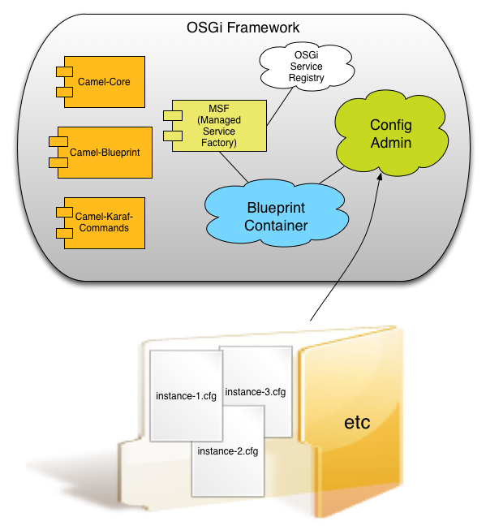
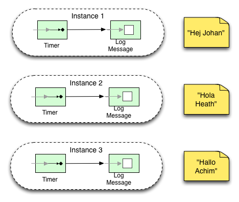
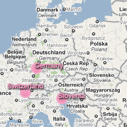

Oracle announced on February 9, 2010 that JavaFX(TM) and Java(TM) platforms are being used as the Official Rich Client Technology by the Vancouver Organizing Committee for the 2010 Olympic and Paralympic Winter Games (VANOC).
 
 
 Sport fans around the globe can now explore the historical Winter Games medal results through an innovative JavaFX application, Medal Wheel, available at <a href="">http://www.vancouver2010.com/olympic-medals/geo-view/</a>. 
 
 
 This are awesome news for the JavaFX community. Oracle is actively pushing it and to be honest, I like the fast UI :)
 
 
 BUT: Even JavaFX does not prevent you from making mistakes. As a German, I had to look after our own statistics. And did not find them. Looking deeper at this shows, that there is a functional error in it :)
 
 Look at the following screens and compare reality to the geo-view.
 
 
 
 

 

