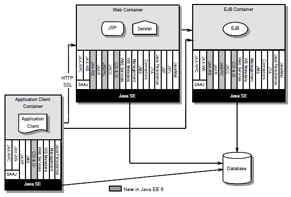

You may find some usefull posts on this blog from time to time. Most of them are solutions or information to or about problems I came across in daily work. Recently a co-worker told me: "You have some great posts, but I don't have a clue how and where to apply them." It did not feel good simply replying: "Thank you, but ...."
 
 To get this into context, he is a specialist of an other area wanting to extend his knowledge to Java EE in general and WebLogic Server.
 
 
 I decided to add another category to this blog. Dedicated to my fellow co-worker and his needs for information :) Let's call it GSW .. Getting Started With ... and I'll fire it up with the first post about Java EE 6. This is anything but a tutorial. This should only guide you through the information available to get a neat start.
 
 If you have any idea what to cover next: I would love to know. Leave a comment or send a reply on twitter (<a href="http://www.twitter.com/myfear">@myfear</a>).
 
 <b>The basics</b>
 
 If you are willing to dive into Java EE you should have a basic knowledge about Java. I assume you did some programming and already know about the JVM, the JDK and one or more integrated development environments (IDE). Take a break now, if you need to revisit your knowledge about Java. Look around <a href="" target_blank="">http://java.sun.com/</a>. I can recommend the <a href="" target="_blank">New to Java Programming Center</a> as en entrance for anybody not already knowing the basics.
 
 <b>Extending the reach</b>
 
 Developers today use the Java and the JVM for a broad range of applications. But starting with the standard Java SE edition, you recognize, that there is additional need for distributed, transactional, and portable applications that leverage the speed, security, and reliability of server-side technology. That is, where Java EE comes on. It was known as Java 2 Platform, Enterprise Edition or J2EE until the name was changed to Java EE in version 5. The current version is called Java EE 6.
 
 The concept of Java EE is only one part of the whole Java platform concept, that adds additional capabilities (compare <a href="http://java.sun.com/new2java/javamap/Java_Technology_Concept_Map.pdf" target="_blank">Java Technology Concept Map ,PDF)</a>. If you look at the following Java EE architecture diagramm, you can see, that the Java EE defines additional containers on top of the&nbsp; Java SE. They are responsible for executing well defined objects with a defined lifecycle within their own domain. That is the most general definition that I can think of.
 
 
 
 (Source: Java EE 6 Spec, copyright Sun/Oracle)
 
 <b>What exactly is Java EE?</b>
 
 Java EE is a set of features for enterprise Java that is definied by its specification. Driven by something called the "Java Community Process" (JCP) it is an umbrella for roundabout 30 different technologies. Containing but not limited to JDBC, EJB, JPA, RMI, JMS, web services, XML, etc. It basically defines the technical contents and how they are coordinated. That includes component models and their lifecycle.
 
 I did a nice <a href="http://blog.eisele.net/2009/12/java-ee-6-specification-summary-zoom.html">flash representation of all contained technolgies</a>. Have a look at it. If you try to become a specialist in Java EE you are going to face round about 6000 pages of specification. But it's to earyl to be afraid of this :) If you stick to the offical "<a href="">The Java EE 6 Tutorial,Volume I</a>" you are done in under 600 pages.
 
 <b>Container and Application Server</b>
 
 A Java EE application server can handle transactions, security, scalability, concurrency and management of the components that are running on (deployed to) it, in order to enable developers to concentrate more on the business logic of the components rather than on infrastructure and integration tasks. There are some providers for either single containers (e.g. OpenEJB, Jetty, etc) or complete Java EE application servers out there. Any provider must meet certain conformance requirements in order to declare their products as <i>Java EE compliant</i>. You can see a list of compliant servers on the <a href="http://java.sun.com/javaee/overview/compatibility.jsp" target="_blank">Sun website</a>.
 
 Up to now, there are two certified servers out there. The most interesting one is <a href="" target="_blank">GlassFish v3</a>. If you want to start over with Java EE it is a must have. Because I don't want to mix up things here, there will be a GSW #2 about GlassFish v3 next.
 
 <b>Quickstart</b>
 
 If you want to start programming right away, get yourself the <a href="" target="_blank">GlassFish Tools Bundle for Eclipse</a>. It comes with a great <a href="" target="_blank">User Guide (PDF)</a>.
 
 <b>Further Links and Readings</b>
 <a href="http://java.sun.com/javaee/downloads/index.jsp">Java EE Downloads: GlassFish and Java EE 6</a>
 <a href="http://java.sun.com/javaee/technologies/index.jsp">Java EE 6 Technologies</a>
 <a href="http://java.sun.com/javaee/reference/tutorials/index.jsp">Java EE Tutorials</a>
 <a href="http://java.sun.com/reference/blueprints/index.jsp">Java BluePrints</a>