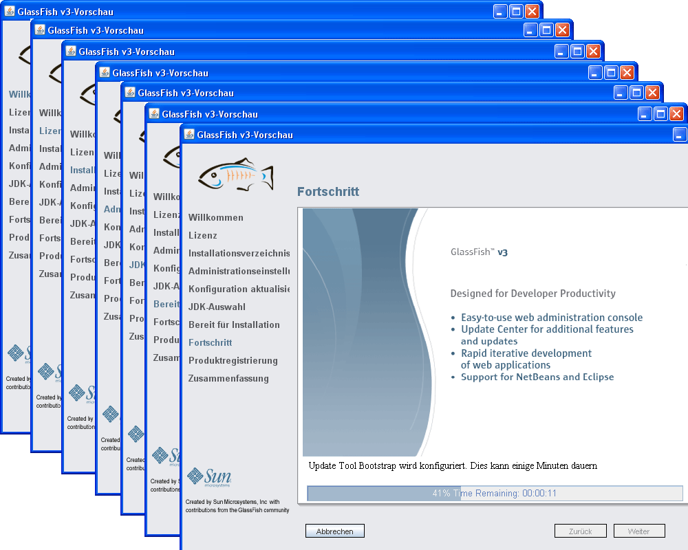
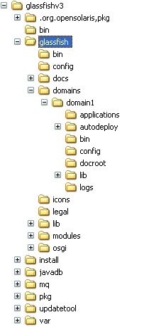
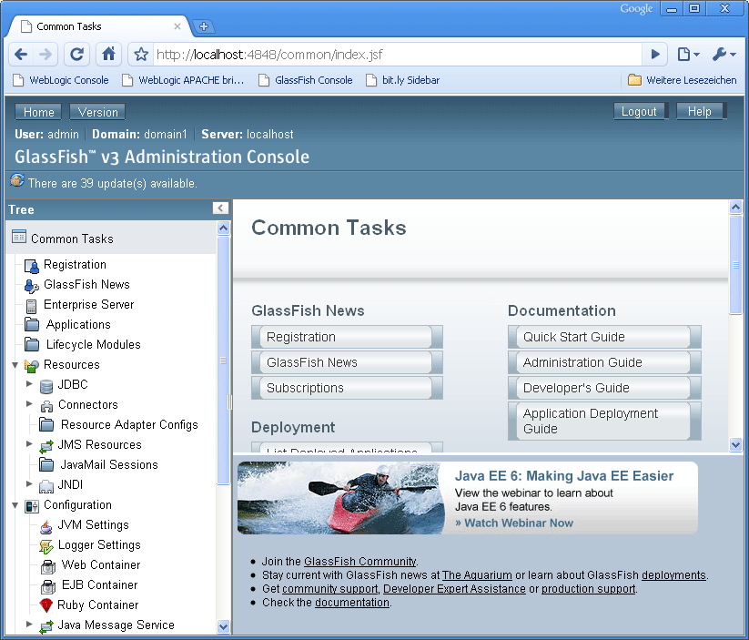
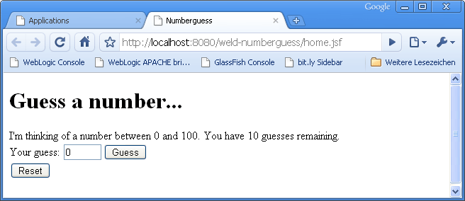

As promised, the next GSW will be dedicated to GlassFish v3. Conceded, I am not a fan of GlassFish since the beginning. Our friendship had a difficult start. But let's forget about this for now and focus on things that makes it more easier for beginners to get started without all this.
 
 
 As you know Java and have read and understood the first part in this series <a href="http://blog.eisele.net/2010/03/getting-started-with-gsw-1-java-ee-6.html">GSW #1</a> you now have a good understanding about Enterprise Java. If you want to start developing Java EE applications all you need is an application server. There are plenty out there. And if you have been in the business for quite some time, you get to know them all. The containers-only, the full-blowns, the wannabees, the professionals. Even if I call them this way, there is no judgement in it. If the application server/container of your choice is a <a href="http://java.sun.com/javaee/overview/compatibility.jsp" target="_blank">Java EE compliant one</a>, you are on the right track. This list is not too long these days, if you look for Java EE 6 compliant servers. The most prominent and well-known is also the Java EE 6 reference implementation (RI): <a href="" target="_blank">The Oracle GlassFish v3</a>
 
 GlassFish v3, is the first compatible implementation of the Java EE 6 platform specification. It is a lightweight, flexible, and open-source application server. And according to the latest statements from Oracle Productmanagement, it will stay open source. 
 
 <b>Download and Installation</b>
 
 You can get your hands dirty if you grab the latest distribution from the <a href="https://glassfish.dev.java.net/downloads/v3-final.html" target="_blank">GlassFish download page</a>. There are bascially two different distributions available. One full-blown Java EE 6 and the lightweight Java EE 6 Web Profile. They differ in the sum of the contained technologies. For further details, scroll down the download page and look for "What's in GlassFish Open Source Edition 3.0?". The tables gives a detailed overview about the technologies in both versions. Every version can be optained for three different platforms. One for Windows based systems, one for Solaris, Linux and MacOS X and a platform-independent zip archive.
 
 I suggest, you are running a Windows maschine as development platform, so we start over with downloading the self-extracting GUI installer for the <a href="http://download.java.net/glassfish/v3/release/glassfish-v3-windows.exe" target="_blank">complete Java EE 6 GlassFish (48MB, exe)</a>. Evevn on a slow line, this should not take more than a couple of minutes.
 
 I did not mentioned, that you could have a Java Development Kit (JDK) 1.6 in place already. <a href="http://java.sun.com/javase/downloads/widget/jdk6.jsp" target="_blank">If not, go: Install one now!</a> It is not needed for the installation. GlassFish brings his own. But I prefer to have different versions in place and install them separately. Next step is to launch the the installer. Now follow these steps:
 
<ul>
 <li>It welcomes you with a nice screen. Click "next".</li>
 <li>Read and agree to the licence agreement. Click "next".</li>
 <li>Choose a destination directory. Click "next".</li>
 <li>Choose a Adminport (default:4848), Http-port (default:8080), Admin-Username (default: admin) and Admin-Password (recommendation: adminadmin). Click "next".</li>
 <li>If you want automatic updates and you are behind a proxy, enter your proxy information. Click "next".</li>
 <li>Choose a JDK from the list or tell the installer where to put it's own. Click "next".</li>
 <li>Now you are ready for the installation. Click "install".</li>
 <li>Wait for the installer to finish his work.</li>
 <li>If you like to, register or sign in to your Sun online account. Click "next".</li>
 <li>Now you can review the installation process. Click "finish".</li>
</ul>
 

 

 
 You have sucessfully installed your GlassFish v3 server! congratulations!
 
 <b>Start your domain</b>
 

 

Now browse to the directory, you installed your GlassFish to. Let's call this %GF_HOME% further on. You see a %GF_HOME%/glassfish/domains directory. This is, where you put your domains. The concept of a "domain" refers to something we could call an "administrative domain". A domain (statically) is an administrative name space. It's a boundary, all GlassFish entities within which are controlled by an administrator. If you look at the directory, you can see, that there already is a "domain1". Let's start it :)
 
 Open a cmd and cd to %GF_HOME%/glassfish/bin.
 
 Now enter: "asadmin start-domain"
 
 If everything went well, you see a couple of stdout messages stating, that your domain ist working:
 
 Admin port for the domain: 4848
 
 Command start-domain executed successfully.
 
 <b>Start the administration console</b>
 
 Ok. Now you have to take a look at the administration console. Point your browser to: http://localhost:4848/. It takes some time until the login screen appears. Login with your admin user and the assigned password (you did this during the installation :)) 
 
 If you see the following screen, you are on the right way:
 

 

The next screen you see, is the welcome screen. You start administrating your complete domain from the left treeview. 
 

 

As you would have expected, its an empty domain up to now. Nothing specific is deployed, and you can start adding your own resource, configuration and deployment settings.
 
 
 Now we are going to develop and deploy a very simple application. All you need for this is maven, and a texteditor. Have a look at my <a href="http://blog.eisele.net/2010/01/glassfish-v3-cdi-maven-eclipse.html">GlassFish v3, CDI, Maven, Eclipse</a> post for details. If you have your war file, go back to the administration console.
 
<ul>
 <li>Click "Applications"</li>
 <li>Click "Deploy"</li>
 <li>Select the archive, you would like to deploy (either upload or browse the local filesystem)</li>
 <li>Click "ok" (upper right) and wait until finished</li>
 <li>Click the "Launch" link in the table right to your new deployment</li>
 <li>This points your browser to http://localhost:8080/yourwebapp</li>
</ul>

 

 
 You have sucessfully deployed your first application to GlassFish v3 server! congratulations!
 
 <b>Further Links and Readings</b>
 <a href="http://docs.sun.com/app/docs/doc/820-7689/aboaa?a=view" target="_blank">Oracle GlassFish Enterprise Server v3 Quick Start Guide</a>
 <a href="http://docs.sun.com/app/docs/doc/820-7692">Oracle GlassFish Enterprise Server v3 Administration Guide</a>
 <a href="http://docs.sun.com/app/docs/doc/820-7693" target="_blank">Oracle GlassFish Enterprise Server v3 Application Deployment Guide</a>
 <a href="http://www.oracle.com/us/products/middleware/application-server/050870.pdf">Oracle iGlassFish v3 Datasheet (PDF)</a>