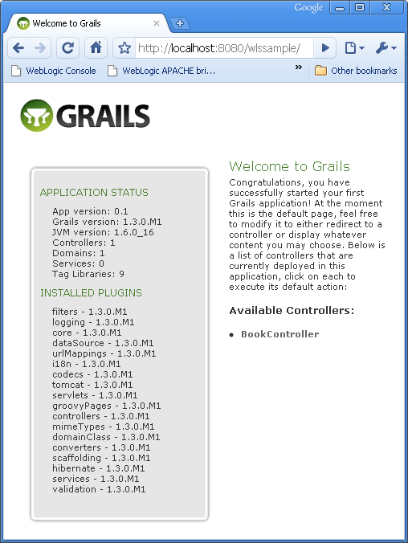

Next in my <a href="http://blog.eisele.net/search/label/GSW">GSW</a> series is a topic I want to write about since some time. One of my co-workers left the company (never will get it, why ;)) and moved on to a <a href="" target="_blank">Groovy</a> company. After having heard him talking about the "fancy" part in Groovy I was looking for a way to get this into my favorite Java EE appserver. Found it in <a href="" target="_blank">Grails</a>.
 
 <i>Grails is a dynamic web application framework built on Java and Groovy, leveraging best of breed APIs from the Java EE sphere including Spring, Hibernate and SiteMesh. Grails brings to Java and Groovy developers the joys of convention-based rapid development while allowing them to leverage their existing knowledge and capitalize on the proven and performant APIs Java developers have been using for years. 
  (Quote: http://www.grails.org)</i>
 
 <b>Prerequisites</b>
 
 - You should have an Oracle Weblogic Server 11g R1P1 in place. If you don't,
 
 get it from the <a href="http://www.oracle.com/technology/software/products/middleware/index.html" target="_blank">Oracle Technology Network's download page</a>.
 
 - Grep a copy of the lates <a href="http://www.grails.org/1.3-M1+Release+Notes">Grails 1.3-M1</a> (download takes some time..)
 
 <b>Installation</b>
 
 Extract the 48MB archive into any folder to your haddrive. You should stay away from spaces or any other weird characters. X:\grails on Windows or ~/grails on Unix is a nice place.
 
 Now you need a suitable environment variable that points to your installation folder. On Windows you do this with
 <code>set GRAILS_HOME="X:\grails</code> try <code>export GRAILS_HOME=~/grails</code>
 
 Now check, if you have a JAVA_HOME environment variable defined. If not, do this now. It should point to your JDK installation. You find one inside the Weblogic product installation directory. (e.g. %WLS_HOME%\jdk160_14_R27.6.5-32).
 
 Next is to append a reference to the "bin" directory within the Grails directory to your PATH variable (eg %GRAILS_HOME%\bin on Windows or $GRAILS_HOME/bin on Unix). 
 
 Open a command window on windows or simply type "grails" in your shell. You should see a help message.
 
 <b>Create an empty Grails project</b>
 
 Once you have installed Grails and veryfied that everything is running you can start using it. First step is to 
 
 create a new project. Use the built-in target for creating one. Change to the command line and enter:
 <code>grails create-app</code>
 
 Some magic happens to the std_out. Watch out for the script to prompt you for the name of your application. I used "wlssample" here. After the script executed completely you find a new directory in the filesystem which is named after the application name you entered. Explore the directory structure. If you are used to Java EE webapplications you probably will not find anything surprising here.
 
 <b>Create a Domain Class</b>
 
 Having an empty app does not make sense. Let's add a persistent object, a Domain Class to it.
 
 Make shure you cd'ed to the root directory of your new project.
 <code>grails create-domain-class</code>
 
 The script asks for a Domain Class name. Enter one. Responding to the command with "book" will create a file
 
 called Book.groovy in %appname%/grails-app/domain. You can edit it with your favorite text editor or IDE.
 
 Modify it to look like this:
 <code>class Book \{ 
  String title 
  String author 
  \}</code>
 
 <b>Create a Controller</b>
 
 Ok. An app, a Domain Object. We are still missing the UI. All this starts with a Controller. Grails Controllers are central to Grails applications. They handle web requests and URLs of the request map to a controller class and a closure within the class.
 
 Another target assists you with this. Run the
 <code>grails create-controller</code>
 
 target and type in the name of the controller. In this example I use the name "Book" again, which generates a controller called BookController.groovy in the directory %appname%/grails-app/controllers.
 
 To make this example as simple as possible we use a feature called dynamic Scaffolding. It allows you to auto-generate a whole application for a given domain class. In your case for the Domain Class Book. Open the controller and change it to look like this:
 <code>class BookController \{ 
  def scaffold = Book 
  \}</code>
 
 
 <b>Fire it up with Tomcat</b>
 
 To see, if you did everything the right way you can fire up the included tomcat and take a first look at your application. Type:
 <code>grails run-app</code>
 
 and point your browser to 
 <code>http://localhost:8080/wlssample/</code>
 
 You should see something like in the following screenshot. Congratulations! You have your fist Grails App up and running.
 
 <b>Package a WAR File</b>
 
 But we want to run this on our Weblogic. To get this up an running we need to create a web application archive (WAR) file from the project. There is a simple script out there to package it. Type:
 <code>grails prod war</code>
 
 This will place a %appname%-0.1.war file in the %appname%/target directory. Now browse to your weblogic console application (typically found here http://localhost:7001/console/), login and click left on "Deployments". Click the "install" button and browse to the target folder. Select the %appname%-0.1.war file and click "Next". Choose "Install this deployment as an application" and click "Next". Don't change anything on the next screen. Simply klick "Finish".
 
 If everything went perfect, you will see two simple confirmation messages stating that the deployment has been successfully installed. Now point your browser to:
 <code>http://localhost:7001/wlssample-0.1/</code>
 
 There you are! Congratulations. You have your sample Grails app up and running in Weblogic Server! 
 
 <b>Further Links and Readings</b>
 <a href="" target="_blank">Grails Documentation</a>
 <a href="http://www.grails.org/IDE+Integration" target="_blank">IDE Integration</a>
 <a href="http://www.grails.org/plugin/home" target="_blank">More Plugins</a>