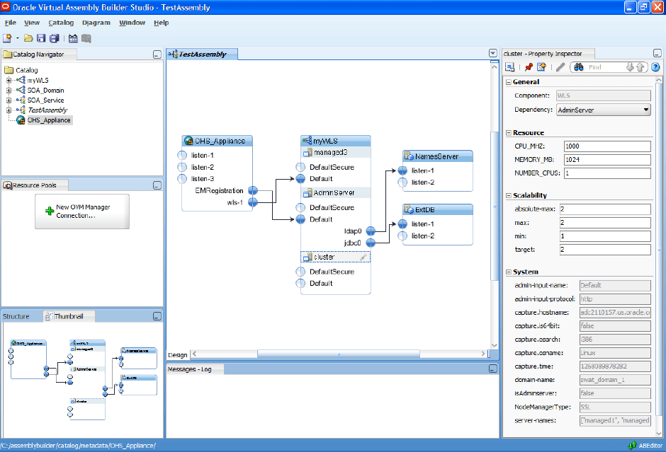
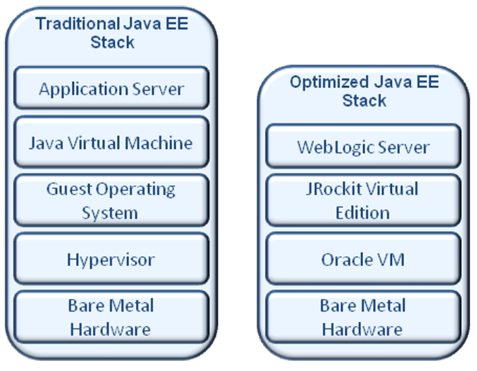

As seen in a <a href="http://www.oracle.com/us/corporate/press/068426" target="_blank">press anouncement</a> a few days ago, Oracle is revealing parts of the future for it's WebLogic Suite.
 
 
 It includes two new products:
 
 - <a href="http://www.oracle.com/us/products/middleware/application-server/virtual-assembly-builder-067878.html">Oracle Virtual Assembly Builder</a> and 
 
 - <a href="http://www.oracle.com/us/products/middleware/application-server/weblogic-suite-virtualization-067887.html">Oracle WebLogic Suite Virtualization Option</a>
 
 <b>Oracle Virtual Assembly</b>
 

 

The Virtual Assembly Builder is a new product designed to help organizations deploy multi-tier enterprise applications in virtualized environments. It also enables administrators to configure and provision these applications. This is done by using the frameworks capabilities for 
 
 (a) automatically capturing the configuration of an existing reference application environment and packaging all its components into a collection of customized software appliances, or 
 
 (b) starting with pre-created, general purpose software appliances representing the various components in an application topology.
 <a href="http://www.oracle.com/us/products/middleware/application-server/ovab-ds-067891.pdf">See the datasheet online (PDF, ~300kb)</a>
 
 <b>Oracle WebLogic Suite Virtualization Option</b>
 

 

The Virtualization Option brings together Oracle WebLogic Server with JRockit Virtual Edition. It is optimized for virtualized environments and able to deliver higher application performance and increased hardware utilization. By adding essential system functions to the JRockit JVM, WLS on Oracle JRockit Virtual Edition can now execute directly on the hypervisor, eliminating the need to deploy and administer a guest operating system. 
 <a href="http://www.oracle.com/us/products/middleware/application-server/wls-virtualization-ds-067888.pdf">See the datasheet online (PDF, ~300kb)</a>