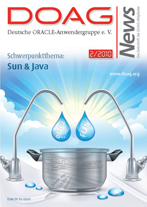

 

Some self promotion again. The latest DOAG News, which is the quarterly magazin from the German Oracle users Group <a href="http://www.doag.org/?content=_engl" target="_blank">DOAG</a> e.V. published an article of mine. This is about GlassFish and Java EE 6 at Oracle and is ment as a guide to Java EE 6 and the "new" Oracle product. Beside this I wrote about some things seen along the road from Sun to Oracle.
 
 
 All DOAG members get the magazin as part of their membership for free. You can also have it, if you like. Check the <a href="" target="_blank">german DOAG publications website</a> for more details.