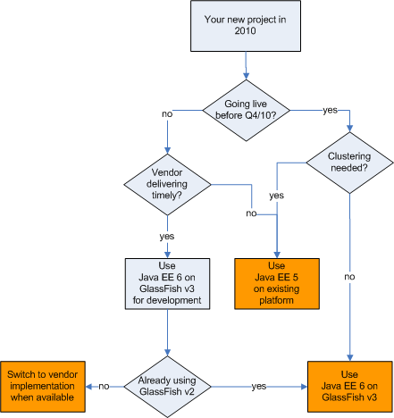

Companys are starting new Java EE projects over and over again these days. It still is one of the widely used enterprise technologies today. If you find youself in the situation of having to kick off a new project you keep asking yourself the question for the right technology and product. The time between the launch of a new specification and the first commercial implementations could be hard, cause you have to decide what you are going to do. Stick to whatever spec is available through your current vendors implementation or move on with a new product or choose from the already available parts of the new spec and mix them up with old versions. The basic question behind this is: What Java EE version should I start over with today?
 
 I was asked this frequently since the new specification came out. And I always find it difficult to answer. Today I will try to summarize my thoughts on this and post a decision helper for you to find your own answers.
 
 <b>Status quo</b>
 
 Java EE 6 is out since December 2009. Up to now the GlassFish Server Open Source Edition 3 is available as the reference implementation. The Oracle GlassFish Server 3 offers a supported distribution. The Other vendors are missing support for Java EE 6. You may rest assured that first vendors come out with complying versions earliest in Q4/10. Some milestone builds for first servers are already out there (e.g. JBoss). You also can find implementations of separate specifications (JSF 2.0, JPA 2.0) but most of them miss commercial vendors support in current Java EE 5 servers up to now. 
 
 <b>The basic decision</b>
 
 The basic decision you have to make ist, whether you are going to give the current GlassFish v3 a timely try or not. This seems easy at first. But if you try to make this decision from an enterprise point of view you have to keep some things in mind. This is what the following flowchart is trying to demonstrate. You basically have three options:
 
 - Stick to Java EE 5 on whatever platform or server you are using
 
 - Use Java EE 6 with one of the GlassFish 3 distributions 
 
 - Develop for Java EE 6 with GlassFish 3 and switch to your vendors distribution later
 
 

 

 <b>Things misfiting the chart</b>
 
 Of course, this is a simple black and white approach. As usual there are some greys in it, too. If you already are a "GlassFish company" this is much simpler, as the chart indicates. You probably even would stick to the version 3 if you need (some kind of) clustering or failover. 
 
 - and if you are running JBoss you could think about using the latest milestone builds. 
 
 - and you can also give the recently released WebLogic Server 10.3.3.0 a try if you are only interested in JSF 2.0.
 
 - and you can try to use EclipseLink 2.0 or Hibernate 3.5 for JPA 2.0 support
 
 - and you could decide that it's worth doing some educational projects to skill up your developers 
 
 - and ... and ... and
 
 <b>Your development project and the future</b>
 
 Nothing prevents you from thinking about the future of your development project. But you should keep in mind, that it is always some kind of risk, if you mix development and productive platforms. If you are striving for a GlassFish 3 development environment and planning to run on any other vendor's server, you should respect this in your plans. The most safe way here could come true for the interaction between GlassFish and Oracle WebLogic. Not knowing in detail what the future holds for both but I am still expecting some kind of utilities that support transition from one to the other.
 
 <b>Links and readings</b>
 <a href="" target="_blank">GlassFish.org</a>
 <a href="" target="_blank">hibernate.org</a>
 <a href="" target="_blank">EclipseLink</a>
 <a href="http://jcp.org/en/jsr/detail?id=317" target="_blank">JPA 2.0</a>
 <a href="http://jcp.org/en/jsr/detail?id=314" target="_blank">JSF 2.0</a>
 <a href="http://community.jboss.org/wiki/AS600M3ReleaseNotes" target="_blank">JBoss AS 6.0.0.M3</a>
 <a href="http://www.oracle.com/weblogic/index.html" target="_blank">Oracle WebLogic</a>