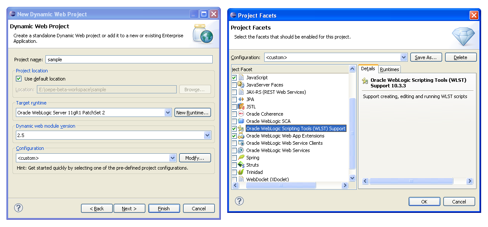
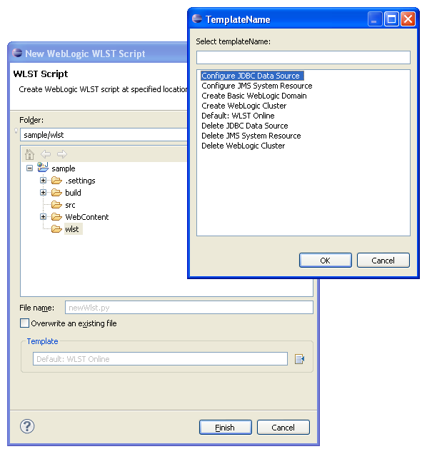
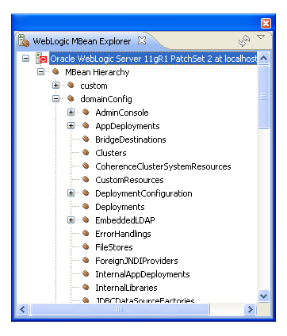
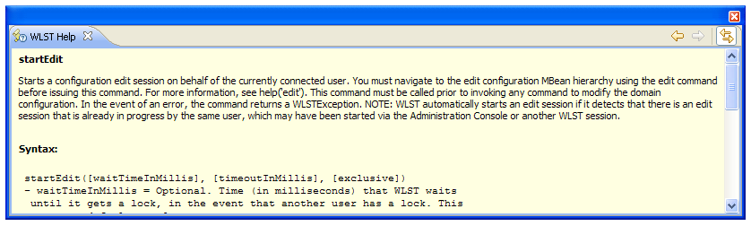

The new <a href="http://www.oracle.com/technetwork/developer-tools/eclipse/downloads/index.html" target="_blank">Oracle Enterprise Pack for Eclipse Release (11.1.1.6.0)</a> is out. One major new feature is the WLST (WebLogic Scripting Tools) integration. 
 
 <b>What is the WebLogic Scripting Tool?</b>
 
 The WebLogic Scripting Tool (WLST) is a command-line scripting interface that system administrators and operators use to monitor and manage WebLogic Server instances and domains. The WLST scripting environment is based on the Java scripting interpreter, Jython. In addition to WebLogic scripting functions, you can use common features of interpreted languages, including local variables, conditional variables, and flow control statements. WebLogic Server developers and administrators can extend the WebLogic scripting language to suit their environmental needs by following the Jython language syntax. The OEPE integration is based on <a href="" target="_blank">PyDev </a>version 1.5.7, a Python Development environment provided by Aptana.
 
 <b>OEPE and WLST</b>
 
 Up to yesterday, you were able to use WLST in basicaly three modes. Interactively, on the command line; in a text file—Script Mode; Embedded in Java code. The new OEPE release introduces a new project facet (Oracle WebLogic Scripting tools support) which enables you to write and execute your WLST scripts directly from and within OEPE.
 
 <b>Getting started</b>
 
 Take one of your favorite projects or create a new one and add the new facet to it. 
 

 

 
 Now you should see a "wlst" folder within your project. Right click and select "New - WLST Script". The following dialog allows for assigning a filename and selecting a template. There are already a couple of templates available. If you select the sample "Configure JDBC Datasource" you have a quite common task at hand with which you can play around a bit.
 
 

 

All you have to do is to write your wlst script and if ready, select "Run As... - WLST Run". Now your script gets executed against the configured server for your project. This has to be up and running already of course.
 
 <b>WLST Views</b>
 

 

There are a couple of new views and view integration available for the WLST support. Beside the .py editor you can use the <i>MBean browser</i>.
 
 It allows browsing of the complete server MBean tree. You can also drag an drop any node into your wlst script editor for easy reference. The first thing I got stuck with were the missing server control functions from within the browser view. They did not make it to this release. Let's hope for a future one :)
 
 Another new view is the&nbsp; WLST Help view. It provides an Eclipse integrated version of the command and variable reference from the <a href="http://download.oracle.com/docs/cd/E14571_01/web.1111/e13813/reference.htm#WLSTC119" target="_blank">WebLogic documentation</a>. More details can be found in the latest <a href="http://download.oracle.com/docs/cd/E14571_01/web.1111/e13813/toc.htm" target="_blank">Oracle FMW WebLogic Scripting Tool Command Reference (10.3.3)</a>. This document describes all of the commands that are available to use with the WebLogic Scripting Tool (WLST). This document includes WLST commands for WebLogic Server, as well as custom WLST commands that can be used to manage installed Oracle Fusion Middleware components.
 
 
 

 

 
 
 All the script output goes to the Eclipse console. With a standard installation it gets mixed up with all the other console out. You can prevent this, if you assign a separate console to the WLST output. 
 
 

 

 
 Will blog about other new features shortly. Stay tuned.