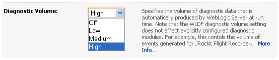

The JRockit Mission Control tools suite includes tools to monitor, manage, profile, and eliminate memory leaks in your Java application. The best part in this is, that this is done with zero performance overhead in production environments.
 
 This short howto will walk you through the most basic features and introduce you to some (unsupported) experimental plugins.
 
 <b>Installation</b>
 
 You should have a WebLogic Server installation running JRockit R28 in place already. If not, it's time to get the latest <a href="http://www.oracle.com/technology/software/products/middleware/index.html" target="_blank">11gR1 (10.3.3)</a> from OTN.
 
 First is to grep a copy of the installer from <a href="http://www.oracle.com/technology/software/products/jrockit/index.html" target="_blank">OTN</a>. Depending on your OS (Linux x86, Linux x86-64, Solaris SPARC 64-bit, Windows x86, Windows x86-64) and Java version you have to download roughly 100 MB. I am using the Oracle JRockit Mission Control 4.0.1 for Windows x86 and Java 6.
 
 Select an installation directory of your choice and if you like, you can choose to install Demos and Samples and the Source Code. The installer comes with a public JRE also. But you don't need it for the things we are going to try next. 
 
 <b>Configuration</b>
 
 Normaly you don't have to configure anything on the jrmc itself. Just go to your %RMIC_INSTALL%/bin dir and fire up jrmc.exe.
 

 

If you are behind a corporate proxy you have to tell Java to use it. I was not able to find any configuration file, therefore I looked around and added a mc.bat/sh to the %RMIC_INSTALL%/missioncontrol with the following entries:
 <code> 
  set JAVA_HOME=%WLSHOME%\jrockit_160_17_R28.0.0-679 
  set PATH=%WLSHOME%\jrockit_160_17_R28.0.0-679\bin 
  java -Dhttp.proxyHost=proxy.com -Dhttp.proxyPort=3128 -jar mc.jar </code>
 
 Why? Because of an experimental plug-in we are going to use. Start jrmc and go to "Help - Install Plugins ... (unsupported)" and expand the Experimental Update Site.
 
 Select the Flight Recorder Plug-in WebLogic Tab Pack 0.0.7.
 

 

and click next. Accept the OTN Developer License Terms and click next. Click finish. Click install all and restart the jrmc. Please keep in mind, that this feature is an experimental plug-in for JRockit Mission Control. Experimental plug-ins are not supported by Oracle and are either sneak peeks of coming functionality, or useful functionality that is not part of the core distribution of JRockit Mission Control. This feature adds several tabs showing WLS related information.
 
 
 To make use of the new features you have to enable the related producers within your WebLogic Server.
 
 Check your domain startup files %WLSHOME%/user_projects/domains/your_domain/bin and make shure, you have Oracle as JAVA_VENDOR and add the following as JAVA_OPTIONS
 <code> 
  -XX:FlightRecorderOptions=defaultrecording=true </code>
 
 Next is to fire up your wls (startWebLogic.cmd/sh) and launch the admin console (http://localhost:7001/console).
 
 Goto: your_domain - configuration - general - advanced and enable the following two checkboxes (don't forget to save your changes):
 

 

Next is to go to your server instance and change the diagnostic volume to "High". Goto: Environment - configuration - general.
 

 

Now everything is configured, and you can start using jrmc with WebLogic server.
 
 
 <b>JRMC Features at a glance</b>
 
 The JRMC has a lot of features. Most basic functions are explained here. Later on I am going to describe the new WebLogic integration.
 
 <i>The Flight Recorder</i>
 
 The JRockit Flight Recorder is a performance monitoring and profiling tool that makes diagnostics information always available, even after catastrophic failure, such as a system crash. At its most basic, Flight Recorder is a rotating buffer of diagnostics and profiling data that you can access whenever you need it. You might consider it a sort of "time machine" that enables you to go back in time to gather diagnostics data leading up to an event. The data stored in the rotating buffer includes JVM and application events. The JRockit Flight Recorder is designed to be always on and its default configuration will not result in any performance overhead because it uses data that is collected by the JVM anyway.
 
 <i>The Management Console</i>
 
 To view real-time behavior of your application and of Oracle JRockit JVM, you can connect to an instance of the JRockit JVM and view real-time information through the JRockit Management Console. Typical data that you can view is thread usage, CPU usage, and memory usage. All graphs are configurable and you can both add your own attributes and redefine their respective labels. In the Management Console you can also create rules that trigger on certain events, for example, an mail will be sent if the CPU reaches 90% of the size.
 
 <i>The Memory Leak Detector</i>
 
 To find memory leaks in your Java application, you connect the JRockit Memory Leak Detector to the running JRockit JVM process. The Memory Leak Detector connects to the JMX (RMP) Agent that instructs to start a Memory Leak server where all further communication takes place.
 
 <b>WebLogic Flight Recorder Tab Pack for Mission Control (Unsupported)</b>
 
 The most interesting part is the new WebLogic integration. Start experiencing it with downloading the Default Recording, you enabled with the corresponding JAVA_OPTION. Right click on your WebLogic Server JVM and select "Dump Default Recording". Choose a timeframe and wait for the recording to be processed. select the blue icon (WebLogic) and see the general overview. You can now inspect all relevant events from the WLDF in a very conveniant gui based way.
 
 The events produced by the WebLogic Diagnostics Framework (WLDF) are throttled per ECID (Execution Context Identifier). If an ECID is picked out by the throttler you will see all WLDF-events generated for a request flow with that ECID. You can control the number of ECIDs that are collected by setting the Diagnostic Volume to Low, Medium or High.
 

 

 
 There are a couple of new tabs available.
 
 Overview 
 
 This is a new tab providing an overview of the WLDF related events.
 
 ECID 
 
 This is a new tab providing an overview of the events grouped by ECID.
 
 Users 
 
 This is a new tab listing events on a per user basis.
 
 Database 
 
 This is a new tab listing database related events. 
 
 EJB
 
 This is a new tab listing EJB (enterprise java bean) related events.
 
 JMS
 
 This is a new tab listing JMS (message service) related events.
 
 JTA 
 
 This is a new tab listing JTA (transaction) related events.
 
 Webservices
 
 This is a new tab listing JAXRPC/JAXWS (webservices) related events.
 
 Servlets 
 
 This is a new tab listing servlet related events.
 
 HTTP Requests 
 
 This is a new tab listing http related events from DMS. Some data may be unavailable unless the DMS producer was active during the recording.
 
 <b>Licensing and the future</b>
 
 JRockit Mission Control is a great tool. You are free to use it under the terms of the OTN License. The productive licensing changed a bit in the past. Latest statement from Oracle regarding the can be found in the JRockit FaQ:
 
<blockquote>
 JRMC will be included in various packages that include the JRockit technology. It will not be sold stand-alone under new licensing agreements, but will continue to be bundled with Oracle products. 
  
  (Source: <a href="http://www.oracle.com/technology/software/products/jrockit/FAQ.html" target="_blank">FaQ</a>)
</blockquote>Have seen the WebLogic Plugin? Wanting more? I do! I am wanting the same integration for the GlassFish. Anyway. There has not been any anouncements on this. The basic integration architecture allows for many integrations points and GlassFish can run on a JRockit. Let's wait for the future.
 
 
 <b>Links and Readings</b>
 <a href="http://www.oracle.com/technology/software/products/jrockit/index.html" target="_blank">Oracle JRockit Family Downloads</a>
 <a href="http://www.oracle.com/technology/products/jrockit/missioncontrol/index.html">JRockit Mission Control Suite</a>
 <a href="http://download.oracle.com/docs/cd/E14571_01/web.1111/e13714/using_flightrecorder.htm#CHDIFFFB" target="_blank">Using WLDF with JRockit Flight Recorder</a>