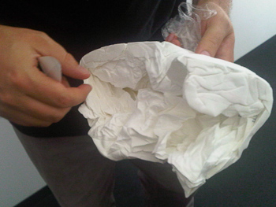
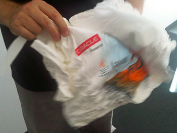

Java developers, architects, programmers, and enthusiasts: get ready for a real adrenaline rush. <a href="" target="_blank">Java Road Trip</a>: Code to Coast tour as it journeys to 20 cities across the United States showcasing Oracle's commitment to everything Java. 
 
 
 I caught them during ODTUG Kaleidoscape earlier this year and brought some t-shirts home. One of them was a present for a fellow co-worker of mine. He got it yesterday and here is the process of unboxing it. It was not too easy taking the pictures. He was quite excited! 
 
 
<table align="center" cellpadding="0" cellspacing="0" class="tr-caption-container" style="margin-left: auto; margin-right: auto; text-align: center;">
 <tbody>
  <tr>
   <td style="text-align: center;"></td>
  </tr>
  <tr>
   <td class="tr-caption" style="text-align: center;">Packed as a surf board. Wrapped up ;)</td>
  </tr>
 </tbody>
</table>
 
<table align="center" cellpadding="0" cellspacing="0" class="tr-caption-container" style="margin-left: auto; margin-right: auto; text-align: center;">
 <tbody>
  <tr>
   <td style="text-align: center;"></td>
  </tr>
  <tr>
   <td class="tr-caption" style="text-align: center;">Ripping away the fancy paper</td>
  </tr>
 </tbody>
</table>
 
<table align="center" cellpadding="0" cellspacing="0" class="tr-caption-container" style="margin-left: auto; margin-right: auto; text-align: center;">
 <tbody>
  <tr>
   <td style="text-align: center;"></td>
  </tr>
  <tr>
   <td class="tr-caption" style="text-align: center;">Trying to figure out what it realy is ..</td>
  </tr>
 </tbody>
</table>
 
<table align="center" cellpadding="0" cellspacing="0" class="tr-caption-container" style="margin-left: auto; margin-right: auto; text-align: center;">
 <tbody>
  <tr>
   <td style="text-align: center;"></td>
  </tr>
  <tr>
   <td class="tr-caption" style="text-align: center;">Uncovering the print</td>
  </tr>
 </tbody>
</table>
 
<table align="center" cellpadding="0" cellspacing="0" class="tr-caption-container" style="margin-left: auto; margin-right: auto; text-align: center;">
 <tbody>
  <tr>
   <td style="text-align: center;"></td>
  </tr>
  <tr>
   <td class="tr-caption" style="text-align: center;">Yes, it's a t-shirt ...</td>
  </tr>
 </tbody>
</table>