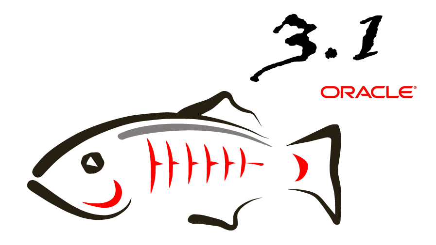
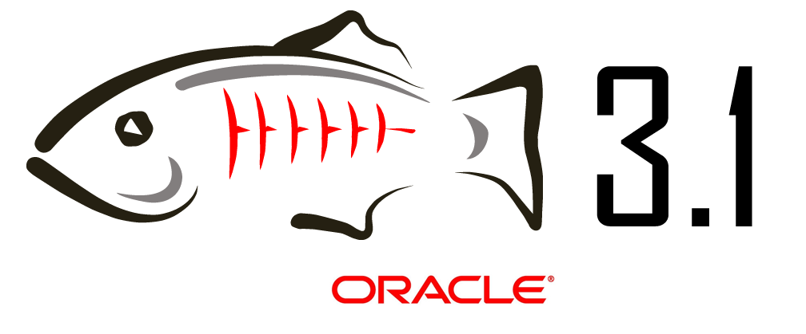

You know <a href="http://www.facebook.com/people/Sparky-GlassFish/100001459721598" target="_blank">Sparky GlassFish</a>? :) Yes. Of course you do. Beside having his own Facebook profile, there is the official <a href="http://www.facebook.com/pages/GlassFish/173885569152" target="_blank">GlassFish page on Facebook</a>. 
 
 As seen today, the GlassFish team is searching for some new v3 or v3.1 logos. I don't know if this is going to be a contest. And I don't know, if I am the right one to contribute; but here is what came to my mind thinking about it. Hope, you like it.And @Oracle: Sorry for using the Logos without explicit permission. I think of this as a design study. If the GlassFish team picks one of them, I am shure they will have the permission. If this is not correct to anybody, let me know and I replace them :)
 
 Comments and further ideas highly appreciated.
 
 
<table align="center" cellpadding="0" cellspacing="0" class="tr-caption-container" style="margin-left: auto; margin-right: auto; text-align: center;">
 <tbody>
  <tr>
   <td style="text-align: center;"></td>
  </tr>
  <tr>
   <td class="tr-caption" style="text-align: center;">The idea here was to replace the tail fin with the 3. Works for me :)</td>
  </tr>
 </tbody>
</table>
 
<table align="center" cellpadding="0" cellspacing="0" class="tr-caption-container" style="margin-left: auto; margin-right: auto; text-align: center;">
 <tbody>
  <tr>
   <td style="text-align: center;"></td>
  </tr>
  <tr>
   <td class="tr-caption" style="text-align: center;">I don't know if I like this one. But this is about catching lines. The 3 should support the dorsal fin and make it bigger.</td>
  </tr>
 </tbody>
</table>
 
<table align="center" cellpadding="0" cellspacing="0" class="tr-caption-container" style="margin-left: auto; margin-right: auto; text-align: center;">
 <tbody>
  <tr>
   <td style="text-align: center;"></td>
  </tr>
  <tr>
   <td class="tr-caption" style="text-align: center;">Same idea as above without actually replacing the tail fin.</td>
  </tr>
 </tbody>
</table>
 
<table align="center" cellpadding="0" cellspacing="0" class="tr-caption-container" style="margin-left: auto; margin-right: auto; text-align: center;">
 <tbody>
  <tr>
   <td style="text-align: center;"></td>
  </tr>
  <tr>
   <td class="tr-caption" style="text-align: center;">Another variant of adding the number to the tail fin.</td>
  </tr>
 </tbody>
</table>
 
<table align="center" cellpadding="0" cellspacing="0" class="tr-caption-container" style="margin-left: auto; margin-right: auto; text-align: center;">
 <tbody>
  <tr>
   <td style="text-align: center;"></td>
  </tr>
  <tr>
   <td class="tr-caption" style="text-align: center;">This is a bit more straight forward one. The dots in the lower left are a braille representation of the numbers. I felt like I have to catch the open space there with something.&nbsp;</td>
  </tr>
 </tbody>
</table>
 
 
<table align="center" cellpadding="0" cellspacing="0" class="tr-caption-container" style="margin-left: auto; margin-right: auto; text-align: center;">
 <tbody>
  <tr>
   <td style="text-align: center;"></td>
  </tr>
  <tr>
   <td class="tr-caption" style="text-align: center;">And the last one. Also not one of my personal favorites. But it could work.</td>
  </tr>
 </tbody>
</table>