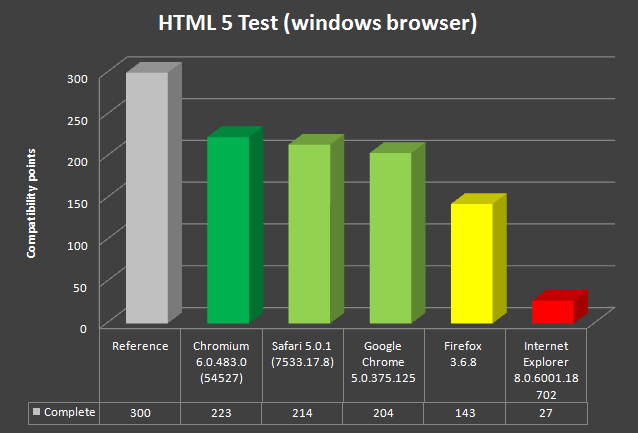

After reading <a href="http://blog.eisele.net/2010/07/ipad-for-business-about-why-and-how.html">the first part in the iPad for Business?</a> series you now know why you should care for it. In this second post you will read about how to write appropriate software and what to keep in mind doing this.
 
 <b>in business ...</b>
 
 Reading any further I would like to make a friendly reminder. If I am writing about using things "... in business", this always adresses the same issues. Writing software for business is technicaly not different from writing your own personal app. But you have to keep many more points on your list of priorities to monitor than with homegrown usecases. Software for business has to be rock-solid, simple to maintain, stable, fast, reliable, sustainable and should be alterable in simple ways. There are literaly hundreds of different approaches to achive this. Some from a methodicly point of view (project management, development), other trying to get there using extended quidelines. All approaches are valid. And I am not going to spend more lines on this. Simply one little point: Non of the following technologies has been around in companies for longer. If you go on reading you agree that we are talking about bleeding edge stuff. Trying to use this in business forces you to keep an eye on technolgy and have a sixth sense.
 
 <b>Apps, apps and apps</b>
 
 Let's start with the magical buzzword. "Apps". This is the heart of every iXXX device at Apple. All mobile devices share the same basics because they all use the famous <a href="http://en.wikipedia.org/wiki/IOS_%28Apple%29" target="_blank">iOS</a>. This is Apple's mobile operating system developed originally for the iPhone, and later deployed on the iPod Touch and iPad as well. It is derived from Mac OS X, with which it shares the Darwin foundation, and is therefore a Unix-like operating system by nature. In iOS, there are four abstraction layers: the Core OS layer, the Core Services layer, the Media layer, and the Cocoa Touch layer (UI). Mac OS X applications cannot be copied to and run on an iOS device. The applications must be written and compiled specifically for iOS and the ARM architecture. Authorized third-party native applications are available for devices running iOS 2.0 and later through Apple's App Store.
 
 <b>Native apps</b>
 
 Apple provides a complete ecosystem for developers willing to implement apps. You can develop your applications with the Xcode 3 developer tools package which is included with every Mac. Beside this, you also use the Interface Builder which is a prototyping tool for Cocoa. For more details have a look at the <a href="" target="_blank">Apple Development Tools</a> page.
 
 If you are willing to write native apps you have to either
 
 a) upload them to the App Store and promote them to all iXXX users or
 
 b) buy yourself a <a href="">company developers license</a>, register all your iPads and directly upload your native app without pushing them to the appstore.
 
 Both ways are not what I call "suitable" for enterprises. One case exposes applications to a broad range of people. In the other case you have to do too many manual steps to be successfull.
 
 <b>Webapps apps</b>
 
 If you are not able (cause the # of iPads is too large) or willing to play with all those native stuff you have another option. You can simply stick to webbased applications. They do not need any direct deployment to the device and simply run within your safari browser. "Wow. That's everything but cool?". Wrong! Safari is based on WebKit and this is nearly ready for HTML5. Your webapps should of course be HTML5 ready.
 
 <b>HTML5 = Next Generation Features for Modern Web Development</b>
 <a href="http://en.wikipedia.org/wiki/HTML5">HTML5</a> is currently under development as the next major revision of the HTML standard. Like its immediate predecessors, HTML 4.01 and XHTML 1.1, HTML5 is a standard for structuring and presenting content on the World Wide Web. It's development is ongoing since the last <a href="" target="_blank">XHTML 1.1 release</a> which is a W3C recommendation since 31 May 2001. 
 
 If you want a real fancy introduction to the new features and you are using one of the "modern" browsers (compare chapter below), have a <a href="http://slides.html5rocks.com/#slide1">look at this slidedeck</a>.
 
 HTML5 is nothing more than some HTML (+ additional tags) like we know it, plus some CSS (+ additional features) like we know it and some fancy new JavaScript APIs. The new JS APIs make this so interesting. There are new features supporting real application development on the web. To name a few: new Selectors, Web Storage, Client SQL DB, Cache API, Workers API, Sockets, Notifications, Drag and drop support and Geolocation support. Bottom line is: HTML5 promises to be a technological tipping point for bringing desktop application capabilities to the browser. As promising as it is for traditional browsers, it has even more potential for mobile browsers. And the best thing is: All you have to implement is just HTML, JavaScript, and CSS—the core technologies of any Web developer. There are a couple of great ressources out there to get a first introduction into the new capabilities. Some I found very usefull (in no particular order):
 
<ul>
 <li><a href="http://www.ibm.com/developerworks/opensource/library/x-html5mobile1/index.html">First part of a 5 part developerworks series: Creating mobile Web applications with HTML 5</a></li>
 <li><a href="">HTML5 Unleashed: Tips, Tricks and Techniques</a></li>
 <li><a href="">Touch The Future: Create An Elegant Website With HTML 5 And CSS3</a></li>
 <li><a href="http://www.w3schools.com/html5/html5_reference.asp">HTML 5 Tag Reference</a></li>
</ul>
 <b>WebKit vs. Gecko vs. IE</b>
 
 Up to now there are only few browsers supporting different subsets of the latest <a href="" target="_blank">HTML5 W3C Working Draft 24 June 2010</a>. The <a href="" target="_blank">HTML5 test website</a> generates a score which is only an indication of how well the browsers supports the upcoming HTML5 standard and related specifications. It does not try to test all of the new features offered by HTML5, nor does it try to test the functionality of each feature it does detect.
 
 

 

 
 If you compare the most recent windows versions of relevant browsers you notice, that all <a href="">WebKit</a> based rendering engines are far ahead. If you are willing to testdrive your iPad webapp you should use foremost the targeted device but it's completely valid to use the desktop browser which is knowing to best support HTML5 at the moment.
 
 <b>Preparing Your Web Content for iPad</b>
 
 Safari on iPad is capable of delivering a "desktop" web experience. iPad has a large screen and fast network connectivity, and Safari on iPad uses the same WebKit layout engine as Safari on Mac OS X and Windows. You can ensure that your website looks and works great on iPad, and even create new touch-enabled web experiences for your customers, by <a href="http://developer.apple.com/safari/library/technotes/tn2010/tn2262/index.html" target="_blank">considering a few specific differences between iPad and other platforms</a>. Apple did quite a good job in introducing all the special things to developers with a couple of documents. You should browse <a href="" target="_blank">http://developer.apple.com/safari/library/</a> for the latest information and some great showcases. Also take a detailed look at the <a href="http://developer.apple.com/iphone/library/documentation/General/Conceptual/iPadHIG/Introduction/Introduction.html" target="_blank">iPad Human Interface Guidelines</a>. The basic device characteristics to keep in mind are:
 
<ul>
 <li>Screen Size is Compact</li>
 <li>Memory is Limited</li>
 <li>People See One Screen at a Time</li>
 <li>People Interact with One Application at a Time</li>
 <li>Onscreen User Help is Minimal</li>
</ul>
 <b>Writing applications with JavaScript? Are you kidding me?</b>
 
 I know: Enterprise developers tend to think about Java Script as of the last scripting language they would ever chose for writing professional applications. Up to some extend this is caused by the many badly written stuff out there with all it's problems like cross browser issues and proprietary function ussage. But you can do it the right way. Look at Google for example:
 
<blockquote>
 Currently, the Gmail program is comprised of 443,000 lines of JavaScript, with 978,000 lines if comments are included. All of it was written by hand [...]
  
  (Source: <a href="http://www.computerworld.com/s/article/9178558/Google_to_use_HTML5_in_Gmail">Adam de Boor in Google to use HTML5 in Gmail</a>
</blockquote>Wow. If this is true ... they are doing a great job at all! And it is a very good indicator, that you could do it also. There are some programming guides out there that could assist you. Anyway, if we are likeminded, than you are not thinking about doing this. And this is perfect to me. Still reaching for great UIs on the iPad? Think about frameworks.
 
 <b>Frameworks and Libraries</b>
 
 Writing all this stuff by hand, like Google does is probably not the right decision if you are aiming for productivity and you are not Google :-) Thank god, there are a couple of HTML5 frameworks out there already you can use. Basically you have to decide if you want to use a serverside or a clientside version. The frameworks presented here have a positive history with me and this is the reason I am presenting them to you.
 
 <i>Sencha Touch</i>
 <a href="" target="_blank">Sencha Touch</a> is an app framework built to leverage HTML5, CSS3, and Javascript. It makes use of HTML5 to deliver components like audio and video, as well as a localStorage proxy for saving data offline. It extensivly uses CSS3 to provide a robust styling layer. The entire library is under 80kb (gzipped and minified), and it's easy to make that number even smaller by disabling unused components or styles.
 
 The creators of Touch also gave birth to the better know <a href="" target="_blank">ExtJS framework</a>. Working with Touch is easy and there are a lot of examples. It is published under several licenses. A GNU GPL license v3 version is also available.
 
 <i>jQTouch</i>
 <a href="" target="_blank">jQTouch</a> is not a complete framework itself. It's a plugin to the well known jQuery JavaScript Library. The plugin itself is MIT licensed and available for download from google code. It supports native animations, automatic navigation, and themes.
 
 <i>YUI 3</i>
 <a href="" target="_blank">YUI 3</a> is Yahoo!'s next-generation JavaScript and CSS library. It powers the new Yahoo! homepage and incorporates what they've learned in five years of dedicated library development. The actual 3.2.0 PR1 adds gestures and touch events. This is going to be extended in the future. So watch out for the final 3.2.x. The library is published under a BSD License.
 
 
 Now heading over to the (java) serverside. There are a couple of choices available also. Basicaly all of them depends upon any kind of UI component stuff (e.g. JSF). If you hope for fancy HTML5 based and mobile optimized UIs without any javascript they are probably the right choice for you.
 
 <i>Mobile Application Development with Oracle ADF Mobile</i>
 <a href="http://www.oracle.com/technetwork/developer-tools/adf/overview/adf-mobile-096323.html" target="_blank">ADF Mobile</a> extends Oracle Application Development Framework to mobile users. Using Oracle JDeveloper, application developers can rapidly develop mobile applications that support mobile users accessing critical business data through either on-device mobile client or mobile. There are two parts to ADF Mobile: ADF Mobile Client and ADF Mobile Browser. ADF Mobile Client supports a complete on-device client framework that works and performs consistently regardless of connectivity. ADF Mobile Browser supports UI renderers that are optimized for Mobile Browser display. Both frameworks enables developers to develop one application that can be deployed to multiple mobile device platforms. The mobile client is (not jet) released for apples devices. Therfore you still have to stick to the "old fashioned" way. (compare otn article: <a href="http://www.oracle.com/technetwork/articles/huang-iphone-097081.html" target="_blank">Developing for the Apple iPhone with Oracle JDeveloper and ADF</a>).
 
 <i>TouchFaces </i>
 <a href="http://www.primefaces.org:8080/prime-showcase/touch/index.jsf" target="_blank">TouchFaces </a>is a mobile UI kit for <a href="">PrimeFaces</a> to create mobile web applications for handheld devices with webkit based browsers. You can run it with Mojarra-2.0.2 and make use of 90+ components
 
 <i>Apache MyFaces Trinidat</i>
 <a href="http://myfaces.apache.org/trinidad/devguide/mobile.html" target="_blank">Apache MyFaces Trinidad</a> is a JSF framework including a large, enterprise quality component library. Trinidad supports wide range of mobile browsers. Some mobile devices are explicitly tested and supported. Others are grouped as basic browsers and Trinidad renders pages so that the page works with or without browser features, such as supports for AJAX, DOM, JavasScript or even CSS. There is a seperate website dedicated to <a href="http://myfaces.apache.org/trinidad/devguide/mobile.html" target="_blank">Mobile Application Development with Trinidat</a>.
 
 <b>Bottom line</b>
 

 

Writing applications for the iXXX family in general is easy if you decide to stick to whatever feature WebKit offers. Beside the fact that the actual HTML5 draft still is not a final specification and things are going to change, it is the only option for large enterprise apps with a big number of users. There are other things to keep in mind. If you are interested: Some coworkers of mine are working on the first iPad in Enterprise book ever. Too bad, that it will be written completely in German. This will be published end of November. Keep up to date with the <a href="http://www.springer.com/computer/information+systems+and+applications/book/978-3-642-15436-2" target="_blank">books webpage at springer</a>.