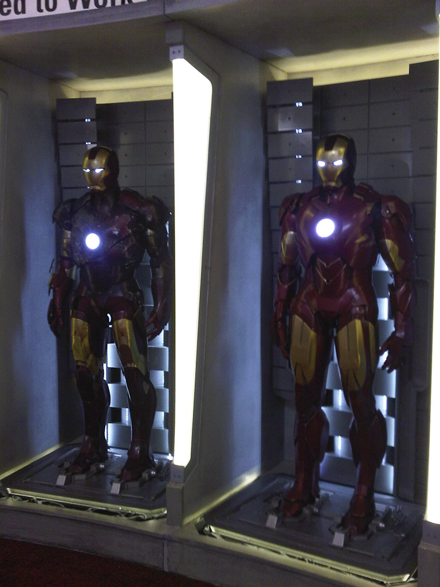
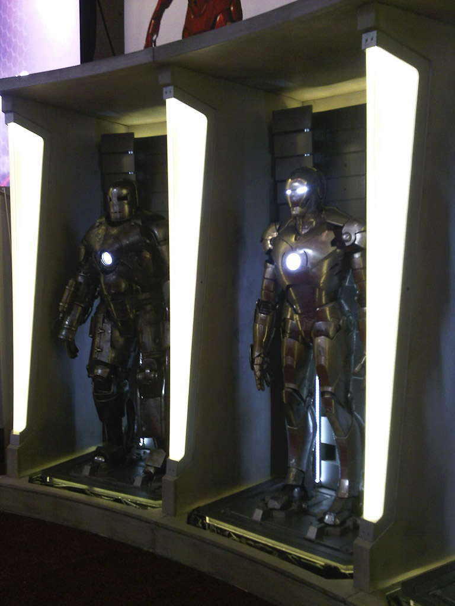
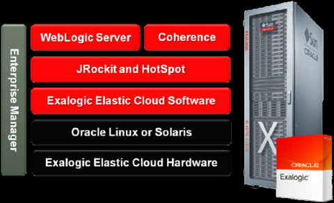

Oracle Exalogic Elastic Cloud is the world's first and only integrated middleware machine—a combined hardware and software&nbsp;stack optimized for running JVMs. One of the parts we know about since a few days. And we all were waiting for the official announcement from Larry yesterday. And here is how it looks like.
  
 
 
 
 The new box is positioned next to the original Marvel suites from Ironman 2. This is awesome. But as you might have guessed, the suites look much smaller than in the movie :)
 
 You can find more information about Exalogic on the <a href="http://www.oracle.com/us/products/middleware/exalogic/index.html" target="_blank">new official website</a>. At the moment there is only a WebLogic server on top of the stack. But at the end of the day, this is simply a box running Oracle Unbreakable Linux. So you should even be able to run GlassFish on it. Even if it does not contain all the performance improvements done for WebLogic.
 
 

 

