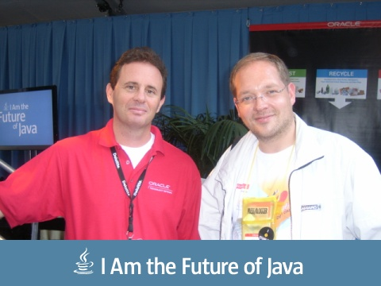
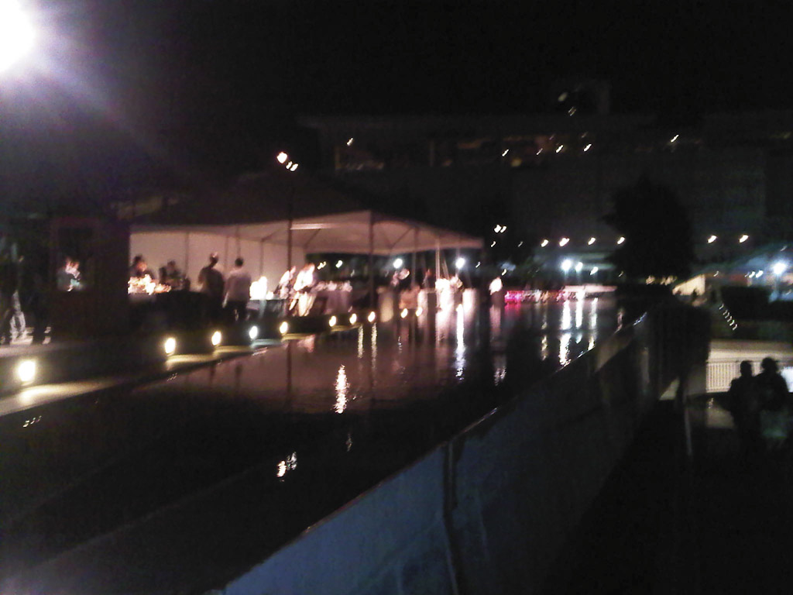

Being here for already five days, this was the first real conference day. And, to be honest, I am dead beaten after the last few days. So there were some sessions to attend, but the most obvious thing, we all were waiting for, was the JavaOne Keynote this evening. So, I went through the day and meet Justin, Björn, Sebastian and many others at the Zone, had some coffee and tried to get through the day. There were some great sessions out there and I enjoyed having them on my schedule.
 
 

 

 
 The evening was promising. After the Java Champions and ACE Directors Meetup we immediate went to the JavaOne Keynote. Packed full and everybody excited to hear what is going to happen. As I said previously, this was announced to be the final statement from Oracle, that they are commited to Java and supportive. 
 
 After a more or less boring start with Intel, everything got exciting as Oracle Executive Vice President of Product Development Thomas Kurian entered the stage. Adam Messinger (JRockit), Mike Lehmann and others joined him to do live demos from what he was talking about. As I have heard, all demos on stage this year has to be live, so there was no video involved.
 
 Everything got kickstarted by the JRockit Flight Recorder demonstration showcased JMX (MBean) as part of its analysis capability. Behind this was the message, that both JVMs are going to be merged into one. Nobody knows about the new name up to now, but it seems obvious, that there no longer will be a JRockit or even a Hotspot. HotRockit would be a great name :-)
 
 Kurian said, that Oracle is committed to deliver Java 7 in 2011 and Java 8 in 2012. He also said that Oracle is committed to delivering the best JVM in the market. Right before the Keynote, Mark Reinhold announced that plan B will be the way to go.
 
 All this was followed by a very impressing demonstration of what the "high-performance graphics engine" called Prism used with JavaFX is able to do. It renders 2D objects today, but will eventually support 3D objects. It will support new hardware Accelerated 2D and 3D Graphics Pipeline. This will be made available in open source via NetBeans.
 
 Mike Lehmann was next do showcase both NetBeans and Eclipse with GlassFish. Nice presentation at all. And Mike is really commited to GlassFish. He was again wearing a GlassFish T-Shirt on stage. Something he already did prior to the merger at the Devoxx last year. Even if commitment is about more than wearing T-Shirts; In this case it's true. I guess Mike really loves what GF is capable of. 
 
<blockquote>
 "We're really excited about Java and we're committed to giving you the world's best programming language, the world's most popular deployment platform, and the ability to deploy amazing clients in Java regardless of target platform. "
  
  [...]
  
  "The future of Java is not about Oracle or any one company. It is about you, the Java developers who create great applications with it."
  
  (T.Kurian, JavaOne Keynote 20.09.10)
</blockquote>
 
 Right after the keynote, I was torn to the side. There was a big surprise waiting. A meet-and-greet with <a href="http://en.wikipedia.org/wiki/Apolo_Ohno" target="_blank">Apollo Ohno</a>. He is an American short track speed skating competitor and an eight-time medalist (two gold, two silver, four bronze) in the Winter Olympics. He is the most decorated American Winter Olympic athlete of all time.
 

 

 

This was directly followed by the OTN party in the Yerba Buena Gardens. Thanks Sheeri for the nice time! I realy enjoyed it. Love uncomplicated people :)
 
 

 

 

 

