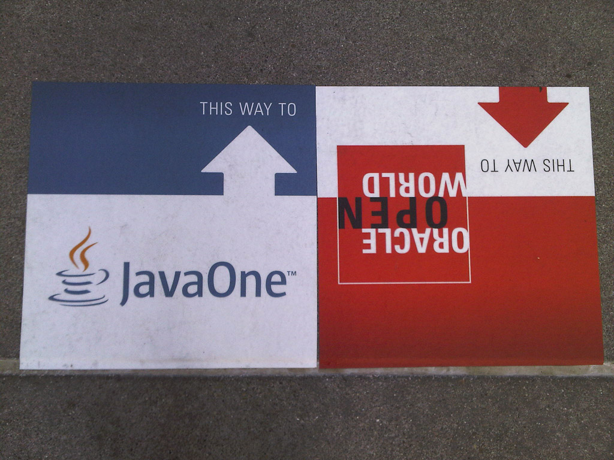

The last real JavaOne/OpenWorld/OracleDevelop day for me. And it was completely busy. Meeting people. All over the day. Appointments. It was awesome. But exhausting. Especially if English is only your second language. Anyway, I meet a lot of wonderful people and it was a pleasure to catch up with all of them. After this heavy morning, we went to the famous Larry-Keynote. To be honest, I did not expect too much. But it was disappointing at all. Seeing the sailing intro the second time, hearing him talk about Exalogic, Exadata and stuff and listening to "Hardware and Software engineered to work together" totally made me sick. Thank god, I had Bjoerns Cam with me again and could spend some time taking closeups of him. Good for some slides. Sooner or later.
 
 After that, we went to the appreciation event. Berlin, Black Eyed Peas (ExaPeas) and many more. We left before midnight. It was too crowded and we had some other complaints. Hotel bed was waiting and therefore, I was happy to finally fetch some sleep before I am heading back to Germany today. I am feeling a little bit of a cold coming up. Hopefully the a/c in the plane will not make it worser.
 

 

First conclusion about the last few days:
 
 It was nice. Nice, to attend this big event. It's huge in plain numbers. More or less 41k people attending it. It was huge in terms of catching up with people I only meet online before. It was good to see Oracle being highly committed to Java and having plans and new directions for the great technology at hand.
 
 

 

