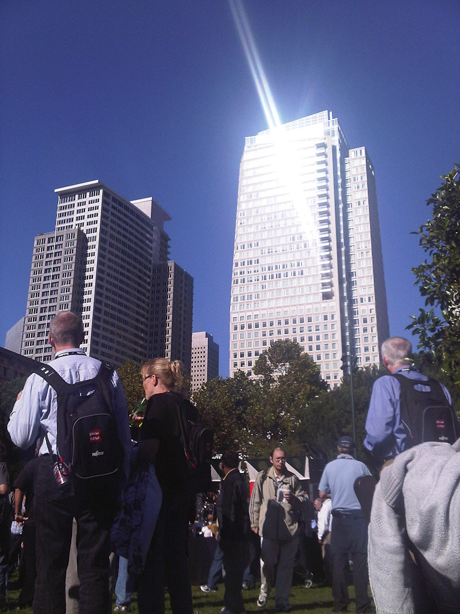

I am at SFO and enjoying the 45min free wifi. Great service. Still some time left until boarding. Time to do a WrapUp posting.&nbsp;It was nice being with all the folks at JavaOne, OracleDevelop and OpenWorld. I love meeting with all those guys I normally only have on the email or twitter or else. And I even managed to meet some German guys I normally don't see around that much being home.
 
 But here is my list of things to change. Don't get it wrong. I liked the OpenWorld in the past. And this time this was not a big exception. But there are always things to improve on. Here is my list:
 
 - the announcements made were not that surprising, as I am used to at OOW. I need stuff, that is surprising there. I need the show.
 
 - the J1 location was a big fail. All the hotels together did not guarantee for a great event. It's the single location that makes this a true J1. Bring J1 back to Moscone in 2011!
 
 - the session slots were not aligned. I had very big empty spaces in my schedule and very packed times. All this in combination with the need to move around that much made me miss many of the originally planned sessions.
 
 - the food was like nothing I can describe in my little English words. Always the same. And not really tasty. Ok. I know that it's not easy to do this for &gt;41k people but I still want to see it better next year.
 
 - wifi was working most of the time. But this is always a point to improve on.
 
 - OTN was located far off everything. The tent was a joke. Going downhill and pushed between those two row houses. All that police around. Dirt all the way. Anything but a nice and warm place, I would like to hang out longer. 
 
 - Google was missing. The lego pit was a joke. Bring those guys back in!
 
 - I can't stand anybody talking about "Software and Hardware engineered to work together anymore"! It's not a slogan, it's a novel. I still like "Software.Hardware.Complete." that works for me somehow.
 
 - If possible, can someone please tell Larry, that seeing this nice Amercas-Cup movie once is by far enough? I like Larry's Keynotes a lot. But seeing the same twice really was not worth it.
 
 - And btw: I think one Keynote is by far enough. Let someone else do the Monday Keynote again.
 
 - Treasure Island is an awesome place. I like it a lot. But please consider using more space again or cutting down the people for this event. It was too crowded and I hardly found a place to talk with a normal voice.
 
 - Another think to think about is the registration process. I don't know if it has to be this complicated. What about giving a bag and a t-shirt to anybody. Nothing more nothing less. That would cut down administration, costs and frustration. With all of us.
 
 
 Anyway. I explicitly skipped the good parts. I will catch up on this later. What are you thinking? Let me know.
 
 Here are some impressions from todays after match, the "It's a Wrap" party.
 
 

 

 

 

 

 

