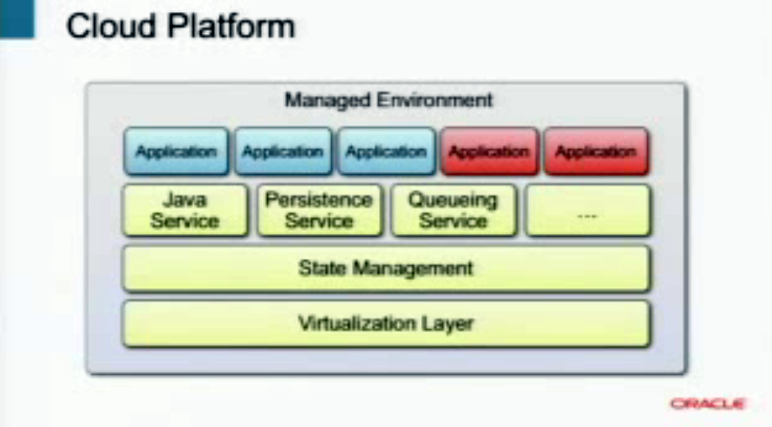

The JavaONE announcements about&nbsp;upcoming&nbsp;Java EE versions were anything but exciting. Nothing too concrete and nothing comparable to a&nbsp;road map&nbsp;or plan like Mark Reinold's presented for Java SE. But Roberto Chinnici still did some slides about Java EE.next during the JavaONE general technical session on September 18. 
 
 <b>The Future as proposed</b>
 
 Everything about the next Java EE version will be cloud support. To enable highly managed environments with scalability and elasticity and to make easy upgrades and easy patching possible. As he said, <i>"Java EE actually has a lot to offer"</i>. A container model, exposed application services, injection and consumption of services for clients and it's already scalable up to very large clusters of instances and on top of this a comprehensive security model. This is a quite fair basis for the cloud enables Java EE.next. Java EE, however, was not designed to be operated in highly dynamic environments. Clouds tend to be elastic, and most of the current computing centers are not. But as Adam Bien stated before, <i>"there is some work to be done with respect to dynamic discovery, self-healing, and dynamic load balancing."</i> (Adam Bien, July 2009, <a href="http://java.sun.com/developer/technicalArticles/Interviews/community/bien_qa_2009.html" target="_blank">tech article</a>) And this is where the requirements for the next Java EE version will arise from:
 
 - Tighter requirements for resource and state management
 
 - Better isolation between applications
 
 - Potential standard APIs for NRDBMS, caching, other
 
 - Common management and monitoring interfaces
 
 - Evolution, not revolution of the programming model
 
 Beside this, there will be a couple of packaging improvements which were presented as "Better Packaging for the Cloud":
 
 - Apps are versioned
 
 - Multiple versions can coexist
 
 - Must deal with data versioning, upgrades, etc.
 
 - Need ability to specify Quality of Service properties
 
 - Apps both expose and connect to services
 

 

A visualization of the direction in terms of architecture Java EE.next is going could look like this. The basis is a virtualization layer. Followed by state management for scalability and a number of services on top. What is called a "Java service" in the stack should be the equivalent to the existing containers. That's what runs your Java code. But there will be more services that will be formalized to provide a comprehensive platform.
 

 

The application itself will contain a number of code modules, which could be a rough equivalent to what there is today with WAR-, EAR- and JAR-files. To&nbsp;fulfill&nbsp;the requirements, the application also needs a definition of the data it uses with plans to migrate the data to be able to do upgrades. It needs security information. The application will actually grow to include more than the currently present code modules.&nbsp;One application would be sitting alongside other applications from an organization.&nbsp;And there is a need for a very strong isolation between the applications.And finally, the whole environment needs to be managed. So, there will certainly be some added features about management interfaces on both the application level, so you can manage your application and its data, but also, at the lower levels, so that platform providers can manage the infrastructure, and get it to scale accordingly.
 

 

Beside this high level stuff, Roberto also pointed out some more detailed plans:
 
 - Modularity build on Java SE work
 
 - explicit dependencies
 
 - explicit versioning
 
 - classloaders straightened out
 
 - Web socket support
 
 - standard JSON API
 
 - HTML5 support
 
 - NIO.2-based web container
 
 - JPA Language support for properties
 
 - JPA generated identity
 
 - all triggered by the @Entity annotation
 
 - Enhancements to the Criteria API, simpler queries
 
 <b>Who needs this? What does the community leaders think?</b>
 
 Seeing all this, makes me wonder, who really needs this cloud stuff. And I remembered a series, Arun Gupta did on his blog. In the <a href="http://blogs.sun.com/arungupta/tags/javaee6+community+feedback" target="_blank">Java EE 6 Feedback from Community</a> series you can learn about how Java EE 6 is currently being used in production, development and deployment environments used within the community, and even feature requests for Java EE 7. I quote the answer to the last question from each participant:
 
 
<blockquote>
 Java EE 6 brought simplicity in complex enterprise applications, and made a significant move towards web-based projects. Indeed, the Java EE 6 specification is rather focused on the Web. While there are many usecases and real-world scenarios that have the Web as the most important client, I think there should be more attention for other clients, i.e. PDA, mobile phone, TV, JavaCard. Easy integration capabilities between those low-resource devices and high-end backend system will drive the adoption of Java EE.
  
  
  From another point of view, more integration with the environment would be useful. For example, in a number of cases I would like to execute a specific EJB-call once CPU load is below 50%, or once disk usage is too high. I understand this is rather difficult to standardize in a non-platform dependent way.
  
  (Johan Vos, <a href="http://blogs.sun.com/arungupta/entry/qa_4_java_ee_6">QA#4: Java EE 6</a>)
</blockquote>
 
<blockquote>
 What I really miss in Java EE 6 is something similar to Spring Web Flow or Seam Page Flow. I hope that in Java EE 7 a new specification will come and standardize flow management (for JSF, of course, but something more general letting you manage different sorts of flows).
  
  
  Batch processing is also something missing. Spring Batch is very good and defines well known principals such as jobs, steps and so one. With EJB 3.1 there is a new Timer Service (inspired from cron and as rich as Quartz). It's time to get a Batch processing specification that can be easily scheduled.
  
  
  Security is also a difficult point. JAAS is too low level. Even if there are some improvements in the Servlet 3.0 API, there is still room to tight the platform together in terms of security.
  
  
  Packaging could also be changed in Java EE 7. We talk a lot about OSGi these days. As a developer I found it too difficult, I would like the EE 7 platform to simplify the creation of bundles (OSGi or something different but compatible). I’m also hoping that Java SE 7 will become more modular. Modularity in Java SE 7 + OSGi packaging in EE 7 would be a great combination.
  
  
  And I remember talking to Adam Bien about it, JMS hasn't changed for more than a decade, it should benefit from the novelties of the platform and get simpler.
  
  
  In a word, I would like Java EE 7 to get richer (more specs), simpler (less code to write) and more integrated (security is one example).
  
  (Antonio Goncalves, <a href="http://blogs.sun.com/arungupta/entry/qa_3_java_ee_6">QA#3: Java EE 6</a>)
</blockquote>
 
<blockquote>
 I think the specifications are more or less feature complete. Of course I can think of a lot of improvements and I believe it's important to stay up to date and integrate new approaches.
  
  
  If you look at JSF and the RI for example, I am still missing a lot of more complex components. I always find myself implementing one or two own in my projects. If you work for more restrictive enterprises, you are not always able to use the component suite of choice. If possible I still prefer to work with either RichFaces or PrimeFaces. Further on the cooperation between JSR 299 and JSR 330 should be clearer in general. The interaction between all JSRs should be taken to a next level. Clear but abstract guidelines
  
  have to be specified, who is working with whom and how. If you look at the @ManagedBean annotation for example, you have three different ways of defining beans that are managed (JSR-314, JSR-316, JSR-299). That's not exactly what I would call intuitive ;)
  
  
  Generally I would love to see the Managed Beans specification becoming the heart of enterprise java. Containers should belong to the past. Services should be available to POJOs and injected (and of course started) as needed. This could speed up the whole environment a lot and frees developers from having to implement interfaces. But the most important improvements would be administrative. Java EE 7 should put those pruning ideas forward and realy try to drop some old stuff. And finally it is time to
  
  solve all those never-ending licensing discussions about the TCKs!
  
  (myself, <a href="http://blogs.sun.com/arungupta/entry/qa_2_java_ee_6">QA#2: Java EE 6</a>)
</blockquote>
 
<blockquote>
 Further simplification and unification of the APIs would be great. The synergies of JSF 2, EJB and CDI could be a lot more leveraged. A more natural use of java.util.concurrent in Java EE would be also interesting (e.g. injection of Executors). For all of my cases @Asynchronous worked perfectly, but Executors seem somehow to fascinate developers :-)
  
  
  JPA 2.0 could be also extended with some useful features like support of resource injection (EntityManager is the most important) into JPA-entities. Its a controversial topic - but really important for projects. Also better support for stateful environments would be nice.
  
  
  I would also expect a standardized JAX-RS client. Something like jersey, but with javax.ws.rs. prefix :-)
  
  
  I’m really surprised, that actually no-one really complains over the really old JMS programming model (1997). This spec could be drastically simplified. A plain injection of a simplified queue or topic would be sufficient for &gt; 80% of all cases.
  
  (Adam Bien, <a href="http://blogs.sun.com/arungupta/entry/qa_1_java_ee_6">QA#1: Java EE 6</a>)
</blockquote>
 
 Sorry for the complete quotes (also to Arun, who did a great job doing this interviews, btw: why did you stop with it? Keep up!) but I found myself wondering, that we did not find the word "cloud" or managed services a single time. The problems the community leads are seeing, are of course more technical and detailed, than anything presented by Roberto. But the basic indication is that they don't necessarily have anything to do with running Java EE in the cloud. And yes, you can argue, that the overall platform architecture should not be driven by fine-grained technical requirements but by a long term direction. Right. You are right, but:
 
 <b>The fears</b>
 
 Or let's call them: my fears ;) are that we were witnesses of the first steps for the overall platform strategy drifting into a direction that is more product and vendor centric than aimed towards an open and multi vendor approach. Have you seen the probably biggest announcement at this years Open World? Oracle Exalogic? Also make sure, you read the <a href="http://www.veriton.co.uk/roller/fmw/entry/oracle_exalogic_initial_analysis" target="_blank">first analysis</a> of fellow ACE Director Simon. It basically is a highly optimized runtime environment for Oracle Fusion Middleware and the product itself was expected to be there way before we heard the announcement. Beside all this technical improvements it has a "Exalogic Elastic Cloud Software" layer in it's architecture. (Also see <a href="http://blog.eisele.net/2010/09/breaking-exalogic-maschine.html">this post from last week</a>.)
 

 

This is where you have to work hardest to establish what's under the covers. The "elastic cloud" software moniker is being used for a host of optimisations Oracle are building into WebLogic Server, JRockit (and presumably Hotspot), JRVE and the Oracle's optimized Linux kernel (unbreakable linux), JDBC and OVM.
 
 Looking at the presented ideas for Java EE.next and the Exalogic I get a strange feeling. This does fit too well to be an "accident" at all. But I leave this up to your thoughts and I would be happy to hear about your fears.
 
 
 To finish with more positiv thoughts. The Java EE 6 Panel <a href="http://blogs.sun.com/alexismp/entry/javaone_2010_java_ee_6" target="_blank">"What do we do now?"</a> gave a more detailed look and discussion about the future of Java EE than Roberto did on a&nbsp;high level&nbsp;in his keynote.