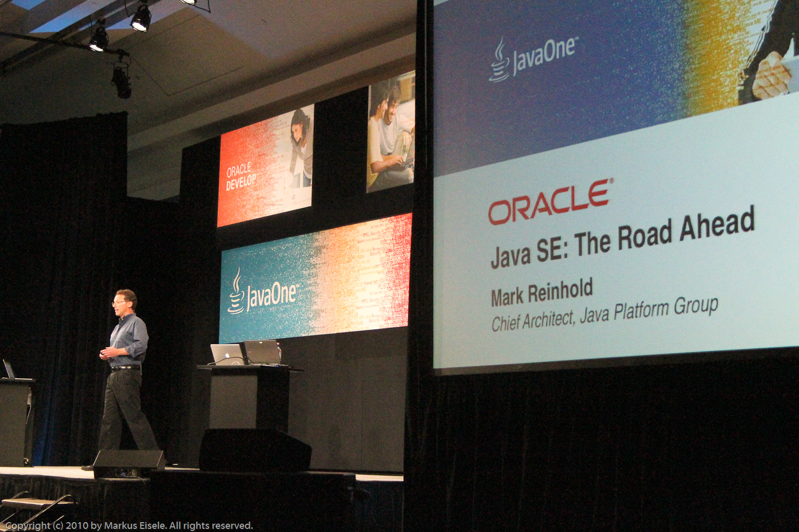

Another JavaONE followup. After I blogged about <a href="http://blog.eisele.net/2010/09/java-eenext-cloud-exalogic-some.html">what's going to happen with Java EE</a>, it is time to recall what was said by Chief Architect, Java Platform Group, Mark Reinhold on the same general technical session on September 18.
 
 After having the Java SE 6 release shipped in 2006 there had been several plans for Java SE 7. The last plan Sun was in charge of was to ship in 2010. This was before the Sun down. It’s been clear for some time that the most recent JDK 7 development <a href="http://blogs.sun.com/mr/entry/rethinking_jdk7">schedule is unrealistic</a>. The schedule was created over nine months ago, prior to the acquisition of Sun by Oracle. The post-acquisition integration process took longer than expected. 
 

 

 <!--more-->The most important quote from Mark's session was:
 
<blockquote>
 It will get the platform moving again, and that's good news. So, in answer to the question I posed at the beginning, <b>7 has moved to 2011. 8, we can expect in 2012</b>. I won't make any guesses about 9, but the current hint is to have releases on a more<b> regular cadence every 18, 24 or maybe 36 months</b> at the outside. A platform like Java, in order to stay alive, needs to keep moving. We are going to keep it moving.
  
  [...]
  
  We are <b>still doing</b> all of this <b>in OpenJDK as before</b>. We are <b>retaining the GPL version 2 license</b>. There are no plans to change this, and <b>we intend to submit JSRs for Java SE 7 and Java SE 8</b> and the relevant component such as Lambda and Coin as necessary.
  
  (Mark Reinhold, JavaOne 10)
</blockquote>
 <b>Main feature categories</b>
 
 To make this more concrete, Mark mentioned the following main feature categories for 7,8 and even 9:
 
 - Productivity
 
 Java is a fairly productive language already, but there are things that can help you get more done with less code.
 
 - Performance
 
 HotSpot and JRockit have very competitive performance from all the major VMs right now, but multi-core processors are still not supported like they should. Java can help with that. 
 
 - Universality
 
 The Java VM, is not just for Java anymore. There are a lot of other languages that need support.
 
 - Modularity
 
 Modularity, the platform is big. Applications are constructed with these brittle class paths, full of JAR files that are difficult to diagnose debug and construct. That should be fixed. 
 
 - Integration
 
 Java, from its beginning, has tended to be in its own sort of a little black box, and not relate particularly well to the underlying platforms upon which it is found. This should change.
 
 - Serviceability
 
 People routinely deploy thousands of VMs across thousands of machines that need some way to manage them all, and in particular, some way to diagnose a problem in a running system, that wasn't necessarily configured at startup time to be diagnosed in any special way. 
 
 

 

<b>Java SE 7 (Mid 2011)</b>
 
 This is the list of features being developed by Oracle, and others, for OpenJDK 7. When the Java SE 7 Platform JSR is submitted then these features will be proposed therein:
 
 - <a href="http://jcp.org/en/jsr/summary?id=292">JSR 292</a>: Support for dynamically-typed languages (InvokeDynamic)
 
 - JSR TBD: Small language enhancements (Project Coin)
 
 - Strict Verification
 
 - Parallel Class Loaders
 
 - Phasers
 
 - Transfer Queues
 
 - <a href="http://jcp.org/en/jsr/summary?id=203">JSR 203</a>: More new I/O APIs for the Java platform (NIO.2)
 
 - Unicode 6.0
 
 - Enhanced Locales
 
 - SDP &amp; SCTP
 
 - TLS 1.2
 
 - ECC
 
 - JDBC 4.1
 
 - XRender Pipeline
 
 - Swing JLayer
 
 - Swing Nimbus
 
 <b>Java SE 8 (Late 2012)</b>
 
 Following features have been delayed and will probably be included into the Java SE 8 version:
 
 - JSR TBD: Project Jingsaw
 
 - JSR TBD: Project Lambda
 
 - <a href="http://jcp.org/en/jsr/summary?id=308">JSR 308</a>: Type Annotations
 
 - Bulk-Data Operations
 
 - Swing JDatePicker
 
 - Collection Literals
 
 <b>Interpretation</b>
 
 It's good to have a roadmap again and the idea to come back to a regular cadence of releases. It's now on Oracle to prove that they can hold the promises. The not changing support for the OpenJDK and the general JCP is a sign, we all were waiting for. Also positive the non changing GPL version 2 license for the OpenJDK. 
 
 But there are still many many things left open. In general all the presented information were public and available since some time. Only the final commitment was missing. This is done now. But what about the other parts, the community is still worrying about e.g. the needed canges and/or Improvements to the JCP? Or the "Google Case"? Some questions still are open and need to be answered by the new steward of Java.
 
 
 If you like, you can also watch the OTN TechCast replay. Mark talking about the JDK 7 roundup:
 <object classid="clsid:D27CDB6E-AE6D-11cf-96B8-444553540000" codebase="http://download.macromedia.com/pub/shockwave/cabs/flash/swflash.cab#version=9,0,47,0" height="322" id="flashObj" width="486"><param name="movie" value="http://c.brightcove.com/services/viewer/federated_f9?isVid=1"><param name="bgcolor" value="#FFFFFF"><param name="flashVars" value="videoId=66865647001&amp;linkBaseURL=https%3A%2F%2Fchannelsun.sun.com%2Fmedia%2Fshow%2F15028&amp;playerID=1640183659&amp;playerKey=AQ%2E%2E,AAAAAFcSbzI%2E,OkyYKKfkn3za9MF0qI3Ufg1AerdkqfR3&amp;domain=embed&amp;dynamicStreaming=true"><param name="base" value="http://admin.brightcove.com"><param name="seamlesstabbing" value="false"><param name="allowFullScreen" value="true"><param name="swLiveConnect" value="true"><param name="allowScriptAccess" value="always"><embed src="http://c.brightcove.com/services/viewer/federated_f9?isVid=1" bgcolor="#FFFFFF" flashvars="videoId=66865647001&amp;linkBaseURL=https%3A%2F%2Fchannelsun.sun.com%2Fmedia%2Fshow%2F15028&amp;playerID=1640183659&amp;playerKey=AQ%2E%2E,AAAAAFcSbzI%2E,OkyYKKfkn3za9MF0qI3Ufg1AerdkqfR3&amp;domain=embed&amp;dynamicStreaming=true" base="http://admin.brightcove.com" name="flashObj" width="486" height="322" seamlesstabbing="false" type="application/x-shockwave-flash" allowfullscreen="true" swliveconnect="true" allowscriptaccess="always" pluginspage="http://www.macromedia.com/shockwave/download/index.cgi?P1_Prod_Version=ShockwaveFlash"></object>