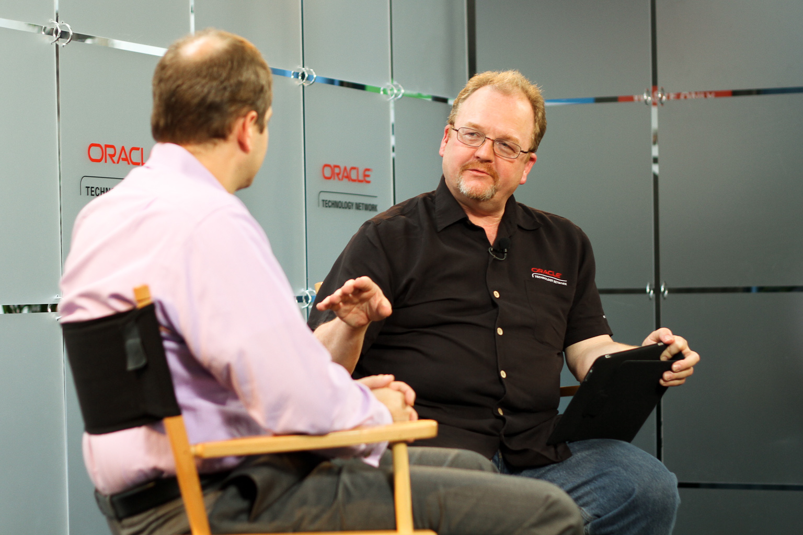
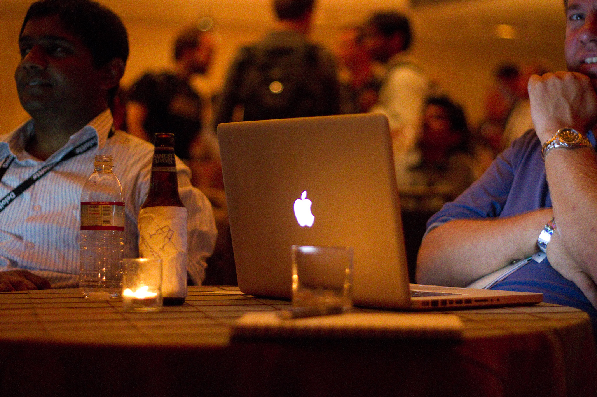

A few days after being back in Germany I finally found the time to do a review about this years mega Oracle and Java event which happened from September 19-23 in San Francisco.
 
 As always, I already found a <a href="http://blog.eisele.net/2010/09/day-8-bad-and-ugly-at-oow-javaone10-and.html">couple of things, that did not work for me</a>. But in general it was simply awesome.
 
 First of all, there are the plain numbers, that are impressive:
 
 - 64,346 hotel room nights
 
 - Over 20.00 man hours for setup
 
 - 220 feet of screens in keynote hall
 
 - 3,622 Oracle experts
 
 - 59,000 lunches
 
 - 141,000 cups of coffee
 
 - 275 miles of network cable
 
 - 1,073 switches
 
 - 182,000 sq ft of tents
 
 - 1,735 customer and partner speakers
 
 - 1,394 product demos
 
 - 56 Java&nbsp;Rockstars&nbsp;and roughly 70 ACE Directors
 

 

With about 41k attendees this is by far the largest developer event happening in the world. And it is impressive to see the masses floating around in Moscone and between the JavaONE hotels. Seeing all this, it seems impossible to create an event of that size. But they did it. And it simply was impressive.
 
 What I liked the most (order does not necessarily&nbsp;corresponds&nbsp;to the importance)
 
 - The ACED Briefing at the Oracle HQ
 
 - The general technical sessions
 
 - Meeting Java EE 6 and GlassFish people
 
 - The ACED Dinner
 
 - The Meet-And-Greet with the Java Champions
 
 - Catching up with other "Twitter-Faces" in real life
 
 - Meeting the OTN Team (Justin, Bob, Vikki, Lillian, Tod and many more :))
 
 - The technical sessions from JavaONE
 
 - Meeting Oracle PMs around my fav topics (OEPE, GF, WLS)
 
 - The parties ;)
 
 - Meeting User Groups people (ODTUG, DOAG, UKOUG)
 
 - Having a good feeling about Java SE 7 -9 again ...
 
 
 I am really looking forward to next years event. The kicks will hopefully be fixed than and I would love to see all the amazing people back on the session schedule, who missed this years JavaONE because of political trouble. Here are some more impressions taken during the conference.
 

 

  

 

 

 

 

 

 

 

 

 

