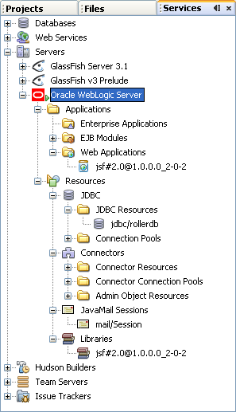
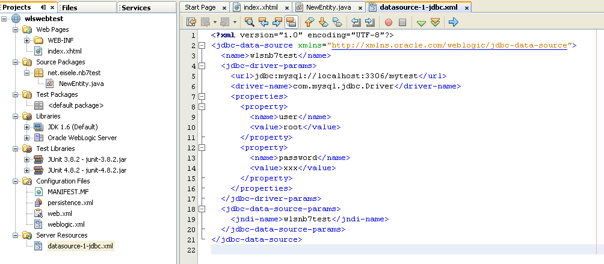
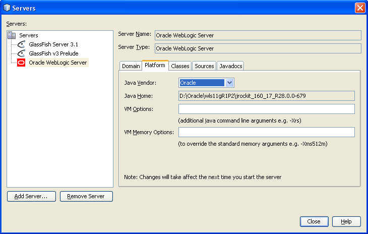

The NetBeans folks have been busy working on their next release: <a href="" target="_blank">Milestone 2 of NetBeans 7</a> is now available and it has a lot to offer: 
 
 - Java EE 6 enhancements, 
 
 - support for GlassFish 3.1 and 
 
 - Oracle WebLogic Server
 
 For a complete list of new features, you should check out the <a href="http://wiki.netbeans.org/NewAndNoteworthyNB70" target="_blank">new and noteworthy page</a>. This post is about all the new WebLogic Server features available.
 
 <b>The past</b>
 
 NetBeans always has been the development tool for GlassFish and Tomcat. With Oracle taking over control and committing their support, it was obvious, that WLS will follow. This happened early with NetBeans IDE 6.10 Milestone 1. As of todays M2 the support grew significantly. 
 
 If you are willing to try it out, get started today. Grep your copy of NetBeans and install it to your favorite location. Start with a new Webproject and select "Add" next to the serverruntimes shownn (GlassFish, of course). Next is to browse for your WLS install. Remember not only to point it to the %HOME% but directly to the server folder (e.g: D:\Oracle\wls11gR1P2\wlserver_10.3). Click next and choose a domain and enter admin user and pwd. A final click on "finish" will close the wizard and lets you go on with the webproject creation.
 
 <!--more-->
 

 

<b>Server libraries</b>
 
 If you decided to enable your webproject with JSF you already came across the first new feature. The wizard let's users choose which server library to use. As expected, you get the choose between the 1.2 and 2.0 RI and MyFaces implementations (at last with the latest 10.3.3.0) . If you selected a library that is not already deployed to the server, NetBeans will do this for you. But it needs to start the server for you to do this. This is tightly integrated and starting and stopping works very smoothly from the output window.
 
 <b>Server Nodes</b>
 

 

The services tab now shows all relevant server node information for the configured WebLogic server. A right click on the server node let's you start, stop the server in normal, debug and profil mode. You can also restart the running instance or view the admin console (in the system browser) or the server log in the output window. Clicking through to the applications you can start, stop and undeploy the selected one with your context menue. You can even unregister JDBC resources. Connectors, JavaMail Sessions and Libraries seems to be read-only information view at the moment. But it looks very nice and integrated now. Even if I am closer to Oracle in general I am still not feeling very comfortable with the red Oracle WLS icon. If I could make a proposal to the PMs. Please check, if you could come up with a less prominent version :)
 
 <b>Datasource creation and deployment</b>
 
 If you project needs a database and this is created by NetBeans the datasource configuration and deployment is now handled automatically. Just add, what you need to add (JPA Entity) and click your way through the wizards. If it happens to ask you for a database and offers a "create new" button. Click it. After entering all needed information you will see a new Folder added to your project. This is called "Server Resources" and it shows all your database definitions. When the application is being deployed the datasource is deployed as well.
 

 

 
 You can verify this by clicking through to the server node and listing your JDBC Resources. It's there and created. Great job!
 
 <b>Developer enhancements</b>
 
 Always a big topic. NetBeans now uses directory based deployment (exploded directory deployment), deploy on save. The IDE will use directory based deployment so no redeployment is needed when changing the web resources. The deployment is also much faster. Together with deploy on save no explicit action is required to push the source code changes to the server. But I am still wondering why they did not utilize the "Fast Swap" feature. The final topping is the improved properties dialog with editable username, password and a selectable JVM. You now are able to choose between Sun and Oracle (*biglaugh*) which let's you choose between HotSpot and JRockit.
 
 

 

 <b>Summary</b>
 
 A lot has been done. It feels very easy to have your WLS working with the latest M2. And it looks very stable already. And I am very looking forward to the final realase which is planned for March 2011.