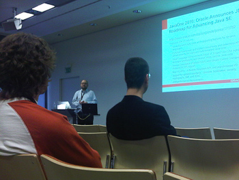
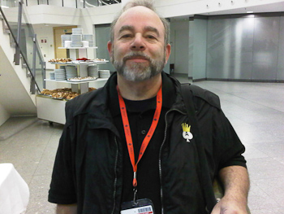
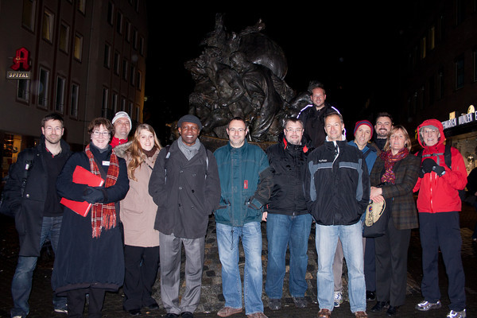

It started yesterday. The DOAG 2010, the German Oracle Usergoup Conference. After a very quick ride by car (it is held in Nuremberg which really close to Munich) I did my check-in things and tried to make me comfortable with everything which is going on. I again had the luck to walk around with Björns cam. A big Thank you for this! Will process the images afterwards and post them to my flickr account. The first day way packed with personal meetings. Catching up with people, you haven't seen for some time is great. A special thanks to <a href="http://twitter.com/#!/robilad">Dalibor Topic</a> (<a href="">blog</a>) who was giving a nice overview about the things to come with JDK 7.
 

 

As you already know, there are a couple of aces with the DOAG conference this year, too. I meet Daniel, Stanley and many more German aces around. 
 

 

 

 
 For some of our international guests there was a sightseeing tour later on. DOAG was so kind inviting me to join and this is how it look like, if a couple of Oracle related guys walk through Nuremberg during evening times freezing their hands off at rainy 7°C. (Thanks to Ronald Bradford for this awesome picture!)
 

 

After a nice dinner and some drinks it finally was time to go to bed. A quick twitter and email check revealed a surprise. Around midnight Oracle filled four new JSRs. Java SE 7 and Java SE 8 among them. Reading this, it was totally clear to me, why Dalibor was smiling at me a few hours ago, when I asked him about the time frame for the JSR submission ;)
 
 
<ul style="line-height: 16px; margin-bottom: 1ex; margin-left: 0em; margin-right: 2em; margin-top: 1ex;">
 <li style="list-style-type: square; margin-bottom: 0ex; margin-left: 0ex; margin-right: 0ex; margin-top: 0ex;">
  

   <i><a href="http://jcp.org/en/jsr/detail?id=334" style="text-decoration: none;">JSR 334</a>: Small Enhancements to the Java Programming Language</i>, by&nbsp;<a href="http://blogs.sun.com/darcy/entry/project_coin_jsr_filed" style="text-decoration: none;">Joe Darcy</a>&nbsp;with help from&nbsp;<a href="http://blogs.sun.com/jjg" style="text-decoration: none;">Jon Gibbons</a>,&nbsp;<a href="http://blogs.sun.com/mcimadamore" style="text-decoration: none;">Maurizio Cimadamore</a>, and many others in&nbsp;<a href="http://openjdk.java.net/projects/coin" style="text-decoration: none;">Project Coin</a>;
  
</li>
 <li style="list-style-type: square; margin-bottom: 0ex; margin-left: 0ex; margin-right: 0ex; margin-top: 0ex;">
  

   <i><a href="http://jcp.org/en/jsr/detail?id=335" style="text-decoration: none;">JSR 335</a>: Lambda Expressions for the Java Programming Language</i>, by&nbsp;<a href="http://blogs.sun.com/briangoetz" style="text-decoration: none;">Brian Goetz</a>&nbsp;with help from&nbsp;<a href="http://blogs.sun.com/abuckley" style="text-decoration: none;">Alex Buckley</a>, Maurizio, and others in&nbsp;<a href="http://openjdk.java.net/projects/lambda" style="text-decoration: none;">Project Lambda</a>;
  
</li>
 <li style="list-style-type: square; margin-bottom: 0ex; margin-left: 0ex; margin-right: 0ex; margin-top: 0ex;">
  

   <i><a href="http://jcp.org/en/jsr/detail?id=336" style="text-decoration: none;">JSR 336</a>: Java SE 7 Release Contents</i>, for the enormous team effort that is&nbsp;<a href="http://openjdk.java.net/projects/jdk7" style="text-decoration: none;">JDK&nbsp;7</a>&nbsp;(the first half of&nbsp;<a href="http://blogs.sun.com/mr/entry/plan_b_details" style="text-decoration: none;">Plan&nbsp;B</a>); and, finally,
  
</li>
 <li style="list-style-type: square; margin-bottom: 0ex; margin-left: 0ex; margin-right: 0ex; margin-top: 0ex;">
  

   <i><a href="http://jcp.org/en/jsr/detail?id=337" style="text-decoration: none;">JSR 337</a>: Java SE 8 Release Contents</i>, for the eventual JDK&nbsp;8 (the rest of&nbsp;Plan&nbsp;B).
  
</li>
</ul>
 
 Today is my first talk at 10:00 (room: Riga). I am giving a brief overview about the Java EE 6 specification and try to present some Samples with NetBeans. If you are there, I would be happy to meet you in person.