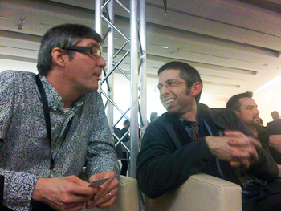
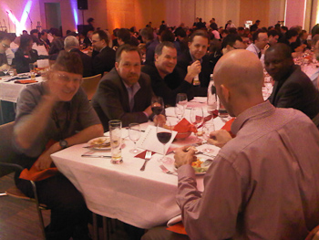

The second day at the 2010 DOAG conference started more or less in time. After a longer evening it needs some discipline to get up early to be at a 10:00 talk. I arrived timely and had some time to get a last minute glimpse at my slides and even check network connectivity and other details.
 

 

The talk itself was awesome. About 30 people listening to my very slideful ( :-( ) introduction to the umbrella JSR 316 (Java EE 6). Even if I tried my best it's simply not possible to introduce a complete set of roughly 30 specifications in 30 minutes. I guess I did a not too bad job. I totally missed pointing the attendees to all the other detailed sessions about single specifications around. I'll promise I'll do better next time. Thanks for all that were listening. I guess I lost nobody and even used NetBeans M7 to demonstrate a simple Servlet calling an EJB. Not the world, but best I could do in this short time. After that I walked around and took some pictures. I hope to get them during the day. They are still on the card with Björns cam. As usual I am trying hard to publish as many impressions I took during the next days.
 
 The afternoon was dedicated to the Q&amp;A preparation with German Oracle management. It always takes some time to get this right and working. Me being one among others who prepared parts of the topics and questions I had to sit in the first row. Always in reach of the microphone to jump in helping the moderator if needed. I was not needed. Thanks for that. The SIG Java lead Andreas did a great job. Also did the moderator of the session which started at 17:00.
 

 

After that it was time to relax and get ready for the community evening. Ed Burns arrived in between and I was happy to finally meet him again after JavaOne. I did not know he speaks German very well. He&nbsp;promised&nbsp;to be there at 19:00 for the party. And he showed up in time. We did a quick walk through. Listened to some Jazz and meet some people out there. The food was awesome and there was plenty to drink out there. Beside him some other fellow guys joined us from time to time. Here are some impressions:
 

 

 

 

Some people in the pictures: Tom Kyte, Steven Feuerstein, Ed Burns, Simon Haslam, Todd Trichler .... it was an awesome evening.
 
 Today is my last day at the conference. I am giving my last talk at 14:00. If you make it, I would be glad.