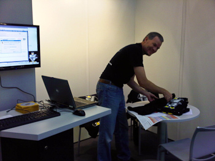

My last conference day started not too early. Ed and me had an eigth o'clock breakfast appointment and we drove to the ccn afterwards. So we managed to see the first sessions starting at nine. I was not feeling like taking pictures that day. I simply carried my bag around and tried to focus. Which was not too easy. Anybody was looking tired and asking around how long the evening was for them you get surprising answers. Some hardly did get any sleep. A big surprise to even see them again in the early morning looking reasonably awake. My first stop was at Ed's keynote. He was brilliant on stage and I love listening to him.
 

 

After that I meet up with Christian Kirsch and Alexander Neumann. Both from heise.de. We talked about different projects to come and evaluated some oportunities for future work together. If you did not know by now: I like the way heise publishing is doing their job. Very professional and supportive editors give you a great time as an author. This happened around lunch time. My second talk was all about migration. At 14:00 I was answering the question how to migrate J2EE to the new Java EE specifications. What to keep in mind; which version or appserver to choose and which pitfalls to avoid. The talk was not that packed as the one yesterday. Maybe it was because Steven Feuerstein gave his keynote in parallel. What a pity for me.
 
 I left the conference right after the talk. Beeing tired and wiped out it was time for me to take the ride back. Two hours by car to get to munich is not the best time you can do for this distance but it's ok. At the end I was happy to have my girls back and finaly have some time to spend with them in the late afternoon.
 
 
 To make it short: I always enjoy the Doag conference. There are many reasons for that. First I like to see the people enjoying the program we created for them. Especially this year it was very hard to get that many good speakers and talks for the Java stream as both Devoxx and WJAX happened at the same time. I spoke to some of the speakers and some even made at last two conferences this week. If I could make a wish, I would love to see all three happening on different dates. Devoxx is something I like to attend, too next year.
 
 The second reason is, that I like the location. The CCN is perfect for the size. All in one location on different levels. You start knowing about the rooms the second day and the tracks try to use the same rooms over and over again. That is easily navigable. 
 
 Third reason this year are the many high quality foreign speaker we had. So many ACE's, Oracle's and other guests have been on the program that it was nearly a three day English speaking conference for me. I enjoyed having OTN there. Todd did an awesome job and I would like to thank the OTN team for making this possible and for following our invitation!
 

 

In general it is easy to say, that the Oracle support was&nbsp;gorgeous. Oracle itself does not sponsor the conference with anything but speakers and their booth in general (which is a very important part for an independent German Oracle Users Group). But they were listening. Not only during the Q&amp;A session but also&nbsp;in between. The feedback they received from their users is valuable and it's a pleasure to see them noticing this and taking care.
 
 
 I would like to close with some very famous words from a well know Austrian-Amerikan: DOAG, "I'll be back!" next year! Looking forward to it!