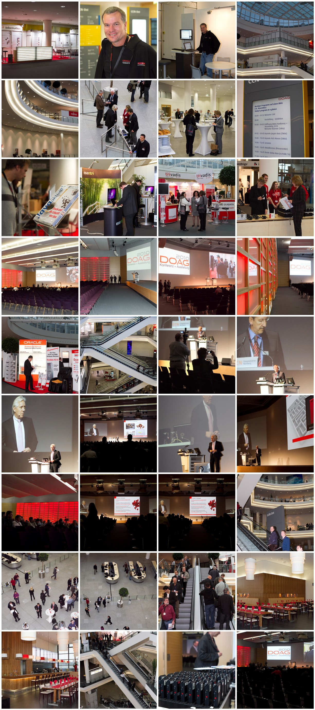
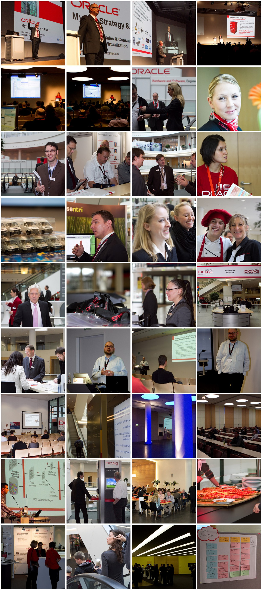

A week after, the images arrived. And I found some time to do the postprocessing. This is what came out after walking around with the 7D of Bjoern and the speedlight and lenses from Bernd. A big "Thank you guys!" for letting me use your equipment! It's a pleasure to have great tools at hand :) Maybe .. sometimes I get my own stuff ...
 
 Get the details at <a href="" target="_blank">flickr/myfear</a>.
 
 