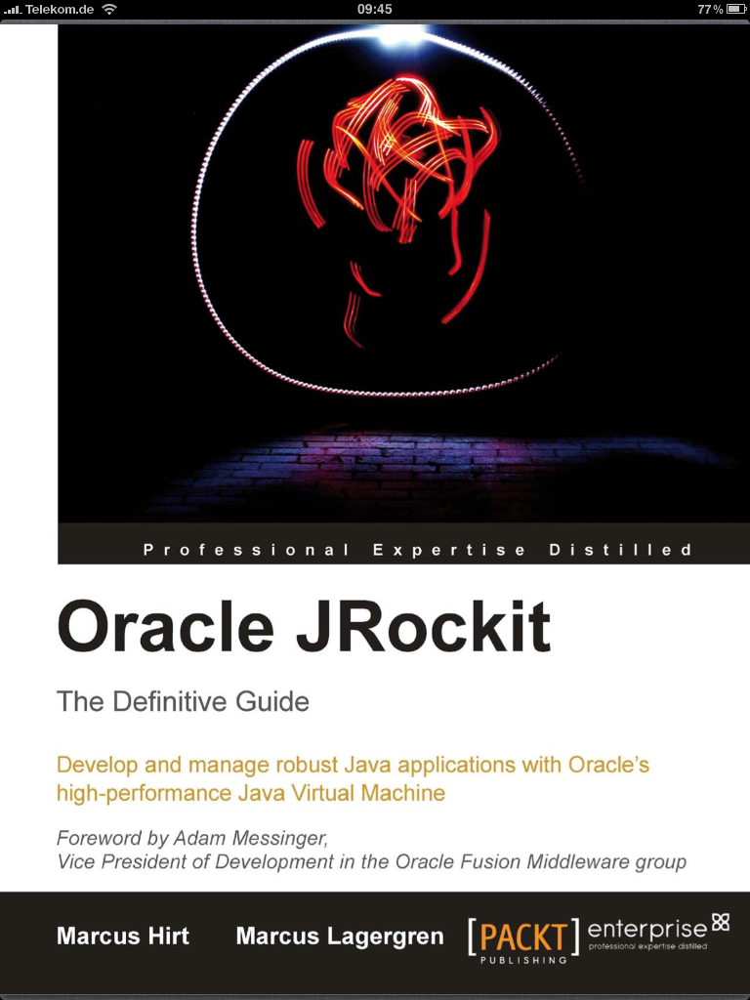

This one was on my list of things to buy for quite some time. The only reason for this is simple: Oracle JRockit is one of the industry’s highest performing Java Virtual Machines and I loved it's JIT everything approach since the beginning. I did not manage to do this, since it was published. But a few days ago, the digital edition arrived on my iPad and I finally found the time to read it. Sit back and relax. This is my personal view about the most stunning Java related book of 2010!
 
 
 Book: <a href="https://www.packtpub.com/oracle-jrockit-the-definitive-guide/book">Oracle JRockit - The Definitive Guide</a>
 
 Language : English
 
 Paperback : 588 pages [ 235mm x 191mm ]
 
 Release Date : June 2010
 
 ISBN : 1847198066
 
 ISBN 13 : 978-1-847198-06-8
 
 Author(s) : Marcus Hirt (<a href="">Blog</a>, <a href="http://twitter.com/#!/marcushirt">Twitter</a>, <a href="">Website</a>), Marcus Lagergren (<a href="http://twitter.com/#!/marcuslagergren">Twitter</a>)
 
 

 

<b>The Authors</b>
 
 As usual, I start with a short introduction of the authors. In this special case, I feel this is very important to understand the book. Both started out with Appeal Virtual Machines where they were founders. This was the company, which initially developed JRockit. Marcus Lagergren holds a M.Sc. in computer science from the Royal Institute of Technology in Stockholm, Sweden. He has a background in computer security but has worked with runtimes since 1999. Marcus has been team lead and architect for the JRockit code generators and has been involved in pretty much every other aspect of the JRockit JVM internals. Since 2007 Marcus works for Oracle on fast Virtualization technology. 
 
 
 Marcus Hirt is currently working for Oracle as Team Lead, Engineering Manager and Architect for the JRockit Mission Control team. Marcus has been an appreciated speaker on Oracle Open World, eWorld, BEAWorld, EclipseCon, Nordev and Expert Zone Developer Summit, and has contributed JRockit related articles and webinars to the JRockit community. Marcus Hirt got his M.Sc. education in computer science from the Royal Institute of Technology in Stockholm.
 
 
 Both have a very stunning vita and I am really sad, that I still did not manage to meet them. Something I'll definitely try to catch up with in 2011.
 
 <b>The Content</b>
 
 Java developers are always on the lookout for better ways to analyze application behavior and gain performance. As we all know, this is not as easy as it looks. If you are trying to understand more about all this you need to know far more than simple Java. The big things in terms of performance happen elsewhere: In the JVM. If you are looking for the best Server JVM out there, you'll come across JRockit. And this book is there to reveal it's secrets. This book helps you gain in-depth knowledge of Java from the JVM’s point of view. It explains how to write code that works well with the JVM to gain performance and scalability. 
 
 
 The first chapter get's you started. You learn about the real basics. Cmd-line options and JRockit versioning. The real content starts with chapter 2. It brings you down to the inner workings of the JVM and the adaptive code generation ürinciples. If you are not used to assembly code examples, you will learn it. Examples are explained with bytecode and assemly code. If necessary instruction by instruction. Further on, code generation strategies, JIT compiling and runtime optimizations are explained as concepts with additional JRockit details. Chapter 3 takes you over to adaptive memory management. Here you will learn about the basics of heap management and garbage collection algorithms. Also scaling and performance are touched here. You get a glimpse at pitfalls and things, that will not work. Chapter 4 follows with everything about threads and synchronization and topics that are hard to debug and difficult to optimize. You get a more detailed look at special JRockit flags which help optimizing the topic. Chapter 5 gives your everything about benchmarking and tuning. You get basic hints about what to think about while creating a benchmark and about which measures to take. It also contains a brief overview about industry-standard benchmarks. After that you get to know about common bottlenecks and how to avoid them. Chapter 6 presents an overview about the JRockit Mission Control. Followed by chapter 7 which dives into the management console, touching MBeans, the runtime and further topics. The runtime analyzer is detailed in chapter 8. Learn about the recordings and how to analyze them in terms of memory, code, threads/locks and latency findings. As expected the flight recorder follows in chapter 9. Another JRockit tool, the memory leak detector is the major player in chapter 10. Chapter 11 dives into the JRCMD cmd-line utility and shows how it can be used for listing and sending diagnostic cmds to one or more locally running instance of the JVM. It's an alphabetical reference guide to the JRCMD commands. Chapter 12 contains everything you need to know about using the JRockit management APIs by showcasing examples. The last chapter 13 summarizes the basics about the JRockit Virtual Edition and gives some basics about the challenges by virtualizing Java. If needed you can dive deeper with the bibliography or even look through the glossary or index. 477 pages of content without the preface and the appendix is a big hit for your weekend. You better have some very silent times to follow this stuff!
 
 <b>Writing and style</b>
 
 As you might have guessed already: I am impressed by the book. Being used to read complex and detailed stuff which takes time, I really flew through this book. You get used to the direct and technical style very easy and it's still personal enough to be interesting so you keep on reading page after page. Even non native speakers should be able to follow, if they know the technical terms. I needed to lookup some very uncommon and hardware near things but this did not disturb the overall reading experience. 
 
 This was my fist eBook as PDF from Packt Publishing and I am not sure, if I am still willing to have the printed version, too. The many assembly and other code examples always makes you want to scroll back. If you are using a book you just need your thumb to solve this problem :) But I still like the digital reading experience in general. 
 
 <b>My expectations</b>
 
 The structure is a bit different from the one I expected. The tooling around JRockit is covered a lot; something I wasn't expecting. But this is the only part, that did not fulfill my expectations. Especially because even those parts are excellent. 
 
 I expected to read some very technical content. But it was far more than that. It goes down to the metal and handles and registers and the JVM internals. If you thought, you know anything about the inner workings of a JVM ... here is what really happens. Don't ask what you can do for your JVM; ask, what your JVM can do for you :)
 
 <b>Conclusion and recommendation</b>
 
 Buy one! No .. better two! The digital edition and of course the paperback. It's worth it. If you have both, you can always carry the digital edition around and recall the basics and optimizations to yourself every time you think about writing optimized code for the JVM. Make shure, you have a silent place to read this one. And you should get a recent JRockit R28 to play around with. I wrote articles about it and I have seen it in the wild since some time. I thought I know a bit. Now, I know even more!
 
 If you are a beginner, you probably need some more basics before reading this one.