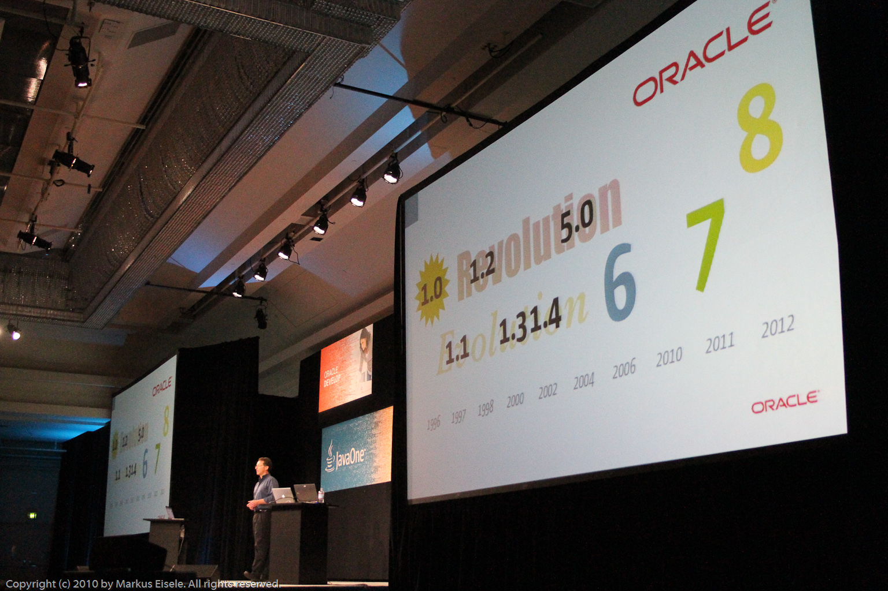

Kevin asks in his recent <a href="http://home.java.net/poll/what-do-you-think-about-current-pace-java-7-java-8-development" target="_blank">Java.net poll</a> what do you think about the current pace of Java 7 / Java 8 development? It's not finished today and only 163 votes were given, but I'll try to explain what I think about the past, pace and what should happen in the future.
 
 <b>the past - of Java</b>
 
 Java came on the scene in 1996. It was all very exciting, very energizing. And Sun kept shipping releases on a fairly regular basis for quite a while. 1.1 came out in 1997. 1.2 in 1998, 1.3 in 2000. 1.4 shipped in 2002. 5.0 shipped in 2004 and the last feature release shipped by Sun was Java 6 in 2006. 
 

 

 <b>the pace and time - in general</b>
 
 It is an age-old experience that we do certain things because they have to be done at specific times. Initially unwritten laws, which determined what to do and when to leave is. These laws were mostly derived from the necessities of nature or the culture. This experience of time is called "<a href="http://en.wikipedia.org/wiki/Kairos" target="_blank">Kairos</a>" by the ancient Greeks. Everyone knows you can be as important to the proper choice of the moment: when we mow the meadow or to invest in new project and other examples. Today we can and must increasingly decide when and what to do and when not. But beside "Kairos" we also depend on "<a href="http://en.wikipedia.org/wiki/Chronos" target="_blank">Chronos</a>", the time we can actually measure and that may be appropriate or not. While chronos is quantitative, kairos has a qualitative nature. Everything depends on your own speed. Or the speed of the organizations you are working. Whenever you are going on even slightly higher speeds than your personal adjustmens to Kairos and Chronos recommend, you will experience the consequences. You have to spend more power than would have been good. Doing this for quite some time even could make you sick.
 
 <b>But wait ... how does this map to java releases?</b>
 
 I know, this sounds very metaphysical and you expected to hear about development stuff. Let's look at how the pace of Java happend to be in the past. It seems as if it followed some kind of a pattern. The odd numbered ones tend to be evolutionary with very few new stuff, but mostly clean-ups and stabilization. The even numbered ones tended to have revolutionary, big things in them. Even if Mark said in his general technical session at J1, that it was not intended to have this kind of pattern in the releases, it was there. An indication of "Kairos" working? I don't know. And please, don't follow that I am heavily involved into any kind of metaphysical stuff in general :) But what I do like to point out is, that I strongly believe that there is a right pace for everything. I am not talking about the right time to do things, but about the speed and release cycles over time. And I believe, that we all have seen this in the past. Start two completely equal projects at the same time with the same setting and force one to be quicker at about 10% of the other. You will most likely see it failing while the other one was ready in time. I am shure, you can find other and better examples.
 
 <b>but we have had long four years silence now - not enough?</b>
 
 Java stood still for years now. More or less exactly four. The double of what "Kairos" had done until 6.0. This should have been a sufficient timeframe for everybody working towards the 6.0 and leaving everything behind. But if you look into the field, you can find lots of 1.4 and 1.5 Versions around. What happened? Was 1.6 too unsexy? Wow .. no ... it was! Were people and companies happy with what they had with 1.4/1.5? I guess not! But it seems as if the missing successor gave them the time to readjust to their own pace and to catch up with the powers lost on the way. Even before the first rumors about possible timelines of Java 7 and 8 came up, the first projects started to move again. It was simply time to do the right thing again. 
 
 <b>was time lost?</b>
 
 Comming back to Kevin's poll, the majority of voters think, that a lot of time was lost, but that we're back on track now, having the new JSRs in place and a timeline for Java 7 and 8. But was this realy lost time? There are two sides to this. From the metaphysical points I gave you above: not a single minute. But from a technology point of view I agree with the majority. Some of the most needed advancements have been delayed and Java itself has to catch up with a lot of progress done by other programming languages. 
 
 <b>how will Kairos influence Java's future?</b>
 
 What happened with Sun was special. A product without a long-term plan is something I personaly could not imagine to see with Oracle. So they are probably taking out Kairos from the equation. But I still think, that they could learn from what happend in the past. The sucessfull release plan from the past allows for some recommendations to a bright future. They are very personal and I would love to discuss them with anybody out there, so please comment and discuss:
 
<ul>
 <li>New Releases every two (!) years</li>
 <li>Follow the even/odd system</li>
 <li>Do continous security updates (monthly or on ASAP)</li>
 <li>Invest in migration (help people getting to newer versions faster and easier)</li>
 <li>Decouple parts and allow version mixes (don't force people to learn all the new stuff at once)</li>
</ul>