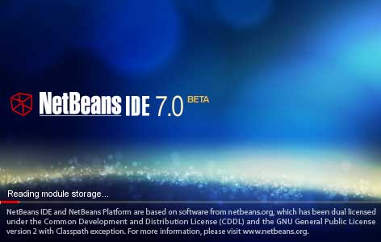

I have spend a couple of hours with Java EE 6 since December 2009 and now it finally seems as if the time is right for doing the first real Java EE 6 project. Beeing an Eclipse advocate for years now, Java EE 6 and the IDE support made me think about NetBeans (again). I guess, I used the 3.x in the past and was happy but switched to Eclipse because of the fast growing infrastructure and the number of available plugins. Being in need of Java EE 6 support everything changed. The first bits are out for Eclipse, but I need the full stack. And there is probably no better place to look at, than NetBeans. Here we go. This are the findings from our first steps for using NetBeans in a larger development team. Thanks to Wolfgang for figuring out all this, and thanks to the NetBeans Team (Jesse, Antonin, Petr) for listening to our questions!
 
 <b>Why you should care!</b>
 

 

Having a small team at hand this is nothing but a big deal. You talk about the prerequisits and everybody installs the stack. If you are trying to run a midsize or even large development team, you are in need of a defined, structured and preconfigured development environment. There are many reasons for this. First is the time. You don't want: 
 
 - everybody to spend a day or two on installing, reading and configuring his IDE.
 
 - different versions around (IDE itself, plugins, server, java)
 
 - different templates, code check configurations or settings around.
 
 And you probably want to be able to scale the team to your needs. One important part of this is a simple and easy development environment and project setup.
 
 <b>Which parts?</b>
 
 In the past, I used to have some archives around with preconfigured Eclipse bundles. They contain different plugins and configurations. One of them was chosen for a new project. If someone came on board, I gave her/him the archive and told her/him to unzip it somewhere. Next was to checkout the project. This is the simple setting. Depending on the projects size, I also decide to rollout the "one" right version of the JDK, Appserver and build tools. For me the optimal set for bigger teams should be:
 
 - IDE itself (with appropriate plugins for your Java EE stack)
 
 - Code Templates
 
 - Quality Checker configuration
 
 - JDK
 
 - Appserver and it's domain
 
 - Build Tool
 
 <b>How to do this with NetBeans?</b>
 
 Have you ever tried to move a NetBeans installation around or rename the folder? Not a big deal, isn't it. But what happens, if you archive it and put it onto another maschine? You probably will experience, that some configurations are broken and you end up with a freshly installed NetBeans or even an error message telling you, that the configured jdkhome is invalid. 
 
 You need to take a look at a couple of places to get this right. As always, there are some solutions to this problem and they are OS dependend. I am asuming, that you are using a Windows maschine as dev envorinment.
 
 The best place to start is a clean NetBeans install. You should prepare yourself a bit, to make this easier later on. Create a local project folder somewhere and map a drive letter to it. On windows you can use SUBST [drive1: [drive2:]path] for that. This is only one approach. You could also use whatever folder you like and provide a wrapper.bat where you set all the folders as variables for NetBeans (find some hints about it in the <a href="http://wiki.netbeans.org/FaqPortableWorkingEnvironments" target="_blank">PortableWorkingEnvironmentFaq</a>). I personally like the single mapped drive a bit more. 
 
 Next is to <a href="http://www.oracle.com/technetwork/java/javase/downloads/index.html" target="_blank">download and install the Java SE Development Kit</a>, that you are planning to use. Don't try to install it to the logical drive, this will fail (Don't know, if it's a bug .. trying to figure it out). You will have to install it to the real folder behind the drive. Now start installing your freshly <a href="http://netbeans.org/downloads/index.html" target="_blank">downloaded NetBeans</a> to this logical drive. During the installation process, you should select the appropriate JDK install. Don't care about the "wrong" drive letter for now. Once finished, go and open your X:\ folder and create a new one. Name it whatever you like. It should contain the future default user settings. I'll call it "nbsettings" from now on. Caution: It must NOT reside inside your NetBeans installation folder! Now open the etc\netbeans.conf in your favorite editor and change the netbeans_default_userdir to "../../nbsettings". Next is to change the netbeans_jdkhome to a relative path: "../../jdk1.6.0_22". Now, open a cmd-line and start bin/netbeans.exe.
 
 You should now have a setup like this:
 
<pre>Java Home = X:\jdk1.6.0_22\jre System Locale; Encoding = de_DE (nb); Cp1252 Current Directory = X:\NetBeans7.0Beta\bin User Directory = X:\nbsettings Installation = X:\NetBeans7.0Beta\nb </pre>Whatever configuration you are working on now should only make changes to your newly created user directory. 
 
 <b>What else?</b>
 
 If you have the basic setup up and running, you can now go, archive the complete logical folder, add a setDrive.bat file containing the subst command and adding some env variables and give everything to your developers. Assuming, that they all run the IDE from a logical drive x:\ you are done. For convenience you should think about adding an up-to-date application server (glassfish or weblogic, of course ;)) and you could even think about pushing out the <a href="" target="_blank">SQE-Quality Plugin</a>. I recommend, that you place every single needed bit (including Maven and Ant in versions your project will be using) to your IDE template. Another point are the <a href="http://netbeans.org/competition/win-with-netbeans/customize-java-template.html" target="_blank">Java Templates</a>. I highly recommend, that you configure them to your projects needs and include them in your bundle. And don't forget to insert <a href="" target="_blank">subversion keywords</a>.
 
 <b>Summary</b>
 
 I like NetBeans a lot. It is fast, has a rich feature-set and everything you need to get started with Java EE 6 is included. Even if the lates 7.0 is still beta I am really looking forward using it. I especially like the maven, hudson and server integration. This looks very smooth from a developers point of view. Compared with Eclipse the missing plugin infrastructure could be an issue. But who cares, if everything you really need is already bundled with the IDE? One other point, I like is the size. My latest helios packages have an average of 550MB and 11,0k files. The NetBeans 7.0 beta comes with 370MB and 4,5k files. That's a big plus if you are zipping everything together ....