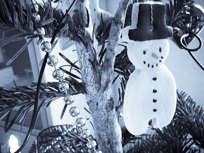

It's nearly done. 2010 is almost over and we finally reached Christmas. Time for eCards, postcards and greetings. I've seen many good ones this year and it's hard to come up with a picture, that visualizes all the good wishes and hopes I have for the many readers out there. Thanks for reading and contributing to my blog this year! Thanks for listening to my thoughts!
 
 
 Now it's time to wish you and your family all the best this holiday season. Have some silent times for Christmas and between the years. And last but not least a great start into 2011!
 
 

 

