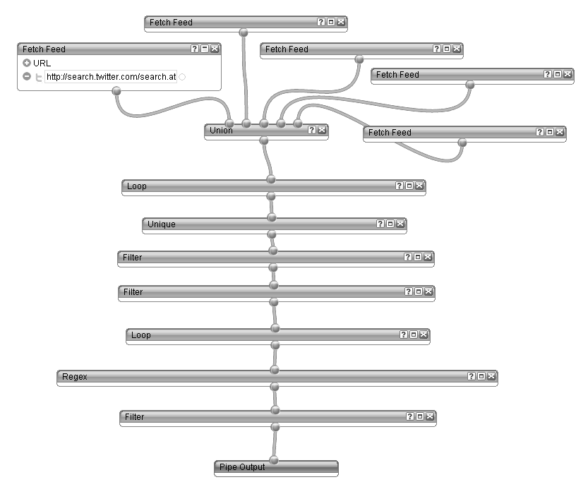

Some questions came up lately about a twitter account of mine. It's called @<a href="http://twitter.com/enterprisejava" target="_blank">enterprisejava</a>. This post is to explain the motivation behind it and of course it's there to explain the technologies used to make it happen. If you are expecting any kind of Java here. I have to disappoint you. No Java in this post. Simple plain old web technologies.
 
 <b>UPDATE 08.11.2011</b>
 
 Due to heavy demand, I made this a little more intelligent :) Moving away from the technology described below this is (as of today) a twitter4j based bot which has a very little bad word detection build in and uses the twitter streaming api to simply retweet everything (once ;)) which has any of the following Java EE related keywords:
 
<pre class="brush: java"> \{"#weblogic", "#javaee", "#websphere", "#tomee", "#javaee6", "#jee6", "#glassfish", "#Coherence", "#JBoss", "#weld", "#CDI", "#hibernate", "#resin", "#JOnAS", "#primefaces", "#myfaces", "#CODI"\} </pre> If you do NOT want to be retweeted you need to add the "#ignore" hashtag to your tweet. I am working on a complete revoke list. Stay tuned for updates and more details about this bot!
 
 <b>Twitter and Java EE - the Motivation</b>
 
 A lot is happening out there in twitter land. Many people use it for different things. My main goals are to a) stay in touch with people I would only meet once or twice a year and to b) get the latest headlines from my favorite topics in a very short and condensed way and last but not least c) ask questions and get inspirations. In the spirit of goal b) I used to visit the <a href="http://twitter.com/search#search?q=%23glassfish" target="_blank">twitter search</a> and type one of my favorite topics after another and try to collect everything I am interested in. This is easy if you only have one or probably two hashtags to watch. But there are some more if you want to stay up to date with #glassfish, #javaee, #weblogic, #cdi, #jsf or to make it short: the whole Java EE universe.
 
 <b>Twitter and Bots - how to make it simpler?</b>
 
 The simplest way seems to be to write a small bot. Why not? There are many reasons not to do this. At first, you have to implement something and maintain it somewhere. Given the restrictions I have (forced to use public and free infrastructure) I don't want to run into any free account limitations with it. And I don't want to code with a scripting language. And I don't want to reinvent the wheel. Many others had done this before and looking at their code: I hate to write bots...
 
 <b>The technology behind @enterprisejava - how it's done!</b>
 
 But you did it? Right? No ... not really. I gave <a href="" target="_blank">Yahoo! Pipes</a>&nbsp;and <a href="" target="_blank">twitterfeed.com</a> a trial. Pipes is a powerful composition tool to aggregate, manipulate, and mashup content from around the web. You basically have some input sources from where to fetch data and some operators and simple functions to manipulate the stream. On a concept level the pipe for @enterprisejava looks like this:
 

 

You see four input sources being united into one stream. Each of them represents a twitter atom stream search for a hashtag (compare above). After they are united into one stream, I am looping over each of them to find&nbsp;duplicates (very basic approach). The marked duplicates are filtered out using the unique operator. Next is to filter every single of my bot's own postings. Followed by a swear word detection and some magic to have a generic /via and RT handling.&nbsp;The result is the stream that goes to the pipe output. You can get the pipe output in a couple of formats. Let's stick to RSS (I know, it is dead .. but it works ...) and put it into twitterfeed. You have to tweak the advanced settings to get the sorting right and think about the update frequency and the maximum number of posts at a time ... and link it to your twitter account. Done. That's all.
 
 <b>The icon problem - It is NOT an official Oracle account!</b>
 

 

Recently I heard some complaints about the use of the Java (Trademark of Oracle) logo in the icon. I am not a lawyer and I created the logo without having anything bad in mind. First reaction about the complaints was to check the Java Branding Guidelines. As you might have expected: There is a way to use the Java and Java EE logos.
 
<blockquote>
 Show your enthusiasm for Java technology
  
  with the Java Get Powered logo. Use it on your
  
  blogs and web sites, t-shirts, coffee mugs,
  
  personal presentations and other belongings.
  
  (Source: <a href="http://java.sun.com/logos/pdfs/477765_Java_Brand_Guide_1pg_FINAL.pdf" target="_blank">477765_Java_Brand_Guide_1pg_FINAL.pdf</a>)
</blockquote>The bad part is, that anything points to <a href="" target="_blank">http://java.sun.com/logos/</a> which is actually a working page on the first look. But if you dig deeper and try to follow the links, that state "Access to the online version of this logo" the links fail. This is not going to become an open letter but I would like to clearly state: Guys: I am part of the good force! I already changed it one time in the last couple of days. And you are still not satisfied with it? Perfect:
 
 Bring back the branding guidelines and let the community contribute to the excitement around Java. I understand the complaints and I am willing to comply with the rules. But I would love to know them before changing the logo again ...