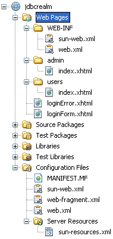

A very common scenario is to have a protected application. You have users which belong to a group and have different rights in your application. The most basic part is to configure your application server and enable the login for your application. This post guides you through the process of setting up a simple JDBC based realm with GlassFish 3.0.1 and creates a basic login form based on Primefaces. 
 
 
 UPDATE: 28.01.2013
 
 There is a <a href="http://blog.eisele.net/2013/01/jdbc-realm-glassfish312-primefaces342.html">new version of the tutorial</a> out since a few days.
 
 <b>Preparation</b>
 
 I am assuming, that you have <a href="" target="_blank">NetBeans (7 Beta2, Java)</a>, GlassFish (<a href="http://glassfish.java.net/public/downloadsindex.html#top">3.0.1</a> or 3.1 bundled with NetBeans) and <a href="">MySQL (5.x)</a> installed and you verified that everything single bit is working. 
 
 <b>Basic Project Setup</b>
 
 Fire up NetBeans and start a new project. Choose Java Web &gt; Web Application and hit next. Now enter a name (e.g. jdbcrealm) and hit next. Choose a Server or add a new one. Select Java EE 6 as your EE version and hit next. Check the box that states JavaServer Faces and switch to the tab components to select Primefaces as the component suite. Click finish. Now you are set. With your NetBeans project. 
 
 <b>Database</b>
 

 

 Create a new database. There are a couple of ways to do this. I like the MySQL GUI Tooling. Get your copy from the <a href="http://dev.mysql.com/downloads/gui-tools/5.0.html" target="_blank">mysql.com website</a>. But you can also use the mysql cmd line. How ever. Execute the following SQL against your installation:
 <code> 
  CREATE DATABASE jdbcrealmdb; 
  USE jdbcrealmdb; 
  CREATE TABLE `jdbcrealmdb`.`users` ( 
  `username` varchar(255) NOT NULL, 
  `password` varchar(255) DEFAULT NULL, 
  PRIMARY KEY (`username`) 
  ) ENGINE=InnoDB DEFAULT CHARSET=utf8;  
  CREATE TABLE `jdbcrealmdb`.`groups` ( 
  `username` varchar(255) DEFAULT NULL, 
  `groupname` varchar(255) DEFAULT NULL) 
  ENGINE=InnoDB DEFAULT CHARSET=utf8;  
  CREATE INDEX groups_users_FK1 ON groups(username ASC); </code>
 
 If we are going to secure our application we need some users with roles. Let's create them, if we are already here:
 <code> 
  INSERT INTO users VALUES('admin','adminadmin'); 
  INSERT INTO users VALUES('markus','blogeisele'); 
  INSERT INTO groups VALUES('admin','admin'); 
  INSERT INTO groups VALUES('markus','user'); </code>
 
 <b>Domain Configuration</b>
 

 

 Now switch to the Services tab in NetBeans and right click the Databases node in the tree. Choose new connection and select MySQL (Connector/J driver) in the drop-down. The driver files should show an entry which points to %NB_HOME%/ide/modules/ext/mysql-connector-java-5.1.13-bin.jar. Hit next and enter the connection parameters (Don't forget to select the newly created database: jdbcrealmdb). Remember to test the connection. After that click finish. Back to the projects tab and your application. Right click and select "New &gt; Other &gt; GlassFish &gt; JDBC Connection Pool". Enter a name for the new connection pool (e.g. SecurityConnectionPool) and underneath the checkbox "Extract from Existing Connection:" select your newly created MySQL connection. Click next. review the connection pool properties and click finish. The newly created Server Resources folder now shows your sun-resources.xml file. Follow the steps and create a "New &gt; Other &gt; GlassFish &gt; JDBC Resource" pointing the the created SecurityConnectionPool (e.g. jdbc/securityDatasource).
 
 
 Next is to copy the %NB_HOME%/ide/modules/ext/mysql-connector-java-5.1.13-bin.jar to your GlassFish domain (%GF_HOME%/glassfish/domains/domain1/lib). Fire up your domain by switch to the services tab in NetBeans and expand the servers node. Right click your GlassFish server node and select start. Open a browser and visit <code>http://localhost:4848/ </code>. Select "Configuration &gt; Security &gt; Realms" and click new. Enter a name (e.g. JDBCRealm) and select the com.sun.enterprise.security.auth.realm.jdbc.JDBCRealm from the drop down. Fill in the following values into the textfields:
 
<table>
 <tbody>
  <tr>
   <td>JAAS</td>
   <td><b>jdbcRealm</b></td>
  </tr>
  <tr>
   <td>JNDI</td>
   <td><b>jdbc/securityDatasource</b></td>
  </tr>
  <tr>
   <td>User Table</td>
   <td><b>users</b></td>
  </tr>
  <tr>
   <td>User Name Column</td>
   <td><b>username</b></td>
  </tr>
  <tr>
   <td>Password Column</td>
   <td><b>password</b></td>
  </tr>
  <tr>
   <td>Group Table</td>
   <td><b>groups</b></td>
  </tr>
  <tr>
   <td>Group Name Column</td>
   <td><b>groupname</b></td>
  </tr>
  <tr>
   <td>Assign Groups</td>
   <td><b>default</b></td>
  </tr>
  <tr>
   <td>Digest Algorithm</td>
   <td><b>none</b></td>
  </tr>
 </tbody>
</table> Most of the values are self explanatory. The most important one is the digest algorithm. I have set it to "none" in this case. This means, the passwords are stored in plain text in your DB. You have to use a digest algorithm that fits your required security assurance. You can use whatever algorithm is supported by Java (e.g. MD5, SH-1, SHA-256).
 
 After you are finished, click save. 
 
 <b>Secure your application</b>
 
 Done with configuring your environment. Now we have to actually secure the application. First part is to think about the resources to protect. Jump to your Web Pages folder and create two more folders. One named "admin" and another called "users". The idea behind this is, to have two separate folders which could be accessed by users belonging to the appropriate groups. Now we have to create some pages. Let's start with the loginForm.xhtml. Create the file with the following content in the root of your Web Pages folder. 
 <code> 
  &lt;?xml version='1.0' encoding='UTF-8' ?&gt; 
  &lt;!DOCTYPE html PUBLIC "-//W3C//DTD XHTML 1.0 Transitional//EN" "http://www.w3.org/TR/xhtml1/DTD/xhtml1-transitional.dtd"&gt; 
  &lt;html xmlns="http://www.w3.org/1999/xhtml" 
  xmlns:p="http://primefaces.prime.com.tr/ui" 
  xmlns:h="http://java.sun.com/jsf/html"&gt; 
  &lt;h:head&gt; 
  &lt;title&gt;Login Form&lt;/title&gt; 
  &lt;/h:head&gt; 
  &lt;h:body&gt; 
  &lt;p:panel header="Login From"&gt; 
  &lt;form method="POST" action="j_security_check"&gt; 
  Username: &lt;input type="text" name="j_username" /&gt; 
  Password: &lt;input type="password" name="j_password" /&gt; 
  &lt;br /&gt; 
  &lt;input type="submit" value="Login" /&gt; 
  &lt;input type="reset" value="Reset" /&gt; 
  &lt;/form&gt;   
  &lt;/p:panel&gt; 
  &lt;/h:body&gt; 
  &lt;/html&gt; </code>
 
 As you can see, whe have the basic Primefaces p:panel component which has a simple html form which points to the predefined action j_security_check. This is, where all the magic is happening. You also have to include two input fields for username and password with the predefined names j_username and j_password. Now we are going to create the loginError.xhtml which is shown, if the user did not enter the right credentials. (use the same DOCTYPE and header as seen in the above example).
 <code> 
  &lt;h:body&gt; 
  &lt;p:panel header="Login Error"&gt; 
  Sorry, you made an Error. Please try again: &lt;a href="#\{facesContext.externalContext.requestContextPath\}/faces/loginForm.xhtml" &gt;Login&lt;/a&gt; 
  &lt;/p:panel&gt; 
  &lt;/h:body&gt; </code>
 
 The only magic here is the href link of the Login anchor. We need to get the correct request context and this could be done by accessing the faces context. If a user without the appropriate rights tries to access a folder he is presented a 403 access denied error page. If you like to customize it, you need to add it and add the following lines to your web.xml:
 <code> 
  &lt;error-page&gt; 
  &lt;error-code&gt;403&lt;/error-code&gt; 
  &lt;location&gt;/faces/403.xhtml&lt;/location&gt; 
  &lt;/error-page&gt; </code>
 
 That snipped defines, that all requests that are not authorized should go to the 403 page.
 
 
 If you have the web.xml open already, let's start securing your application. We need to add a security constraint for any protected resource:
 <code> 
  &lt;security-constraint&gt; 
  &lt;display-name&gt;Admin Pages&lt;/display-name&gt; 
  &lt;web-resource-collection&gt; 
  &lt;web-resource-name&gt;Protected Admin Area&lt;/web-resource-name&gt; 
  &lt;description/&gt; 
  &lt;url-pattern&gt;/faces/admin/*&lt;/url-pattern&gt; 
  &lt;http-method&gt;GET&lt;/http-method&gt; 
  &lt;http-method&gt;POST&lt;/http-method&gt; 
  &lt;http-method&gt;HEAD&lt;/http-method&gt; 
  &lt;http-method&gt;PUT&lt;/http-method&gt; 
  &lt;http-method&gt;OPTIONS&lt;/http-method&gt; 
  &lt;http-method&gt;TRACE&lt;/http-method&gt; 
  &lt;http-method&gt;DELETE&lt;/http-method&gt; 
  &lt;/web-resource-collection&gt; 
  &lt;auth-constraint&gt; 
  &lt;description/&gt; 
  &lt;role-name&gt;admin&lt;/role-name&gt; 
  &lt;/auth-constraint&gt; 
  &lt;/security-constraint&gt; 
  &lt;security-constraint&gt; 
  &lt;display-name&gt;User Pages&lt;/display-name&gt; 
  &lt;web-resource-collection&gt; 
  &lt;web-resource-name&gt;Protected Users Area&lt;/web-resource-name&gt; 
  &lt;description/&gt; 
  &lt;url-pattern&gt;/faces/users/*&lt;/url-pattern&gt; 
  &lt;http-method&gt;GET&lt;/http-method&gt; 
  &lt;http-method&gt;POST&lt;/http-method&gt; 
  &lt;http-method&gt;HEAD&lt;/http-method&gt; 
  &lt;http-method&gt;PUT&lt;/http-method&gt; 
  &lt;http-method&gt;OPTIONS&lt;/http-method&gt; 
  &lt;http-method&gt;TRACE&lt;/http-method&gt; 
  &lt;http-method&gt;DELETE&lt;/http-method&gt; 
  &lt;/web-resource-collection&gt; 
  &lt;auth-constraint&gt; 
  &lt;description/&gt; 
  &lt;role-name&gt;user&lt;/role-name&gt; 
  &lt;/auth-constraint&gt; 
  &lt;/security-constraint&gt; </code>
 
 If the constraints are in place you have to define, how the container should challenge the user. 
 <code> 
  &lt;realm-name&gt;JDBCRealm&lt;/realm-name&gt; 
  &lt;form-login-config&gt; 
  &lt;form-login-page&gt;/faces/loginForm.xhtml&lt;/form-login-page&gt; 
  &lt;form-error-page&gt;/faces/loginError.xhtml&lt;/form-error-page&gt; 
  &lt;/form-login-config&gt; 
  &lt;/login-config&gt; </code>
 
 The realm name has to be the name that you assigned the security realm before. Close the web.xml and open the sun-web.xml to do a mapping from the application role-names to the actual groups that are in the database. This abstraction feels weird, but it has some reasons. It was introduced to have the option of mapping application roles to different group names in enterprises. I have never seen this used extensively but the feature is there and you have to configure it. Other appservers do make the assumption that if no mapping is present, role names and group names do match. GlassFish doesn't think so. Therefore you have to put the following into the sun-web.xml:
 <code> 
  &lt;security-role-mapping&gt; 
  &lt;role-name&gt;admin&lt;/role-name&gt; 
  &lt;group-name&gt;admin&lt;/group-name&gt; 
  &lt;/security-role-mapping&gt; 
  &lt;security-role-mapping&gt; 
  &lt;role-name&gt;user&lt;/role-name&gt; 
  &lt;group-name&gt;user&lt;/group-name&gt; 
  &lt;/security-role-mapping&gt; </code>
 
 
 If you now point your browser to <code>localhost:8080/jdbcrealm/</code> you will see the login screen. Enter your credentials and see what happens.
 
 

 

 

 
 That's it. By far the longest tutorial I did so far. Hope, you like it. Let me know, if you need more details or have questions. Thanks for reading!