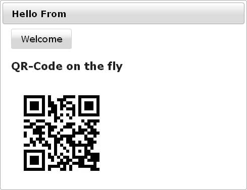

I've been playing around with <a href="http://en.wikipedia.org/wiki/QR_Code" target="_blank">QR-Codes</a> lately. To make it short. I love them. If you have a nice, little reader on your mobile you have a very handy way of getting contacts, urls, email adresses, and short texts into your mobile. If you look around, you can find a lot of websites offering to create such stuff for you. 
 

 

One of the most prominent are the <a href="" target="_blank">Google Chart Tools</a>. If you like to, you can simply use this online version. An image tag with the following url
 
<pre>https://chart.googleapis.com/chart? chs=150x150&amp;cht=qr&amp; chl=Hello%20world&amp;choe=UTF-8 </pre>gives you a very simple "Hello World" QR-Code. But what happens if you are not able or willing to access any free service on the net? What happens if you need to create your own QR Codes? Here we go. That was part of the question I was asking myself. And here is a short howto.
 
 <b>Getting started</b>
 
 Make yourself&nbsp;comfortable&nbsp;with whatever programming language you want to use. But for this tutorial you are going to need a Java EE Webcontainer or at best one of the latest <a href="http://glassfish.java.net/public/downloadsindex.html#top" target="_blank">GlassFish 3.x</a>. Next is to grep your copy of <a href="" target="_blank">Primefaces </a>and one of your favorite development environments. If you are naughty you could also use the latest <a href="" target="_blank">NetBeans 7.0 Beta</a> which provides all prerequisites out of the box. 
 
 Start by creating a new web-project and make sure to check the box beside "Enable Context and Dependency Injection" and also make sure you use the JSF 2.0 implementation with PrimeFaces as the component library. If this is done, you have to make a decision for the QR-Code library to use. I did a simple search on google and was somehow disappointed. Many many options but mostly readers or even closed source. One very promising result was <a href="" target="_blank">ZXING</a>. ZXing (pronounced "zebra crossing") is an open-source (Apache v2), multi-format 1D/2D barcode image processing library implemented in Java. If you look at the samples you mostly find decoding samples. But there also is an <a href="http://code.google.com/p/zxing/source/browse/trunk/core/src/com/google/zxing/qrcode/encoder/Encoder.java?r=1053" target="_blank">Encoder</a>. 
 
 That's what I was looking for. Get the <a href="http://code.google.com/p/zxing/downloads/list" target="_blank">1.6 release</a> which has roughly 60 MB and start by unpacking it. Next is to build the core project (mvn install). Which gives you a handy (325KB) core-1.6-SNAPSHOT.jar to copy as a library to your netbeans project. Now your all set and we can start coding.
 
 <b>Encoding Strings</b>
 
 Wow. That is not too easy. Even if there is an Encoder, you still have to do some work to get this done. If you look around the <a href="http://groups.google.com/group/zxing/topics" target="_blank">google groups discussions</a> forum you quickly find some solutions. One came up with a complete <a href="http://groups.google.com/group/zxing/browse_thread/thread/fbdd29e93e1ec86e/f851c3d18beba422?lnk=gst&amp;q=generateQRCodeImage#f851c3d18beba422" target="_blank">generateQRCodeImage()</a> Method which you can simply copy and use for your own trials. 
 
 The basic magic is to not only have the simple QR-Code written but also have the "the quiet zone" as described in QR code spec (at least 4 modules on each size). So here is all you have to do:
 <code> 
  QRCode qrcode = new QRCode(); 
  Encoder.encode(code, ErrorCorrectionLevel.L, qrcode); </code>
 
 Plus all the magic you need for having "the quiet zone" in place (please refer to the mentioned method above for a complete walthrough). After that you simply have to write out to whatever stream you need.
 <code> 
  ImageIO.write(image, "png", out);</code>
 
 <b>Putting it into a Servlet</b>
 
 The simplest approach is to encapsulate everything into a servlet. All you need is an OutputStream to which to write your QR-Code:
 <code> 
  generateQRCodeImage(out, code, width, width); </code>
 
 If you add some magic parameters you can even have you own @WebServlet(name = "QRCodeGenerator").
 
 <b>Primefaces are better</b>
 
 But who wants to use Servlets our days? JSF 2.0 and Primefaces are the ones to use. All you need is the <a href="http://www.primefaces.org/showcase/ui/dynamicImage.jsf" target="_blank">Dynamic Image Streaming</a> component from Primefaces. Use the example and put your generateQRCodeImage method into that managed bean.
 <code> 
  @Named(value = "qrcontroller") 
  public class QrImageController  </code>
 

 

Small difference, you now have to use the StreamedContent API for getting the image data. You have to play around a bit to find a solutions. The fastest way was to simply get an ByteArrayInputStream and convert it to a DefaultStreamedContent. That worked. Even if you have some additional steps for converting the BufferedImage. Finally all you have to do is to put the component to your facelet
 <code> 
  &lt;p:graphicimage value="#\{qrcontroller.qrcode\}"&gt;&lt;/p:graphicimage&gt;</code>
 
 Right click your project, select run and you are done!
 
 Fine! Thanks for reading! If you have comments or other libraries you can recommend: I would be happy to read about what you are thinking.