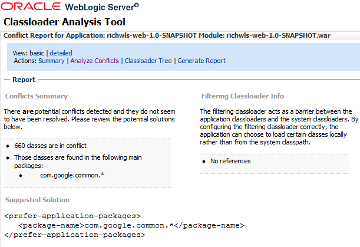
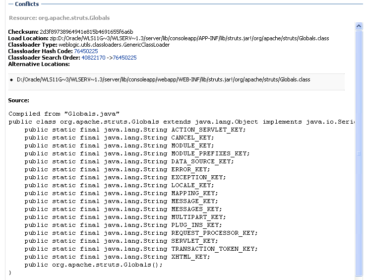
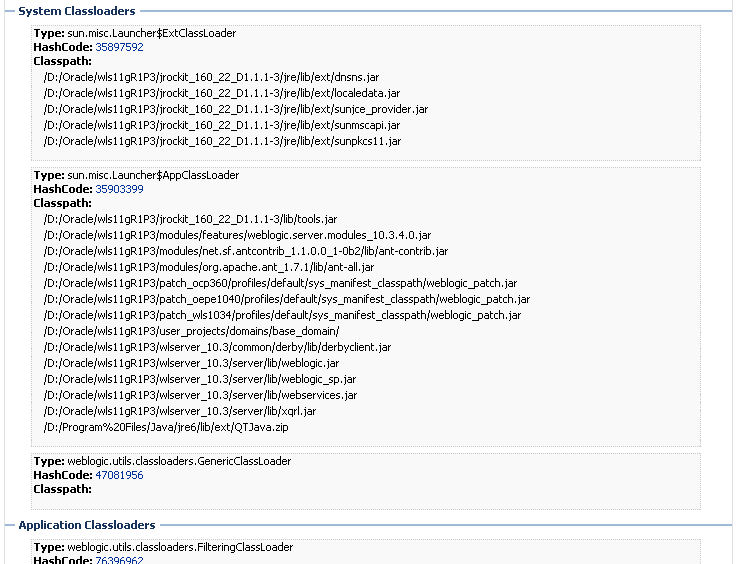

The recently published Oracle WebLogic 11g Patchset 3 contains a new analysis tool called CAT. CAT is a Web-based class analysis tool which simplifies filtering classloader configuration and aids you in analyzing classloading issues, such as detecting conflicts, debugging application classpaths and class conflicts, and proposes solutions to help you resolve them. This post looks into it and shows what is possible and where it is helpful to use.
 
 <b>Getting started</b>
 
 Download and install <a href="http://www.oracle.com/technetwork/middleware/weblogic/downloads/wls-main-097127.html" target="_blank">WebLogic 10.3.4.0 (together with Coherence and OEPE)</a> and use the configuration wizard to create a new domain. Name it whatever you like and make sure you run it in development mode. Deploy your application.
 
 <b>About CAT</b>
 

 

Your applications may use many different Java classes, including Enterprise Beans, servlets and JavaServer Pages, utility classes, and third-party packages. WebLogic Server deploys applications in separate classloaders to maintain independence and to facilitate dynamic redeployment and undeployment. Because of this, you need to package your application classes in such a way that each module has access to the classes it depends on. In some cases, you may have to include a set of classes in more than one application or module. All this makes applications larger as they include multiple frameworks for their functionality. And there are many sources (open source, commercial sources, or developed in-house) to handle. Using the capabilities of WebLogic server applications can use those dependencies in different ways:
 
 - Framework JARs bundled directly in the modules
 
 - MANIFEST classpath references to other JARs
 
 - Server application and JAR libraries
 
 - Server system classpath
 
 As the application classpath grows, it gets cumbersome for application developers to understand which class is getting loaded from which source. Sometimes applications bundle different versions of JARs than those in the system classpath. 
 
 
 CAT is a stand-alone Web application, distributed as a single WAR file (WL_HOME/server/lib/wls-cat.war). It is deployed as an internal on-demand application only in development mode and the deployment happens upon first access. If the server is running in production mode, it is not deployed automatically but you can deploy it manually, just like any other Web application. According to the documentation you can deploy it to any WebLogic Server version 10.3.x and above. It helps developers understand, analyze, and resolve classloading issues in their applications. CAT will report potential problems and also present solutions for resolving those issues.
 
 <b>Using CAT</b>
 
 Point your browser to http://wls-host:port/wls-cat/ and enter your credentials. After the automatic deployment finished, CAT displays all your currently running applications and modules. CAT lets you:
 
 - Analyze classloading conflicts
 
 - View the system and application classloaders
 
 - Generate reports
 
 CAT analyzes classes loaded by the system classpath classloader and the WebLogic Server main application classloaders. You can perform analysis at the class, package, or JAR level.
 
 <b>Display basic and detailed information about applications and modules</b>
 
 Select a module or application on the left hand and you will see general information in basic view. This includes a very basic summary, first warning overview and a list of referenced libraries.If you select the detailed view the warnings change. At the first sight there is no obvious difference between the basic and detailed view except the fact that you also have some more details about the System Classloaders. But this information is not present from time to time. There seems to be room for improvement here :)
 
 <b>Analyze classloading conflicts</b>
 

 

If you deploy the console application and inspect it, you have your first example with some potential conflicts. Select Application: consoleapp Module: console on the left hand menu and select detailed view. Now you have a brief warning "There are potential classes in conflict". Now select "Analyze Conflicts" and look at what's happening. The CAT displays the potential number of conflicts. In case of the console app there are potentially 533 classes in conflict state. Struts seems to be the troublemaker here. A suggested solution tells you to use the reversed web app classloader by setting the&nbsp;prefer-application-packages  in your weblogic.xml. 
 

 

If you click on a single potentially conflicted class, you see some more information. Beside the complete list of classes in conflict (in this case APP/INF lib and WEB-INF/lib org.apache.struts.Globals.
 
 <b>Get suggestions for configuring filtering classloaders</b>
 
 The filtering classloader acts as a barrier between the application classloaders and the system classloaders. By configuring the filtering classloader correctly, the application can choose to load certain classes locally rather than from the system classpath. You even get hints on actual settings with a filtering classloader in place.
 
 <b>Display the classloader hierarchy and the entire classpath for each classloader</b>
 

 

If you click on "Classloader Tree" and chose the "detailed" view you get a complete list of classloaders, their loaded jars and filters. Covering all available classloaders. If you click on the HashCode link you get a details analysis about exactly this classloader in which you could also search for a class or a resource. It is possible to analyze both classes as well as resources such as XML or property files. To analyze a class, for example, the class Globals in package org.apache.struts, type in the fully qualifed class name, for example, "org.apache.struts.Globals". If you are searching for a resource, prefix your search with "#".
 
 You can also see the classloader search order. But it's hard to compare the hashes and remember them. 
 
 <b>Generate Reports</b>
 
 If you click the link "Generate Report" the complete classloader tree is exported to an XML file (cat-report-consoleapp.xml) which makes it more easy to search within. Beside the single classpath entries it also exports the conflict elements.
 
 <b>Final thoughts</b>
 
 Hey. It's nice! Thanks Oracle. This will make my life a little easier while searching for conflicts. But: It's a very very basic development tool. Usability is far off from good and this includes navigation, look and feel and behavior. The basic/details concept does not look very thought over. I bet, there are other versions of the tool around which have far more capabilities or there were others planed. I don't know how big the suggested solution space is. At first, it seems to be limited. I'll give it a more practical test in the near future and I am very excited to see, how this is working with real complex projects.