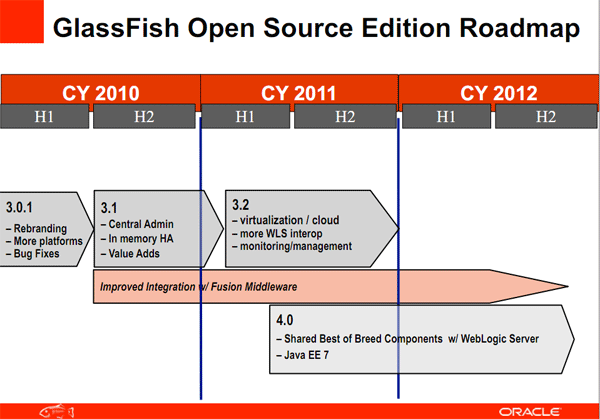

GlassFish 3.1 is finally there. As <a href="" target="_blank">promised by Oracle back in March</a> last year! And it is an exciting release. It brings back all the clustering and high availability support we were missing since 2.x into the Java EE 6 world. And there are other really nice things on the feature map. Here is your short introduction.
 
 <b>Get it!</b>
 

 

As usual you can get the latest GlassFish Open Source Server 3.1 release (which is completely the same as the latest RC3/RC4 btw) from <a href="http://glassfish.java.net/downloads/3.1-final.html" target="_blank">glassfish.org/downloads/</a>. They should be there the minute this post was issued. The commercial version Oracle GlassFish Server 3.1 is available via <a href="" target="_blank">otn.oracle.com</a>. Both can be downloaded with a Web Profile only or the full version. 
 
 <b>What's really new</b>
 
 It's still the lightweight and modular Java EE 6 runtime you know. But now we have:
 
<ul>
 <li>Clustering 
   Multiple clusters per domain, multiple instances per cluster. Up to 100 instances per domain!</li>
 <li>ssh provisioning 
   GlassFish Server uses secure shell (SSH) to ensure that clusters that span multiple hosts can be administered centrally.</li>
 <li>Centralized management 
   The use of SSH to enable centralized administration of remote instances is optional and is required only for specific operations. Instances local to the DAS can be administered without SSH. If SSH is not practicable in your environment, you can administer remote instances locally.</li>
 <li>High Availability (HA) 
   Enhanced and optimized from GlassFish 2.x, High Availability Session Persistence, High Availability Java Message Service, RMI-IIOP Load Balancing and Failover</li>
 <li>GlassFish Embedded API 
   A reworked GF Embedded API is there to satisfy your needs!</li>
 <li>(improved) RESTful API</li>
 <li>Enterprise OSGi specifications (HTTP, Web, JTA, JDBC, JPA)</li>
 <li>Use of CDI in hybrid applications</li>
 <li>Latest Felix version, improved OSGi shell</li>
 <li>Improving yet more the developer productivity features</li>
 <li>ActiveRedeploy (preserving state across redeploys) now  
   covers stateful EJBs</li>
 <li>JDBC statement leak detection and reclaim and SQL tracing</li>
 <li>Maven plugin</li>
 <li>Application versioning</li>
 <li>Application-scoped resources</li>
 <li>weblogic.xml support</li>
</ul>
 <b>Oracle GlassFish Server Control</b>
 
 Even if the OSS and the commercial version are basically the same the commercial version includes some value add-ons which are useful in some situations. Beside the support and the MyOracle Support access with the contained knowledge base you now also get the Server Control add-on. It consists of different parts:
 
<ul>
 <li>DAS Backup &amp; Recovery Performance Tuner 
   A complete backup and restore solution for the complete GlassFish domain.</li>
 <li>Monitoring Scripting Client 
   A cmd line client for your monitoring needs.</li>
 <li>ActiveCache for GlassFish 
   Stateful HTTPSession clustering with Oracle's Coherence (will be available with Coherence version 3.7 which ships later the year.</li>
 <li>Oracle Access Manager Integration 
   GlassFish Integration for OAM</li>
 <li>Load Balancer Plugin &amp; Installer 
   Separate LB Plugin with it's own installer.</li>
</ul>
 <b>Get the complete documentation!</b>
 
 The 3.1 issue also delivers the long awaited complete set of documentation. And you can have it in two separate ways. Get the ZIP of PDF documents for Open Source Edition from <a href="http://glassfish.org/docs" target="_blank">glassfish.org/docs</a> and browse the <a href="http://download.oracle.com/docs/cd/E18930_01/index.htm" target="_blank">Online &amp; PDF documents for Oracle GlassFish Server</a> docs on the oracle.com site. As a side note: I love the new doc design in the oracle library! It's readable and navigable ;)
 
 <b>The updated roadmap</b>
 
 The roadmap has been updated, too. As usual this was published with a safe harbor statement in front, so you know what to think about it. It's most likely going to happen but nobody will pay you anything if you rely on this.
 
 

 

 <b>What else is happening today?</b>
 
 Together with the new GlassFish release a Java EE SDK Refresh (Update 2) was pushed out as well. There will be a <a href="http://glassfish.org/webinars" target="_blank">launch webinar</a> at 10 AM (PT) / 7 PM (CET). And as always you can find lot's of great resources and engineer blogs via <a href="" target="_blank">theaquarium blog</a>. Go check them out! And enjoy the new GlassFish release!
 
 <b>Finally: This was a hard piece of work! Congratulations to all the engineers working on it!&nbsp;</b>