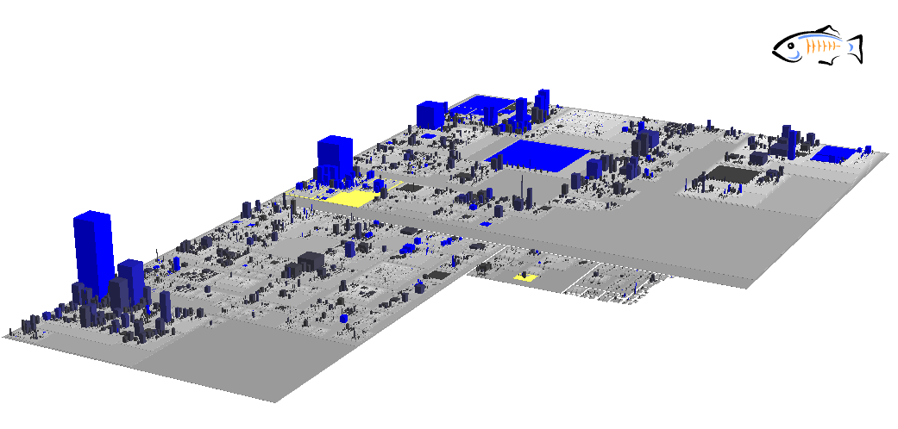
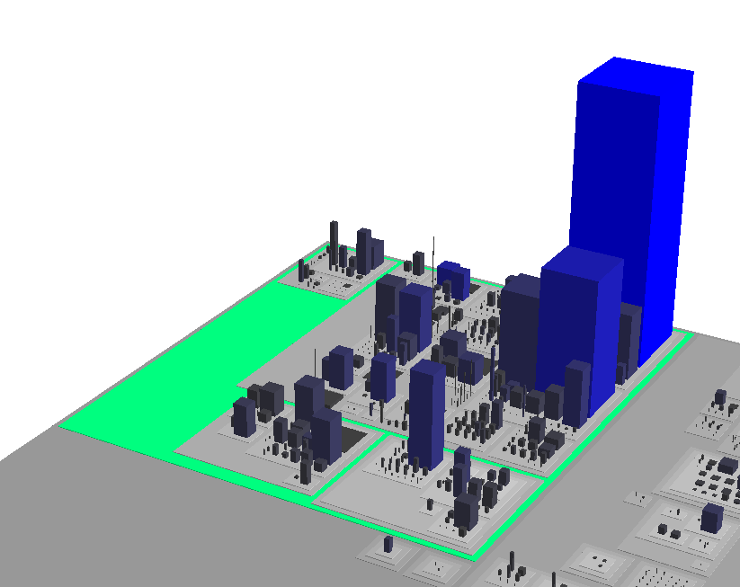
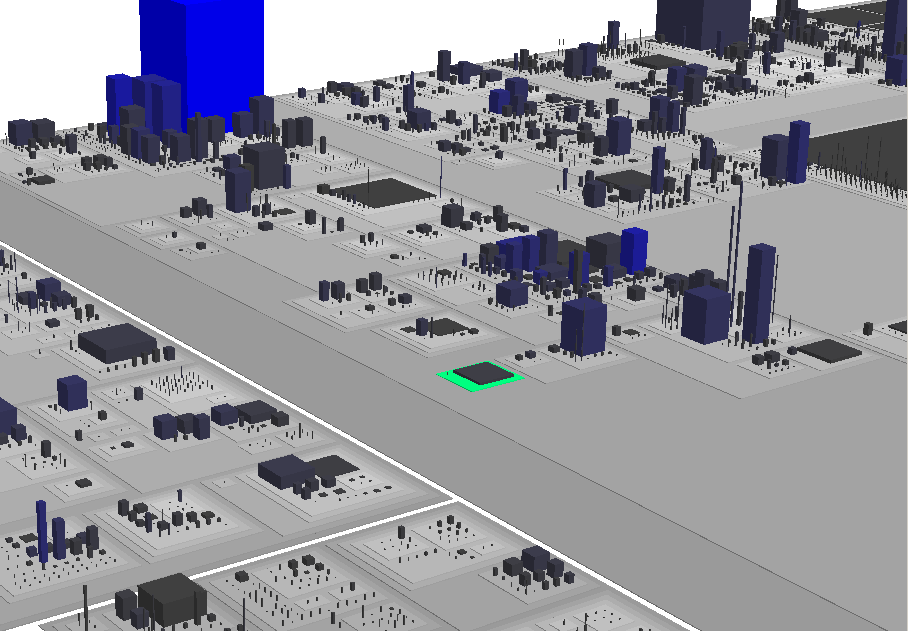
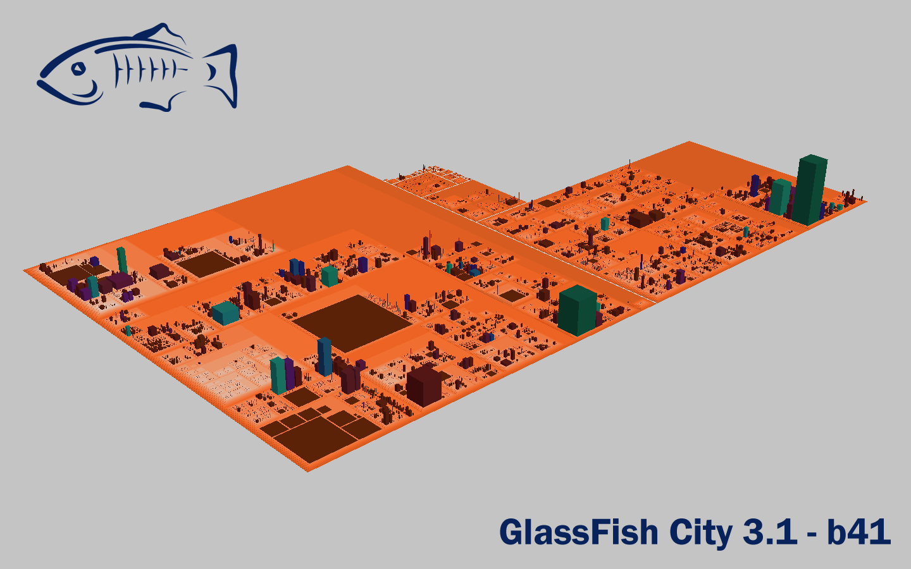

Have you ever wondered, how GlassFish would look like? I mean .. not the well know logo. Or even the non existent Oracle GlassFish logo. More in terms of daily live? What would GlassFish look like, if you transform the sourcode into something that you "could" compare to dimensions you probably have a feeling for. I stumbled about an awesome tool a few months ago. And always being on the hunt to present new view for well known things I had the chance to run this analysis today. Get excited ...
 
 <b>GlassFish City</b>
 
 If you are into Enterprise Architecture and ever have heard about software landscapes, you probably know, what will follow. I used a tool called CodeCity to visualize the project. <a href="http://www.inf.usi.ch/phd/wettel/codecity.html" target="_blank">CodeCity</a> is an integrated environment for software analysis, in which software systems are visualized as interactive, navigable 3D cities. The classes are represented as buildings in the city, while the packages are depicted as the districts in which the buildings reside.
 
 
<table align="center" cellpadding="0" cellspacing="0" class="tr-caption-container" style="margin-left: auto; margin-right: auto; text-align: center;">
 <tbody>
  <tr>
   <td style="text-align: center;"></td>
  </tr>
  <tr>
   <td class="tr-caption" style="text-align: center;">GlassFish City from front</td>
  </tr>
 </tbody>
</table>
<table align="center" cellpadding="0" cellspacing="0" class="tr-caption-container" style="margin-left: auto; margin-right: auto; text-align: center;">
 <tbody>
  <tr>
   <td style="text-align: center;"></td>
  </tr>
  <tr>
   <td class="tr-caption" style="text-align: center;">GlassFish City from back</td>
  </tr>
 </tbody>
</table>
 
<table align="center" cellpadding="0" cellspacing="0" class="tr-caption-container" style="margin-left: auto; margin-right: auto; text-align: center;">
 <tbody>
  <tr>
   <td style="text-align: center;"></td>
  </tr>
  <tr>
   <td class="tr-caption" style="text-align: center;">EJB District</td>
  </tr>
 </tbody>
</table>
 
<table align="center" cellpadding="0" cellspacing="0" class="tr-caption-container" style="margin-left: auto; margin-right: auto; text-align: center;">
 <tbody>
  <tr>
   <td style="text-align: center;"></td>
  </tr>
  <tr>
   <td class="tr-caption" style="text-align: center;">Apache District</td>
  </tr>
 </tbody>
</table>
 
<table align="center" cellpadding="0" cellspacing="0" class="tr-caption-container" style="margin-left: auto; margin-right: auto; text-align: center;">
 <tbody>
  <tr>
   <td style="text-align: center;"></td>
  </tr>
  <tr>
   <td class="tr-caption" style="text-align: center;">Logging District</td>
  </tr>
 </tbody>
</table>
 <b>The facts</b>
 
 In order to be able to use CodeCity, you first need to generate a MSE model. This is done with the help of <a href="http://www.intooitus.com/inFusion.html" target="_blank">inFusion</a>. inFusion is an integrated environment for performing in-depth code and architectural reviews of object-oriented and procedural software systems, written in C, Java or C++. inFusion supports the analysis, diagnosis and quality improvement of your systems at the architectural, as well as at the code level. After the parsing you get some first basic facts for the GlassFish development trunk 3.1-b41 according to inFusion:
 
 445613 lines of clean code.
 
 Packages: 1072
 
 Classes: 10427
 
 Methods: 69852
 
 Attributes: 30885
 
 Parameters: 62484
 
 Local Var: 78937
 
 Annotations: 149
 
 Annotation References: 5515
 
 Calls: 191858
 
 Accesses: 154880
 
 Exceptions: 27304
 
 Primitive Types: 0
 
 <b>Basic interpretation</b>
 
 Class hierarchies tend to be shallow and of average width (i.e. inheritance trees tend to have only few depth-level(s) and base-classes with several directly derived sub-classes)
 
 Classes tend to contain an average number of methods; and are organized in rather fine-grained packages (i.e. few classes per package);
 
 Methods tend to be average in length and having a rather simple logic (i.e. few conditional branches); Methods call several other methods from several other classes.
 
 There are many other conclusions to draw and I simply presented the ones that got generated automatically. But the idea behind all this was simply to present an awesome picture and nothing more (for now :)).
 
 <b>What I learned</b>
 
 JRockit is awesome. The conversion from Java into the MSE model via inFusion took more than five minutes and consumed roughly 1.7 GB heap. One of the basic steps is analyzing the files, which took 21 seconds with HotSpot and 18 seconds with JRockit. Which is not too much but a little faster. Beside this, the whole calculation takes time. In general I was stuck for more than 30 minutes with calculating for the final city model.
 
 Hope you enjoyed it! Happy to read about your thoughts!
 
 
<table align="center" cellpadding="0" cellspacing="0" class="tr-caption-container" style="margin-left: auto; margin-right: auto; text-align: center;">
 <tbody>
  <tr>
   <td style="text-align: center;"></td>
  </tr>
  <tr>
   <td class="tr-caption" style="text-align: center;">Download Wallpaper 1440x900px</td>
  </tr>
 </tbody>
</table>
<table align="center" cellpadding="0" cellspacing="0" class="tr-caption-container" style="margin-left: auto; margin-right: auto; text-align: center;">
 <tbody>
  <tr>
   <td style="text-align: center;"></td>
  </tr>
  <tr>
   <td class="tr-caption" style="text-align: center;">Wallpaper two. On Grey 1440x900px</td>
  </tr>
 </tbody>
</table>
 
 <b>Links and resources</b>
 <a href="http://java.net/projects/glassfish/sources/svn/show/tags/3.1-b41" target="_blank">Latest 3.1-b41 Source</a>
 <a href="http://www.inf.usi.ch/phd/wettel/codecity.html" target="_blank">CodeCity</a>
 <a href="http://www.moosetechnology.org/docs/faq/importJavaWithinFusion" target="_blank">Import Java System with inFusion</a>
 <a href="http://www.intooitus.com/inFusion-tryit.html" target="_blank">inFusion Trial</a>
 
 <b>Further Background Reading</b>
 

 <strong style="display: block; margin: 12px 0 4px;"><a href="http://www.slideshare.net/wettel/visual-exploration-of-largescale-system-evolution-presentation-687858" title="Visual Exploration of Large-Scale System Evolution">Visual Exploration of Large-Scale System Evolution</a></strong><object height="355" id="__sse687858" width="425"><param name="movie" value="http://static.slidesharecdn.com/swf/ssplayer2.swf?doc=wettelwcre2008-1224854028808262-8&amp;stripped_title=visual-exploration-of-largescale-system-evolution-presentation-687858&amp;userName=wettel"><param name="allowFullScreen" value="true"><param name="allowScriptAccess" value="always"><embed name="__sse687858" src="http://static.slidesharecdn.com/swf/ssplayer2.swf?doc=wettelwcre2008-1224854028808262-8&amp;stripped_title=visual-exploration-of-largescale-system-evolution-presentation-687858&amp;userName=wettel" type="application/x-shockwave-flash" allowscriptaccess="always" allowfullscreen="true" width="425" height="355"></object>
  
 

  View more <a href="">presentations</a> from <a href="http://www.slideshare.net/wettel">Richard Wettel</a>.
 

