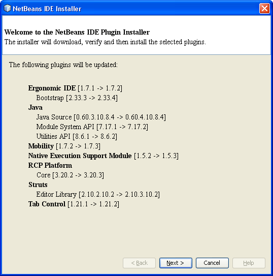

It was like: WOW today ... Starting my IDE this morning was a big surprise. Being used to Eclipse since some time, the regular update check was something I really missed with NetBeans. But it is simply useless. First of all there are not that many plugins around and second they don't update that often. What a big surprise, seeing the IDE telling me, there actually IS something to update. Here we go:
 
 

 

 
 Most of them are minor changes. And I was not able to get a list of changes in any of them. But: Hey, thanks for the Update, NetBeans Team :) Looking forward to the 7.0 final!