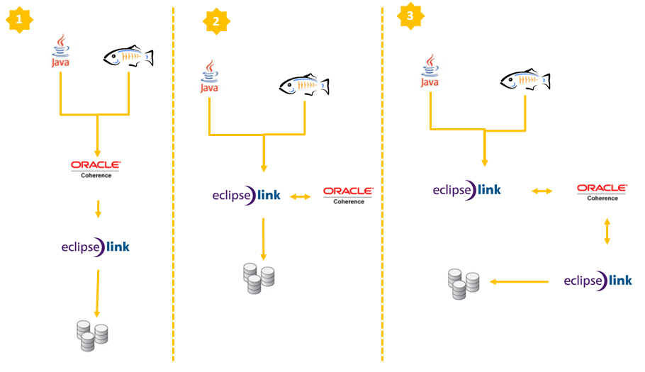

Have you heard about Coherence before? Probably yes. It's one of those famous in-memory grid solutions&nbsp;promising&nbsp;awesome fast data access and unlimited space for your frequently used data. Some of it's well know competitors are <a href="http://www.jboss.org/infinispan">Infinispan</a>, <a href="">Memcached</a> and <a href="">Terracotta Ehcache</a>. They are all great and the worst part with Coherence probably is, that it is NOT open source. This is the first part of a four part series in which I shortly explain the usage of Coherence together with GlassFish. This one is intended to give you a brief overview of the possible scenarios. The following ones will go into more details and describe the configuration with concrete examples.
 
 <b>Why Coherence?</b>
 
 But why did I choose Coherence over any of the other ones? I love working with GlassFish and I was looking for a stable and easy integration with one of those in-memory grids for some data intensive use-cases recently. So the first place to look was the Oracle product stack. More or less driven by the idea, that there has to be any kind of integration into EclipseLink which is the JPA 2.0 RI shipped with GlassFish. Especially since there is the new Cache API with JPA 2.0.
 
 First research revealed a leak of information in that topic. Neither of the mentioned products does have any plugin or other integration with EclipseLink up to now. Even if EclipseLink has something called the "cache interceptor" framework which allows you to tie in 3rd party cache systems really easily, I was looking for a (probably supported) ootb solution. So I ended up looking at Coherence. Little remark: I am not the right person to ask about licensing or costs. All I do is use Coherence according to the <a href="http://www.oracle.com/technetwork/licenses/standard-license-152015.html">OTN License</a>.
 
 <b>What is Coherence?</b>
 
 Oracle Coherence is an in-memory data grid solution. You can scale mission-critical applications by using Coherence to provide very fast access to frequently used data. By automatically and dynamically partitioning data in memory across multiple servers, Coherence enables continuous data availability and transactional integrity, even in the event of a server failure. It is a shared infrastructure that combines data locality with local processing power to perform real-time data analysis, in-memory grid computations, and parallel transaction and event processing.
 
 <b>Strategies for JPA on the grid</b>
 
 All of the in-memory data grid solutions have a very simple put/get API. You issue something like: 
 <code> 
  Cache.put(key, object); 
  Cache.get(key); </code>
 
 
 to store your objects into the cache or get them back from the cache. Coherence would be responsible to persist everything into your Database (probably using EclipseLink). From an application point of view this seems like a very straight forward API to use. Let's call it the "JPA backed Caches". But it's only one of the three possible scenarios. The second is the L2 Cache approach for JPA which basically means your simply implement your JPA based application and plug in coherence in a second step. Third is combination of the first two and simply redirects all database operations to Coherence. All three have their positive points and of&nbsp;course&nbsp;drawbacks.
 
 

 

 <b>Products and Definitions</b>
 
 At this point in time it's best to look at the different products and names around. The JPA 2 RI is&nbsp;<a href="">EclipseLink</a>, which is part of the commercial offering from Oracle called&nbsp;<a href="http://www.oracle.com/technetwork/middleware/toplink/overview/index.html">TopLink</a>. All the Coherence integration is part of the&nbsp;<a href="http://www.oracle.com/technetwork/middleware/ias/tl-grid-097210.html">TopLink Grid</a>&nbsp;product which also contains EclipseLink as JPA implementation.
 
 <b>1) JPA backed Caches</b>
 
 You can use the Coherence API with caches backed by a database mapped through JPA. The&nbsp;grid accesses relational data through JPA CacheLoader and CacheStore implementations. In this "traditional" Coherence approach, TopLink Grid provides CacheLoader and CacheStore implementations that are optimized for EclipseLink JPA. (EclipseLinkJPACacheLoader&nbsp;and&nbsp;EclipseLinkJPACacheStore) which are both contained in the&nbsp;toplink-grid.jar&nbsp;file.&nbsp;Going this way, you use the standard JPA run-time configuration file persistence.xml and the JPA mapping file orm.xml. The Coherence cache configuration file coherence-cache-config.xml must be specified to override the default Coherence settings and define the CacheStore caching scheme.
 
 I'll dive into this example with the next&nbsp;<a href="http://blog.eisele.net/2011/02/high-performance-jpa-with-glassfish-and_14.html">blog post</a>&nbsp;which should be the <a href="http://blog.eisele.net/2011/02/high-performance-jpa-with-glassfish-and_14.html">second part in the series</a>.
 
 <b>2) JPA L2 Cache&nbsp;</b>
 
 The Grid Cache configuration uses Coherence as the JPA shared (L2) cache.
 
 Primary key queries attempt to get entities first from Coherence and, if unsuccessful, will query the database, updating Coherence with query results. Non-primary key queries are executed against the database and the results checked against Coherence to avoid object construction costs for cached entities. Newly queried entities are put into Coherence. Write operations update the database and, if successfully committed, updated entities are put into Coherence.
 
 I'll explain this strategy with the <a href="http://blog.eisele.net/2011/03/high-performance-jpa-with-glassfish-and.html">third part</a> in the series.
 
 <b>3) JPA L2 Cache with a JPA backed Cache</b>
 
 The Grid Entity configuration should be used by applications that require fast access to large amounts of fairly stable data and that perform relatively few updates In combination with Coherence as a L2 Cache using write-behind to improve application response time by performing database updates asynchronously. Read operations get objects from the Coherence cache. Write operations put objects into the Coherence cache, the configured L2 Cache performs write operations on the database.
 
 I'll show you this example with the last part in the series.
 
 <b>Further Reading and Downloads:</b>
 <a href="http://www.oracle.com/technetwork/middleware/coherence/downloads/index.html">Coherence 3.6</a>
 <a href="http://www.oracle.com/technetwork/middleware/ias/downloads/1111topsoft-101984.html">TopLink Grid 11g (11.1.1.3.0)</a>
 <a href="https://www.samplecode.oracle.com/sf/docman/do/listDocuments/projects.toplinkgrid-examples/docman.root.docf1722">Toplinkgrid Examples (OTN login required)</a>