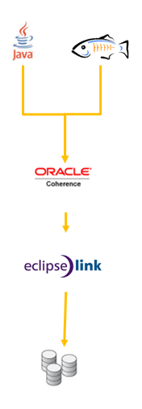

In this second part of my <a href="http://blog.eisele.net/2011/02/high-performance-jpa-with-glassfish-and.html">four part series</a> I'll explain strategy number one of using Coherence with EclipseLink and GlassFish.This describes the steps you have to take to configure a JPA backed Cache with Coherence and how you could use it from within GlassFish as a high performance&nbsp;data store.
 
 

 

<b>General approach</b>
 
 You can use the Coherence API with caches backed by a database mapped through JPA. The grid accesses relational data through JPA CacheLoader and CacheStore implementations. In this "traditional" Coherence approach, TopLink Grid provides CacheLoader and CacheStore implementations that are optimized for EclipseLink JPA. (EclipseLinkJPACacheLoader and EclipseLinkJPACacheStore) which are both contained in the toplink-grid.jar file. Going this way, you use the standard JPA run-time configuration file persistence.xml and the JPA mapping file orm.xml. The Coherence cache configuration file coherence-cache-config.xml must be specified to override the default Coherence settings and define the CacheStore caching scheme.
 
 <b>Details</b>
 
 The CacheLoader implementation &nbsp;redirects all read operations/queries&nbsp;directly to the database via EclipseLink. The CacheStore&nbsp;takes care for all write operations (insert, update, delete) which are executed against the database using EclipseLink.&nbsp;This solution is basically independent from GlassFish and it's JPA provider. You simply use Coherence with it's native API and Coherence takes care of persisting the entities. This approach is&nbsp;referred&nbsp;to as "Traditional Coherence Configuration" in the documentation.
 
 <b>Preparation</b><a name="preparation">&nbsp;</a>
 
 In order to get this and each of the following examples to work, we need to make some preparations. First one is to get all the needed software. Get your copy of <a href="http://www.oracle.com/technetwork/java/javase/downloads/index.html">Java SE Development Kit 6u23</a>, <a href="">GlassFish 3.1 (Part of NetBeans)</a>, <a href="">MySQL Community Server (5.5.9)</a>,&nbsp;<a href="http://www.oracle.com/technetwork/middleware/ias/downloads/1111topsoft-101984.html">TopLink (11.1.1.4.0)</a> and <a href="http://www.oracle.com/technetwork/middleware/coherence/downloads/index.html">Coherence (3.6.1.0)</a>. Any IDE would work. I based all examples on <a href="">NetBeans 7.0 Beta2</a>. You should start by installing the bits and pieces. Create an empty "coherence" db with MySQL. We will use this one for all examples. I will NOT guide you through this. I'll start with the relevant Coherence parts.&nbsp;This will be the configuration you need to follow the other parts of this series, too. So you'd better keep it ;)
 
 Unzip your Coherence download to a suitable location (e.g. x:\Oracle\coherence\) and check the installation by setting up and running the sample cache server application. Change to the \bin folder and execute the cache-server.cmd/sh. Prior to this make sure, that the JAVA_HOME variable is pointing to a valid JDK install. If everything went smoothly you get message: "Started DefaultCacheServer...". One simple side note: Coherence is cluster-aware. Which means, it automatically tries to discover other running Coherence nodes in your subnet. If you are seeing any other output than "ActualMemberSet=MemberSet(Size=1," you should stop here and configure Coherence <a href="http://download.oracle.com/docs/cd/E15357_01/coh.360/e15831/installcoh.htm#BABFCAJA">to run on your machine only</a>. Great. All set. Let's go and execute the example client. Start coherence.cmd/sh and wait for the output "Map (?):". If you check back with the server console you will see something like this:
 <code>(thread=Cluster, member=1): Member 2 joined Service Management with senior member 1</code>. 
 
 Play around with it and try the following commands, each confirmed with return: help, cache myCache, put message "hello", get message, size, list, bye. For further help please consult the <a href="http://download.oracle.com/docs/cd/E15357_01/coh.360/e15831/installcoh.htm#BABIHHFJ">tutorial</a>.
 
 <b>Move it into&nbsp;practice</b>
 
 Start a new Java/Java Class Library project with NetBeans. Name it "GridEntityExample" (check the dedicated lib folder box). Add coherence.jar, toplink-grid.jar and mysql-connector-java-5.1.13-bin.jar to the lib folder and add them to the projects dependencies.
 
 Add two new packages&nbsp;entities and server&nbsp;(e.g.&nbsp;net.eisele.coherence.entities,&nbsp;net.eisele.coherence.server) and
 
 As we already have the cache-server example, it's easy to modify it to fit our needs. &nbsp;Add a new Entity Class (Employee) to the entities package. Change the primary key type to "int" and click next. Select EclipseLink JPA 2.0 from the dropdown box. As the wizard will not let you finish without, create a new Database Connection (jdbc:mysql://localhost:3306/coherence) and click finish. Add two private Strings (firstName, lastName) and their getters and setters to the entity. Remove the @GeneratedValue from the id attribute (more on that later). Some tweaks in the persistence.xml finish up the configuration. Add the following:
 <code> 
  &lt;property name="eclipselink.ddl-generation" value="create-tables" /&gt; 
  &lt;property name="eclipselink.ddl-generation.output-mode" 
  value="database" /&gt;  
  &lt;property name="eclipselink.jdbc.read-connections.min" value="1" /&gt; 
  &lt;property name="eclipselink.jdbc.write-connections.min" value="1" /&gt; 
  &lt;property name="eclipselink.jdbc.batch-writing" value="JDBC" /&gt; 
  &lt;property name="eclipselink.logging.level" value="FINE" /&gt; 
  &lt;property name="eclipselink.logging.thread" value="false" /&gt; 
  &lt;property name="eclipselink.logging.session" value="false" /&gt; 
  &lt;property name="eclipselink.logging.exceptions" value="false" /&gt; 
  &lt;property name="eclipselink.logging.timestamp" value="false"/&gt; </code>
 
 Now we need a simple&nbsp;StartCacheServer class which should resist in the server package. Give it a simple main method:
 <code> 
  public static void main(String[] args) throws UnknownHostException \{ 
  // Restrict Coherence to localhost 
  System.setProperty("tangosol.coherence.wka", InetAddress.getLocalHost().getHostAddress()); 
  // Start CacheServer 
  DefaultCacheServer.main(new String[0]); 
  \} </code>
 
 Now we have to configure Coherence. This is done via the coherence-cache-config.xml file. The complete file can be <a href="http://download.oracle.com/docs/cd/E14571_01/doc.1111/e16596/tlcgd002.htm#CHDEEHFB">found in the tutorial</a>. The key to success is the second init-param for the class-scheme. You have to reference the persistence unit from the persistence.xml there:
 <code> 
  &lt;init-param&gt; 
  &lt;param-type&gt;java.lang.String&lt;/param-type&gt; 
  &lt;param-value&gt;GridEntityExamplePU&lt;/param-value&gt; 
  &lt;/init-param&gt; </code>
 
 Right-click StartCacheServer and run it. You should see the already know message: "Started DefaultCacheServer...".
 
 Ok. Now we are going to insert our first employee into the database. Create a simple InsertExample class:
 <code> 
  public static void main(String[] args) throws UnknownHostException \{ 
  // Restrict Coherence to localhost 
  System.setProperty("tangosol.coherence.wka", InetAddress.getLocalHost().getHostAddress()); 
  // Disable local storage--need to start independent CacheServer 
  System.setProperty("tangosol.coherence.distributed.localstorage", "false"); 
  // Get the configured Cache  
  NamedCache cache = CacheFactory.getCache("Employee"); 
  //Create a new Employee 
  Employee emp = new Employee(); 
  emp.setFirstName("Markus"); 
  emp.setLastName("Eisele");  
  emp.setId(1); 
  //Put the Employee into the cache 
  cache.put(1, emp); 
  \} </code>
 
 
 Run it and check with your db, if the newly created Employee is there. It should be :)
 
 Done. That's all. Ok, where exactly is the GlassFish part?
 
 <b>Using this approach with GlassFish</b>
 
 It's simple as hell. Create a new domain (let's call it coherence) and create a new WebApplication (lets call it GridEntityWeb). Add the GridEntityExample project and the coherence.jar as dependencies. Now you have to configure the cache. This is done again via a coherence-cache-config.xml. Create one in WEB-INF/classes and make it reference the EclipseLinkJPA service-name.
 
 <code> 
  &lt;cache-config&gt; 
  &lt;caching-scheme-mapping&gt; 
  &lt;cache-mapping&gt; 
  &lt;cache-name&gt;*&lt;/cache-name&gt; 
  &lt;scheme-name&gt;distributed-eclipselink&lt;/scheme-name&gt; 
  &lt;/cache-mapping&gt; 
  &lt;/caching-scheme-mapping&gt;  
  &lt;caching-schemes&gt; 
  &lt;distributed-scheme&gt; 
  &lt;scheme-name&gt;distributed-eclipselink&lt;/scheme-name&gt; 
  &lt;service-name&gt;EclipseLinkJPA&lt;/service-name&gt; 
  &lt;/distributed-scheme&gt;  
  &lt;/caching-schemes&gt; 
  &lt;/cache-config&gt; </code>
 
 
 That's all. Make sure the StartCacheServer is running and fire up your GlassFish domain together with your application. If you simply copy the few lines from the InsertExample you can quickly test if everything is working. All left to do now is to find a nice and clean way to integrate this into your application. Maybe you could come up with a generic Coherence crud service (probably based on <a href="http://www.adam-bien.com/roller/abien/entry/generic_crud_service_aka_dao" target="_blank">Adam's proposal</a>).
 
 <b>Drawbacks and thoughts</b>
 
 When using this approach, it is essential to configure the persistence unit to ensure that no changes are made to entities when they are inserted or updated. Any changes made to entities by the JPA provider are not reflected in the Coherence cache. This means that the entity in the cache will not match the database contents. In particular, entities should not use ID generation, for example, @GeneratedValue, to obtain an ID. That means that in order to insert an object into a Coherence cache, you need to provide its identity as well, to serve as the key.
 
 The ID is typically the key under which the entity is stored in Coherence. Optimistic locking (for example, @Version) should not be used as it may lead to a database transaction commit failure.
 
 So in general this is not really a commonly use approach which only fits with some special scenarios where you are fighting with big loads of data.
 
 But what exactly is the deal here. Let's see: If you run the configured example in a loop and insert 12.635 Employee objects, it takes roughly 13 minutes on my machine. This happens if you run Coherence in synchronous mode. But you can utilize a feature called "write-behind" to improve application response time by performing database updates asynchronously. If you add one single line to the CacheServer's coherence-cache-config.xml:
 <code> 
  &lt;write-delay&gt;10s&lt;/write-delay&gt; </code>
 
 the needed time to issue the inserts from an application point of view shrinks to 9 seconds! Of course, the running server still needs it's time to process the updates asynchronously but for the client this is the optimal behavior. 
 
 
 Enough for now. I will try to explain more an more concepts running my way through the examples. As you might have guessed, there is a lot to know if you work with caches. Next part will cover Coherence as L2 cache for EclipseLink with GlassFish. Thanks for reading. Stay tuned.
 
 <b>Further Readings:</b>
 <a href="http://download.oracle.com/docs/cd/E15357_01/coh.360/e15830/configforjpa.htm#CHDCCIHA">Using Coherence Caches Backed by TopLink Grid</a>
 <a href="http://download.oracle.com/docs/cd/E15357_01/coh.360/e15831/toc.htm">Coherence 3.6 Tutorial</a>
 <a href="http://coherence.seovic.com/coherence_blog/2009/05/sequence-generator-for-coherence.html">Synthetic Sequence Approach</a>