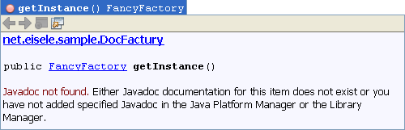
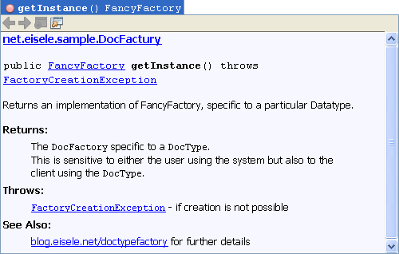

Project documentation is an important but awkward thing to do. Same is true for JavaDoc. The few special comments in the Java source code that are delimited by /** ... */. This short post presents a very pragmatic approach to JavaDoc and outlines the general best practices for successful sourcecode documentation.
 
 <b>Why you should care!</b>
 

 

Look at the NetBeans screenshot from the right. This is the tooltip you get, when trying to use the method. And now? What happens? Why? For what? How does this thing behave? Do you know what to do, if you see a getInstance() method?
 

 

The second screenshot gives you a more detailed idea about what you can&nbsp;achieve with writing some JavaDoc comments. And it applies to nearly any situation.&nbsp;If you are writing any kind of Java program you should keep in mind, that others probably want to use it's public API or need to use your implementation. This is not only true for framework developers but for anybody working within a team. Even if we are talking about component boundaries or utility classes. A class without documentation is trivial or worthless.
 
 <b>Hey: I am a programmer not a writer!</b>
 
 In theory, the general idea of commenting code sounds like a worthy one: Offer the reader detail, an explanation of what's going on. What could be more helpful than being helpful? 
 
 To make it short. I am not proposing to write too much beside the actual code. But that's exactly the problem. Beside the fact, that there are a couple of JavaDoc tags you could use it's also mostly up to you how much and what you write. The basic rule of thumb is:
 
<blockquote>
 Comments should say something code does not and cannot say.
  
  (Source: <a href="http://programmer.97things.oreilly.com/wiki/index.php/Comment_Only_What_the_Code_Cannot_Say" target="_blank">97 Things Every Programmer Should Know</a>)
</blockquote>Does this help? Partly. This rule needs some interpretation. If you don't have source.jars at hand you probably don't have any code at all to look at. So: The less open the source is, the more extensive the comments should be. The second idea here is to look at your stakeholders. Who is the one intended to read the documentation? I don't like the idea to talk about skills here. My favorite is to classify the APIs into abstraction level. The higher the abstraction level, the more general and easier readable texts should be there. If you have a lower abstraction level, the texts could be more technical and probably less readable in terms of writing style. But, it's always good to remember the reworked old adage as a rule to keep in mind:
 
<blockquote>
 If it was hard to write, it should be EASY to read!
  
</blockquote>
 <b>Ok: Tell me, which are the important parts?</b>
 
 Now you know, how and when to document your sources. What does this mean in practice?
 
 If you refer to the Java SE 6 JavaDoc documentation you have 19 tags which you could use to. Here are the usage guidelines I propose for your next project:
 
 
 1) Introduce a class header with a single line of documentation ("First Sentence") and an @author tag at a minimum.
 
 2) Add as many documentation up the hierarchy as possible. Use \{@inheritDoc\} down the hierarchy.
 
 3) Document all public methods except getters and setters with at last a single line and add @throws and @return. @params only if they are not obvious. 
 
 4) Use @link as internal reference and @see to add references to external resources.
 
 5) Javadocs should get peer-reviewed, just like code.
 
 
 Optional but possible needed:
 
 - Introduce a meaningful file comments if needed (e.g. OSS or Company Copyright). Skip it, if not! 
 
 - If you are developing versions you should make broad use of the @deprecated tag where applicable.
 
 
 That's all. Nothing more. Nothing less.
 
 What are your best practices in projects? Let me know. Comments and other ideas are welcome!
 
 <b>Read more</b>
 <a href="" target="_blank">JavaDoc Overview (Java SE 6)</a>
 <a href="http://www.oracle.com/technetwork/java/javase/documentation/index-137868.html" target="_blank">How to Write Doc Comments for the Javadoc Tool</a>
 <a href="http://download.oracle.com/javase/6/docs/technotes/tools/windows/javadoc.html#javadoctags" target="_blank">JavaDoc Tags</a>
 <a href="http://java.sun.com/docs/books/jls/first_edition/html/18.doc.html" target="_blank">JLS Documentation Comments (first Edition)</a>