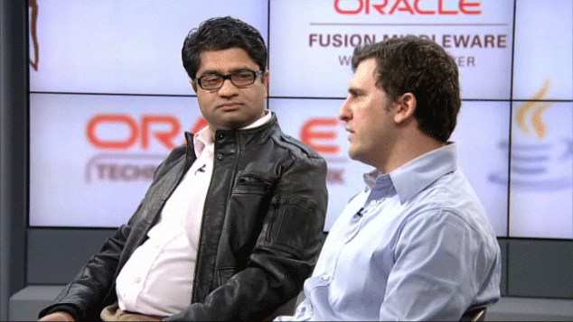

VP Development Anil Gaur and Product Manager Adam Leftik explain Oracle's strategy for creating increasing integration between GlassFish Server and Oracle WebLogic Server with an overview of new features and functionality for developers in GlassFish. The 21:23 minutes Techcast moderated by Justin Kestelyn is good as always and I found the time to transcribe some quotes from it (sorry for any mistakes I did...). It's interesting to see, how both products coexist and grow together over time. The first 10 minutes are worth watching if you are interested in interoperability. After that you get a brief intro about the new and exciting GlassFish Server 3.1 release.
 
 
 Watch the complete TechCast replay on <a href="http://medianetwork.oracle.com/media/show/16342" target="_blank">Oracle Media Network</a>. I would love to have embedded it here, but it's still a Flash player and I'm not going to embed this kind of video playing stuff here.
 
<table align="center" cellpadding="0" cellspacing="0" class="tr-caption-container" style="margin-left: auto; margin-right: auto; text-align: center;">
 <tbody>
  <tr>
   <td style="text-align: center;"></td>
  </tr>
  <tr>
   <td class="tr-caption" style="text-align: center;">Anil Gaur and Adam Leftik</td>
  </tr>
 </tbody>
</table>
<blockquote>
 "Both Weblogic and Glassfish are strategic products for Oracle"
  
  (Anil Gaur)
</blockquote>
 
<blockquote>
 "GlassFish it's industry leading Open Source Application Server"
  
  (Anil Gaur)
</blockquote>
 
<blockquote>
 "We are using GlassFish server as a means for providing innovation and the ability to get features out into the broader Java EE developer community quickly.
  
  As well as also bringing technology and innovations back into WebLogic Server vault."
  
  (Adam Leftik)
</blockquote>
 
<blockquote>
 "The customers today they can start with GlassFish, when their enterprise need grow, they will need a more comprehensive solution and WebLogic Server will fit in right there."
  
  (Anil Gaur)
</blockquote>
 
<blockquote>
 "We are gona be use more shared components from GlassFish, so a couple of examples there: We are taking the latest version of JSF in addition to that CDI, we gonna share a common CDI implementation as well.
  
  EclipseLink will sort of move into the TopLink grid features that are part of the EclipseLink vault [...] providing a common reverse proxy plugin."
  
  (Adam Leftik)
</blockquote>
 
<blockquote>
 "And we are learning from WebLogic in terms of like the Coherence integration, how we can pull in that functionality and integrate with GlassFish."
  
  (Anil Gaur)
</blockquote>