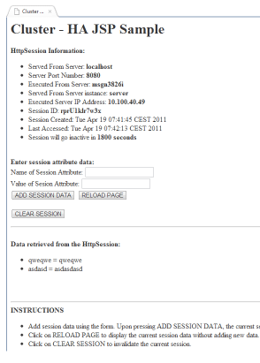

Yesterday, Oracle released the latest evolution of Coherence, their flagship, distributed in-memory data grid product Oracle Coherence 3.7. Coherence 3.7 simplifies the configuration and management of large-scale deployments and provides more data storage capabilities and intelligent and dynamic load balancing of client connections. The new Elastic Data feature introduces breakthrough technology that enables the use of both memory and disk-based devices for data grid storage, enabling near memory speed access to data, regardless of storage medium, and greater flexibility in capacity and resource planning.
 

 

It also introduces dynamic load balancing and automatic proxy discovery for Coherence*Extend clients (for example, application servers or desktop applications accessing the Oracle Coherence data grid). It also integrates with F5 BIG-IP Load Traffic Manager (LTM) and SSL Acceleration technologies to take advantage of existing infrastructures to secure, optimize and load balance application traffic. Coherence configuration files are now described using XML schema definitions (XSD) and are no longer described using Document Type Definition (DTD).
 
 Last but not least Coherence 3.7 finally introduces the native integration with GlassFish Server by using the Coherence*Web SPI for GlassFish (ActiveCache for GlassFish), providing "no code change" installation and configuration of Coherence*Web, making it dramatically easier for GlassFish Server users to scale their applications. And that's exactly what we are going to do today.
 
 <b>Preparation</b>
 
 Get the latest <a href="http://draft.blogger.com/oracle.com/goto/glassfish">Oracle GlassFish Server 3.1</a>. Unzip/install it to your favorite location. Download<a href="http://www.oracle.com/technetwork/middleware/coherence/downloads/index.html?ssSourceSiteId=ocomen"> Oracle Coherence for Java Version 3.7</a>. Same here: Unzip to your favorite location. Open the coherence_3.7\lib\webInstaller.jar and extract the webInstaller.jar\web-install\coherence-web.jar and the session-cache-config.xml. Now you have to create a domain if you haven't already (asadmin create-domain coherenceTest). Copy the coherence.jar from coherence_3.7\lib\ to your domain\lib folder.
 
 <b>Configuring</b>
 
 If you are starting from scratch, you have to fire up your favorite IDE and create a new Web or Ear Project. If you are configuring a web project, copy the coherence-web.jar file to the /WEB-INF/lib/ directory of your Web application. If you are configuring an ear project, copy the coherence-web.jar file to the EAR file's /lib. The session-cache-config.xml needs to be in your /WEB-INF/classes folder.
 
 For this simple example I refer to the good old <a href="http://blogs.sun.com/arungupta/resource/glassfish/clusterjsp.zip">clusterjsp</a> (taken from <a href="http://blogs.sun.com/arungupta/entry/screencast_34_glassfish_3_1">Arun's Screencast #34</a>). Extract it. Put coherence-web.jar into ear/lib folder and create a WEB-INF/classes folder in which you put the session-cache-config.xml file. Great. Delete the sun-web.xml from WEB-INF and create a new glassfish-web.xml containing:
 <code> &lt;glassfish-web-app&gt;  
  &lt;session-config&gt;  
  &lt;session-manager persistence-type="coherence-web" /&gt;  
  &lt;/session-config&gt;  
  &lt;glassfish-web-app&gt; </code> Done. Package everything up again.
 
 <b>Start a Cache Server</b>
 
 A Coherence data node (also known as a cache server) is responsible for storing and managing all cached data. It can be run either in a dedicated JVM (out-of-process) or within a GlassFish Server instance (in-process). The simplest setting is to run it in-process. To make this easy you have to edit the config/domain.xml and add a JVM Option:
 <code> &lt;jvm-options&gt;-Dtangosol.coherence.session.localstorage=true&lt;/jvm-options&gt;</code>
 
 Now fire up your GlassFish and deploy the sample. If you are looking at the server.log you see Oracle Coherence coming up and logging some fancy stuff:
 
<pre>Oracle Coherence Version 3.7.0.0 Build 23397 Grid Edition: Development mode ... Clustered Session Cache Name=session-storage Local Session Cache Name=local-session-storage Local Session Attribute Cache Name=local-attribute-storage Death Certificate Cache Name=session-death-certificates SessionDistributionController Class Name=com.tangosol.coherence.servlet.glassfish31.GlassFishHybridController AttributeScopeController Class Name=com.tangosol.coherence.servlet.AbstractHttpSessionCollection$ApplicationScopeController ... </pre>That's good. Now you know, that everything is working.
 
 <b>Start your GlassFish and deploy the application</b>
 

 

Now you can start the application and use it as normal. This doesn't make too much sense if you are running everything on one node only. You should try to configure a complete cluster with at least one node and two or even more instances to experience the session replication. This very basic example makes use of all the defaults present for Coherence*Web Cache and cluster configuration. If necessary, you can provide an alternate cache and cluster configuration in your own custom session-cache-config.xml and tangosol-coherence-override.xml file. You must include the file in the WEB-INF/classes. Please refer to the complete documentation (see links below) for details.
 
 <b>Links and Further Readings</b>
 <a href="http://blog.eisele.net/2011/02/high-performance-jpa-with-glassfish-and.html">High performance JPA with GlassFish and Coherence</a>
 <a href="http://download.oracle.com/docs/cd/E18686_01/coh.37/e18690/toc.htm" target="_blank">Oracle® Coherence User's Guide for Oracle Coherence*Web</a>
 <a href="http://download.oracle.com/docs/cd/E18686_01/coh.37/e18677/gs_install.htm#CIHDECEA" target="_blank">Installing Oracle Coherence for Java</a>
 <a href="http://download.oracle.com/docs/cd/E18686_01/coh.37/e18690/glassfish.htm" target="_blank">Using Coherence*Web with GlassFish Server</a>
 <a href="http://download.oracle.com/docs/cd/E18686_01/coh.37/e18692/installjdev.htm#CACEHFGJ" target="_blank">Installing and Configuring Eclipse and OEPE with Coherence</a>
 
 <b>Screencasts</b>
 
 The GlassFish Product Manager Adam Leftik published two screencasts about the concepts behind Oracle Coherence and how Active Cache for GlassFish provides seamless integration with Coherence*Web. This is great additional information if you need to know more about the whole topic. 
 
 <i>Active Cache For GlassFish Part 1 of 2</i>
 <iframe title="YouTube video player1" width="450" height="345" src="http://www.youtube.com/embed/RV3YxaoV5c4" frameborder="0" allowfullscreen></iframe>
 
 <i>Active Cache For GlassFish Part 2 of 2</i>
 <iframe title="YouTube video player2" width="450" height="345" src="http://www.youtube.com/embed/mRoZZSeHCpQ" frameborder="0" allowfullscreen></iframe>