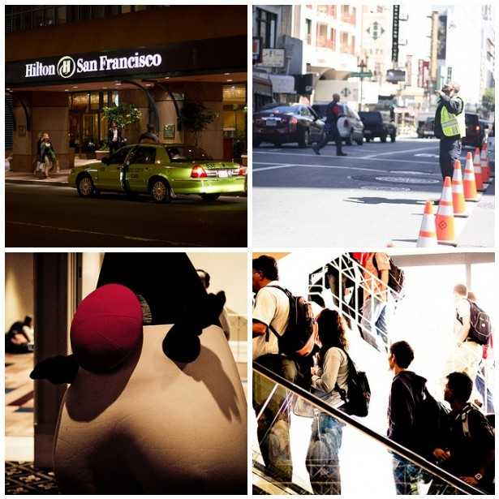

Yesterday Oracle announced, what we all were expecting. JavaOne 2011 will be in the exact same place than the more or less&nbsp;disastrous 2010 version. It will be located in downtown San Francisco and takes place in parallel with Oracle OpenWorld. To be honest, this is not a big surprise. Did anybody expect them to move such an event within less than a year? Let's see, what's going to change and what to expect.
 
 

 

 <b>Location</b>
 
<table cellpadding="0" cellspacing="0" class="tr-caption-container" style="float: right; margin-left: 1em; text-align: right;">
 <tbody>
  <tr>
   <td style="text-align: center;"></td>
  </tr>
  <tr>
   <td class="tr-caption" style="text-align: center;">Source: <a href="http://www.oracle.com/ocom/groups/public/@ocom/documents/webcontent/171753.pdf">OOW Conference Map</a></td>
  </tr>
 </tbody>
</table>Like last year it will be held in the hotels around the Mason Str. This have been the Hilton as the main conference Hotel with all the keynotes and&nbsp;demo grounds, the hotel Nikko and the Parc 55. Seeing <a href="http://blogs.sun.com/theaquarium/entry/javaone_2011_san_francisco_october">Alexis posting</a> about some changes:
 
<blockquote>
 [...] no more wandering between hotels and Moscone, more room for JavaOne sessions with Oracle Develop being moved to another venue [...]
</blockquote>It seems as if this will be a complete separate conference probably with completely separate social activities. So there should be no need to wander around. I don't know if this will improve the overall experience to me personally, because I used to visit OOW, OracleDevelop and JavaOne but until Oracle decides to shift J1 to another&nbsp;time frame this will be my personal problem. Until today I don't really see a reference to Oracle Develop. It seems as if it's completely vanished away. They will probably make it a more closer part of OpenWorld and leave all those poor Java guys alone ;) Let's see. 
 
 As Alexis also wrote:
 
<blockquote>
 [...] more community involvement in the event planning, more space and time for "hallway conversations", and more sessions overal. [...]
</blockquote>That sounds like fun. Hey, guys, if you are reading this: I am here to help! *wink* I would love to help!
 
 <b>JavaOne Main Content Tracks</b>
 
 The content tracks cover the complete platform as expected. Sad to see, that the <a href="http://www.oracle.com/javaone/program-committee-077948.html">JavaOne program review committee</a> still is an old list. At last one external reviewer named there, <a href="https://twitter.com/#!/joshbloch/status/62733926749306881" target="_blank">stated that he did not even got</a> an invitation up to now. Anyway, I hope they will try to tie in some community guys, too. The Java Champions of the ACE Directors for example? Why not :)
 
 And I am speculating that this years JavaOne will also have a huge drawback because the Google/Oracle case is still unsolved I don't expect any Googlers there ....sad.sad.sad.
 
 
<ul>
 <li>Core Java Platform</li>
 <li>Emerging Languages, Tools, and Techniques</li>
 <li>Enterprise Service Architectures and the Cloud</li>
 <li>Java EE Web Profile and Platform Technologies</li>
 <li>Java ME, Mobile, Embedded, and Devices</li>
 <li>Java SE, Client Side Technologies, and Rich User Experiences</li>
 <li>The Java Frontier</li>
</ul>
 <b>Last years impressions</b>
 
 I compiled some picture impressions from last years JavaOne. It was nice. If you like to see more, take a look at the <a href="">flickr.com/myfear photo set </a>.
 

 

 <b>Resources and Information</b>
 <a href="http://blogs.sun.com/theaquarium">The Aquarium</a>
 <a href="">JavaOne Conference Blog</a>
 <a href="https://twitter.com/#!/javaoneconf">@javaoneconf</a>
 <a href="http://www.oracle.com/javaone">JavaOne Website</a>
 <a href="http://www.facebook.com/javaone">Facebook</a>
 <a href="http://www.linkedin.com/groups?gid=1749197">LinkedIn</a>
 <a href="https://mix.oracle.com/groups/20893">Oracle Mix</a>