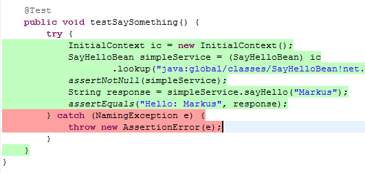
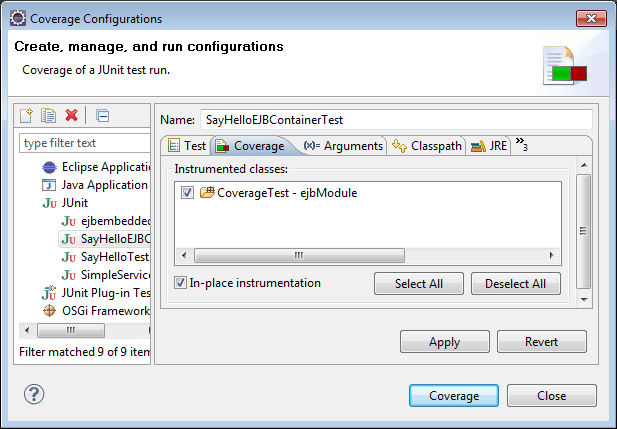

Have you ever been struggling with the percentage of test coverage in your projects? It's essential for all development projects to not only have a good feeling about your overall test coverage but to have some tool at hand to resilient number at hand for each iteration you do.
 
 If you are working with Java EE projects, you have to find a way to check coverage for your container managed beans. This is a short howto about using Eclemma with Eclipse and GlassFish Embedded Container to get coverage information about your EJBs.
 
 <b>Preparation</b>
 
 Get yourself a recent <a href="" target="_blank">Eclipse Helios</a> build (I am using the <a href="http://www.eclipse.org/downloads/packages/eclipse-ide-java-ee-developers/heliossr2" target="_blank">Eclipse IDE for Java EE Developers</a>) and install any additional components (e.g. m2eclipse, GlassFish server adapters) you may need. Don't forget to get a recent <a href="http://glassfish.java.net/downloads/3.1-final.html" target="_blank">GlassFish Server 3.1 Open Source Edition </a> install (Full Platform). I'm going to demonstrate the usage of the Embedded Container in two different ways, so you should have Maven at hand, too. Last step is to <a href="http://www.eclemma.org/installation.html" target="_blank">install Eclemma</a> into your Eclipse version.
 
 <b>What's all this stuff around?</b>
 
 If you start googling about embedded EJB glassfish and so on, you get a couple of solutions out there. Some mention the EJB 3.1 container API, some the embedded GlassFish, some talk about the Embedded Maven Plugin. So the very first thing I'd like to do is to tell you about the options you have to run your enterprise beans in embedded mode.
 
 <i>GlassFish Server 3.1 Embedded Server</i>
 
 The complete GlassFish server has a embeddable API. These is falling into different catagories. Top level APIs (org.glassfish.embeddable) which provide classes and interfaces necessary to embed GlassFish and perform lifecycle operations, application deployments and runtime configurations. Scattered Archive APIs (org.glassfish.embeddable.archive) which contain an abstraction for a scattered Java EE archive. The Web Container APIs (org.glassfish.embebdable.web, org.glassfish.embeddable.web.config) which provide classes and interfaces necessary to programmatically configure embedded WebContainer and create contexts, virtual servers, and web listeners. The advanced pluggability or Service Provider Interfaces (org.glassfish.embeddable.spi) to plugin a custom GlassFish runtime. The last part is the EJB container APIs (javax.ejb.embeddable) which are part of the EJB 3.1 Specification, Embeddable Container Bootstrapping. All those APIs help you to completely integrate a GlassFish server into your own infrastructure. If you are willing to use the complete embedded Server you have to add either the full- or the web-profile jars to your project.
 <code> 
  &lt;dependency&gt; 
  &lt;groupId&gt;org.glassfish.extras&lt;/groupId&gt; 
  &lt;artifactId&gt;glassfish-embedded-all&lt;/artifactId&gt; 
  &lt;version&gt;3.1&lt;/version&gt; 
  &lt;/dependency&gt; </code>or<code>  
  &lt;dependency&gt; 
  &lt;groupId&gt;org.glassfish.extras&lt;/groupId&gt; 
  &lt;artifactId&gt;glassfish-embedded-web&lt;/artifactId&gt; 
  &lt;version&gt;3.1&lt;/version&gt; 
  &lt;/dependency&gt; </code>
 
 <i>EJB 3.1 container API</i>
 
 Starting with Java EE 6 and EJB 3.1 you have the new API for running your beans outside the container (<a href="http://download.oracle.com/docs/cd/E18930_01/html/821-2424/gjlde.html" target="_blank">GlassFish 3.1 docs</a>). The EJB 3.1 Embeddable API supports all EJB 3.1 Lite features with addition of the EJB timer service and testing of EJB modules packaged in a WAR file. For EJB modules in a WAR file (or an exploded directory), if a web application has one EJB module, and there are no other EJB modules in the classpath, those entries (libraries) are ignored. If there are other EJB modules, a temporary EAR file is created. For EJB modules in a WAR file to be tested, the client code must use EJB modules with interfaces or without annotations. Those EJB modules are not part of the classpath and can't be loaded by the client class loader. This API is mostly valuable for outside container testing of your EJBs. If you are willing to use this container API only, you simply have to add the %AS-INSTALL%/glassfish/lib/embedded/glassfish-embedded-static-shell.jar from your existing (!) GlassFish installation to your project.
 
 <i>The Maven GlassFish Plugin</i>
 
 The <a href="" target="_blank">Maven Glassfish Plugin</a> is a Maven2 plugin allowing management of Glassfish domains and component deployments from within the Maven build lifecycle. It encapsulates domain configuration and deployment attributes within the build configuration for a more rapid development integration loop and simplified management of continuous integration testing of components destined for deployment within the Glassfish V2 and later JavaEE containers. As far as I know, this plugin simply facilitates the available asadmin commands to control a GlassFish server installation. 
 
 <b>Getting started with Maven and the GlassFish Server 3.1 Embedded Server API</b>
 
 In this first step, I am going to demonstrate the usage of the embedded Server API. Create a new maven ejb module project and add the full-profile dependency to it:
 <code> 
  &lt;dependency&gt; 
  &lt;groupId&gt;org.glassfish.extras&lt;/groupId&gt; 
  &lt;artifactId&gt;glassfish-embedded-all&lt;/artifactId&gt; 
  &lt;version&gt;3.1&lt;/version&gt; 
  &lt;/dependency&gt; </code>
 
 Implement a simple ServiceBean with some methods. It should be more than one, because I would love you to see some not covered methods, too ;)
 <code> 
  // ... imports 
  @Stateless 
  public class SimpleService \{ 
  // ... 
  public String saySomething(String sometext) \{ 
  LOGGER.log(Level.INFO, "sometext: \{0\}", sometext); 
  return "hello from " + sometext; 
  \} </code>
 
 Now implement your Testclass. Let's call it SimpleServiceTest. The real magic happens in @BeforeClass and @AfterClass.
 <code> 
  // ... imports 
  @BeforeClass 
  public static void setUpBeforeClass() throws Exception \{ 
  // Define GlassFish and add target/classes as deploy folder 
  GlassFish glassfish = GlassFishRuntime.bootstrap().newGlassFish(); 
  glassfish.start(); 
  Deployer deployer = glassfish.getDeployer(); 
  URI uri = new File("target/classes").toURI(); 
  deployer.deploy(uri); 
  \}  
  @AfterClass 
  public static void tearDownAfterClass() throws Exception \{ 
  // Stop GlassFish 
  glassfish.stop(); 
  glassfish.dispose(); </code>
 
 
 The only thing left to do is to actually implement your test.
 <code> 
  @Test 
  public void testSaySomething() \{ 
  try \{ 
  InitialContext ic = new InitialContext(); 
  SayHelloBean simpleService = (SayHelloBean) ic 
  .lookup("java:global/classes/SayHelloBean!net.eisele.coverage.ejb.SayHelloBean"); 
  assertNotNull(simpleService); 
  String response = simpleService.saySomething("Markus"); 
  assertEquals("hello from Markus", response); 
  \} catch (NamingException e) \{ 
  throw new AssertionError(e); 
  \} 
  \} </code>
 
 Remember to use the appropriate JNDI name. Every EJB that could be found is deployed to the embedded server and the JNDI name is built using java:global/classes as prefix followed by the simple class name of the EJB (you can also use the appropriate Global JNDI name as in the above example). If you now run your test with "Coverage As ... &gt; JUnit Test (Alt + Shift + E,T)" you get a new Coverage view in Eclipse which shows something like this:
 

 

 
 Your code gets highlighted according to the coverage report also:
 

 

Great! You are done. Happy coding. Now let's look at the next option.
 
 <b>Getting started with ANT and the EJB 3.1 container API</b>
 
 Create a new EJB Project with eclipse and add the %AS-INSTALL%/glassfish/lib/embedded/glassfish-embedded-static-shell.jar to your build path. Don't forget to remove the Server Runtime you assigned during project creation. Again: Create your EJB(s), and a Testcase. And again, the real magic happens in @BeforeClass and @AfterClass.
 <code> 
  // ... imports  
  private static EJBContainer ejbContainer;  
  @BeforeClass 
  public static void setUpBeforeClass() throws Exception \{ 
  Map properties = new HashMap(); 
  properties.put(EJBContainer.MODULES, new File("target/classes")); 
  ejbContainer = EJBContainer.createEJBContainer(properties); 
  \}  
  @AfterClass 
  public static void tearDownAfterClass() throws Exception \{ 
  ejbContainer.close(); 
  \} </code>
 
 After that you have to do your test implementation, which is in fact very similar to the above example:
 <code> 
  @Test 
  public void testSaySomething() \{ 
  try \{ 
  InitialContext ctx = new InitialContext(); 
  SayHelloBean simpleService = (SayHelloBean) ctx .lookup("java:global/classes/SayHelloBean!net.eisele.coverage.ejb.SayHelloBean"); 
  assertNotNull(simpleService); 
  String response = simpleService.sayHello("Markus"); 
  assertEquals("Hello: Markus", response); 
  \} catch (NamingException e) \{ 
  throw new AssertionError(e); 
  \} 
  \} </code>
 
 If you now run your JUnit test "Run As ... &gt; JUnit Test (Alt + Shift + X,T) everything works fine. Running this with Eclemma Coverage doesn't work. You get a nasty javax.naming.NamingException because the lookup failed. If you scan the console output you see, that the EJBs are bound to some very strange names:
 <code> 
  java:global/ejb-app7860127669114899398/23c86a3f57efddcfe9c95749beab5a21/SayHelloBean,  </code>
 
 To prevent this, you have to change the Coverage configuration for your test to "In-place instrumentation".
 
 

 

 
 EclEmma tries not to touch your project's content. Therefore class files are normally instrumented outside your project in a temporary folder. This is exactly where the fancy JNDI names come from. In-place instrumentation will modify your class files. Instrumented class files can not be used with launch modes other than Coverage. Therefore a clean build is required after a coverage launch with in-place instrumentation.
 
 Beside this change, everything works exactly the same way as with the maven example.
 
 <b>Conclusion</b>
 
 It works. Even if it is a very strange and violent thing to do. You could instrument your classes with additional coverage information and you could also test them with your embedded GlassFish. Hope this little introduction was helpful.
 
 <b>Links and Readings</b>
 <a href="http://blogs.sun.com/alexismp/entry/testing_ejb_3_1_s" target="_blank">Using the EJBContainer API with or without Maven (but with GlassFish v3)</a>
 <a href="http://ctpjava.blogspot.com/2009/10/unit-testing-ejbs-and-jpa-with.html" target="_blank">Unit Testing EJBs and JPA with Embeddable GlassFish</a>
 <a href="" target="_blank">GlassFish &gt;&gt;Embedded</a>
 <a href="http://weblogs.java.net/blog/bhavanishankar/archive/2011/03/02/quick-introduction-embeddability-glassfish-open-source-edition-31" target="_blank">Quick introduction to Embeddability of GlassFish Open Source Edition 3.1</a>
 <a href="" target="_blank">Overview of the GlassFish Embedded APIs (JavaDoc)</a>
 <a href="http://java.net/projects/glassfish/sources/svn/show/trunk/v3/tests/embedded" target="_blank">Further Source Examples of using GF Embedded (java.net svn)</a>
 <a href="http://weblogs.java.net/blog/bhavanishankar/archive/2010/12/15/changing-log-levels-embedded-glassfish" target="_blank">Changing Log Levels in Embedded GlassFish</a>