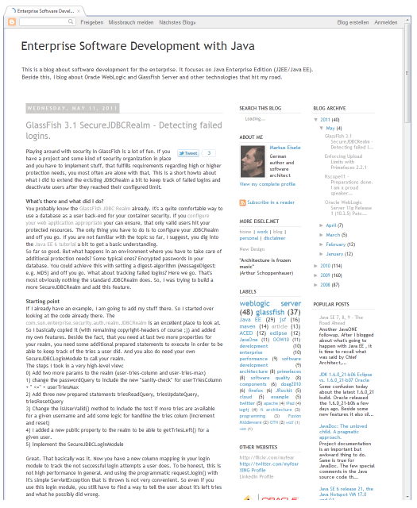

You have heard about the recent <a href="http://buzz.blogger.com/2011/05/blogger-is-back.html">Blogger outage</a>? This blog was affected also. I lost a redesign I did in the few hours between the trouble started and they started noticing it. Anyway, I am not too sad about this. I'm not blogging on a daily basis and I could do without 20.5 hours of not being able to post. And the blog was accessible all the time. That is something I call a good service. 
 

 

All the discussions about the outage bring some things back to the users minds. You are not paying for the service. It's free and with this being a free service, I am very happy about it's stability. I have seen some more and worser outages with services I pay for. Thanks Google for providing blogger.com to us. And thanks for your overall performance and stability.
 
 
 Your probably reading this in a reader, so I thought I share a screenshot of the new&nbsp;blog design&nbsp;with your. It's lighter, more open and content centric. I am going to drop the black background on the main eisele.net pages, too. Hope, you like it. come back often and contribute! I am happy to have your here and thanks for any hint and contribution you, dear fellow reader, do!
 
 Have a great week, happy blogging (again) and take care!