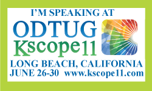

ODTUG <a href="" target="_blank">Kscope11</a>, the annual Oracle Development Tools User Group conference is nearly around the corner. It is bringing together the best Oracle minds in the industry. The content covers BI and Oracle EPM, Application Express, Database Development,and Fusion Middleware. You can attend symposiums, hands-on training labs, presentations, and much more. The list of this <a href="http://kscope11.com/fusion">year's Fusion Middleware content</a> is quite impressive. And the best part: I am delivering two parts of it.
 
 

 

<a href="http://kscope11.com/component/seminar/seminarslist#All the Java ADF Beginners Need to Know Part 1" target="_blank">All the Java ADF Beginners Need to Know Part 1</a> and <a href="http://kscope11.com/component/seminar/seminarslist#All the Java ADF Beginners Need to Know Part 2" target="_blank">Part 2</a>
 
 Session 1, 06/27/2011, 11:15 AM-12:15 PM
 
 Session 2, 06/27/2011, 1:15 PM-2:15 PM
 
 
 Two mini-lessons on Java concepts and syntax, aimed at PL/SQL developers and DBAs who need to know sufficient Java to start building ADF Components with Java. In general this is a basic Java course to get everybody up to speed with the language in general. I will try to spend as less time as possible on the slides and simply show the basic concepts with examples right in the IDE.
 
 
 In general I am very excited and looking forward to it. Not only because of this years<a href="http://kscope11.com/location" target="_blank"> beautiful location</a>, which is Long Beach, California, located on the Pacific Ocean Shores, just 22 miles south of downtown LA but also because I am really looking forward meeting all those great people again I met there last year. 
 
 
 Take a look <a href="" target="_blank">at the pictures I took</a> from last years Kaleidoscope in Washington D.C. I hope to share some from this years visit, too!