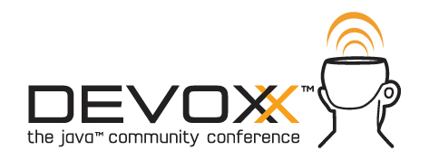
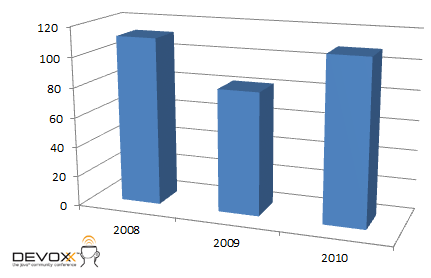
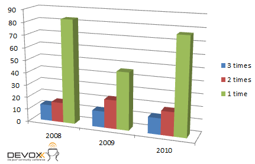
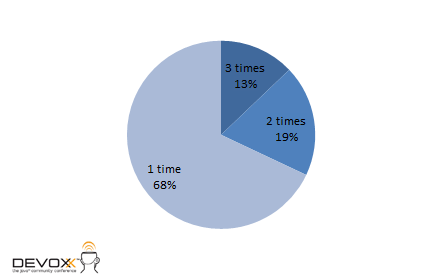

You might have seen my earlier post about the <a href="http://blog.eisele.net/2011/06/w-jax-some-data-analysis-about-speakers.html">W-JAX and their speakers</a>. I received some feedback from people interested in comparing the results to other conferences. I thought about that and found it reasonable to do. Here we go. Next on the list is the Devoxx (former JavaPolis). Again, this was compiled from the sources available (compare links at the end of the post). I asked Stephan to get some more information from him but I guess, he is too busy organizing the 2011 event. So, I would be happy to receive any corrections or additions. 
 
 Btw: the 2011 <a href="" target="_blank">CfP is still open</a>. At the time posting for less than 9 days 15:48:21.
 
 <b>General Information</b>
 

 

The Devoxx is "The Java™ Community Conference". Rebranded from former JavaPolis it's basically the conference of the Belgian JUG. With it's no1 speakers and topics it has become one of the main Java conferences around. The Devoxx conference is a special blend of many IT disciplines, ranging from Java to Scripting, FX to RIA, Agile to Enterprise, Security to Cloud and much more. 
 
 <b>General Speaker Distribution</b>
 
 Let's start with a look at the general distribution of the speakers. 
 
<table align="center" cellpadding="0" cellspacing="0" class="tr-caption-container" style="margin-left: auto; margin-right: auto; text-align: center;">
 <tbody>
  <tr>
   <td style="text-align: center;"></td>
  </tr>
  <tr>
   <td class="tr-caption" style="text-align: center;">Speakers per year</td>
  </tr>
 </tbody>
</table>The first one after the rebranding from JavaPolis was the one with the most speakers in general. 2009 was reduced to the numbers of a very early W-JAX with 2010 being back to the hundred. It's most likely, that the 2011 Devoxx will be around this numbers again.
 
 
 <b>Top 13 - always on</b>
 
 In this case we do not have a simple top 10, but a top 13 list of speakers attending every Devoxx since 2008. The 2011 speakers are not announced until now, so I don't know, if this list will be smaller after that.
 
 
 Guillaume Laforge
 
 Richard Bair
 
 Kirk Pepperdine
 
 Bill Venners
 
 Alexis Moussine-Pouchkine
 
 Brian Goetz
 
 Jasper Potts
 
 Carl Quinn
 
 Mark Reinhold
 
 Chet Haase
 
 Virgil Dodson
 
 Dan Allen
 
 Dick Wall
 
 <b>Speaking at W-JAX and Devoxx</b>
 
 There are a couple of speakers which can be seen at both. At last for 2010 I did look at them and found the following ones:
 
 
 Stefan Tilkov
 
 Dan Allen
 
 Viktor Klang
 
 Christian Dupuis
 
 Adam Bien
 
 
 <b>Frequent speaker distribution</b>
 
 Ok, now let's look at the general distribution between first-timers, frequent and top speakers.
 
<table align="center" cellpadding="0" cellspacing="0" class="tr-caption-container" style="margin-left: auto; margin-right: auto; text-align: center;">
 <tbody>
  <tr>
   <td style="text-align: center;"></td>
  </tr>
  <tr>
   <td class="tr-caption" style="text-align: center;">Breakdown by years.</td>
  </tr>
 </tbody>
</table>
 
 Compared with the W-JAX this is a very low fraction of returning speakers and also a lower fraction of two-timers.
 
 <b>Nearly 70% one-timers</b>
 
 Nearly 70% one-timers and only 13% of top speakers attending every conference since 2008 makes a great mix.
 
<table align="center" cellpadding="0" cellspacing="0" class="tr-caption-container" style="margin-left: auto; margin-right: auto; text-align: center;">
 <tbody>
  <tr>
   <td style="text-align: center;"></td>
  </tr>
  <tr>
   <td class="tr-caption" style="text-align: center;">Complete speaker distribution 2008-2010</td>
  </tr>
 </tbody>
</table>
 <b>Conclusion</b>
 
 Woohhoow. I did expect similar results as from the W-JAX, but I must say, that you see far more "fresh blood" at the Devoxx. And there is one thing, the numbers don't tell you: The speakers are excellent and well known. Even the ones, speaking on one conference only. 
 
 <b>Links</b>
 <a href="http://www.devoxx.com/display/JV08/List+view" target="_blank">Devoxx 2008 Speakers</a>
 <a href="http://www.devoxx.com/display/DV09/List+view" target="_blank">Devoxx 2009 Speakers</a>
 <a href="http://www.devoxx.com/display/Devoxx2K10/Javaholics" target="_blank">Devoxx 2010 Speakers</a>