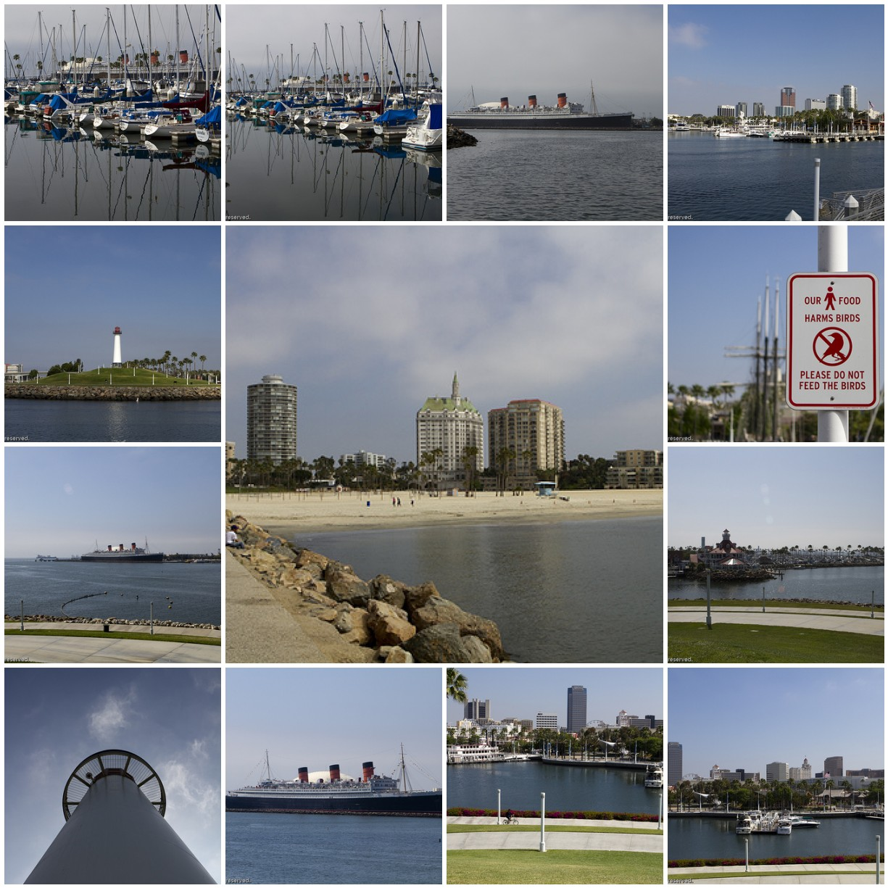

Kscope11, June 26-30 at the Long Beach Convention Center in Long Beach, CA, is ODTUG’s annual conference bringing together the best Oracle minds in the industry. And after a successful first year last year I am attending this year, too. After a really long flight (roughly 12h) I safely arrived Friday evening and already had some time to walk around and get adjusted to the timezone. Today is the first conference day. Symposiums all over. I'm sitting right inside the FMW (Fusion Middle Ware) Symposium lead by Chris and Debra. I am really looking forward to my two little sessions tomorrow. I'm excited to see, how I do the job presenting in English. Even if this isn't my first time, it's always a challenge to stand.
 
 If you are interested in some more impressions from the conference, follow my <a href="http://draft.blogger.com/twitter.com/myfear" target="_blank">twitter stream</a> or look at the <a href="" target="_blank">KScope'11 photoset on flickr</a> (from which the mosaics below are taken) or even follow the official <a href="" target="_blank">Kscope social accounts</a>.
 
 

 

 

 

