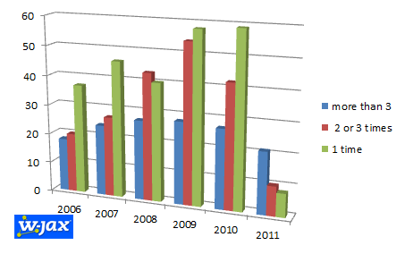

Conferences are casting their shadows these days. DOAG; Devoxx; JavaOne and finally the German W-JAX announced their first speakers for 2011. Looking through the list, I was wondering, if my first impression is true: Are those really the same guys over and over every year? I googled around a bit and did some data analysis on the speaker (public available information only). I decided to include data from 2006 onward, because this was the year I had the pleasure to attend once. Hope, you like it. Disclaimer: I did some copy and paste and spreadsheet works for the numbers. They are not official. So, if you find any mistakes, I would be happy to correct them.
 
 <b>General Information</b>
 

 

The <a href="" target="_blank">W-JAX</a> is the conference for holistic technical Know-how in the enterprise and web environment. Here Europe’s leading experts come together to distribute their knowledge and experience to the attendees. Due to their unique mix of topics the W-JAX gives key impulses to the java Enterprise Community, every year again.
 
 A total of 550 speakers attended from 2006 to 2010. For 2011 the speaker number is not completely known, because they release the information bit by bit. At the moment I count 39. The datasource for the following analysis are the speaker websites listed below.
 
 <b>General Distribution</b>
 
 As you can see, the 2009 W-JAX was the one with the most speakers (140). I don't know the number of attendees but I guess, it was the biggest one overall. It seems as if the number decreases since 2010. I wouldn't be surprised to see this years number lower than the 2010 number.
 

<table align="center" cellpadding="0" cellspacing="0" class="tr-caption-container" style="margin-left: auto; margin-right: auto; text-align: center;">
 <tbody>
  <tr>
   <td style="text-align: center;"></td>
  </tr>
  <tr>
   <td class="tr-caption" style="text-align: center;">Speaker per year. 2011 still preliminary.</td>
  </tr>
 </tbody>
</table>
 <b>Top 10 - always on</b>
 
 I was wondering, if my feeling was true to see the same faces over and over again. In fact this list is really short. Only 10 of them attended every W-JAX since then. Taking into account, that the final list for 2011 isn't there, we still have some follower, which still could make it.
 
 <i>All time speaker</i>
 
 Adam Bien
 
 Arno Haase
 
 Bernd Kolb
 
 Dierk König
 
 Eberhard Wolff
 
 Kai Tödter
 
 Michael Plöd
 
 Peter Roßbach
 
 Stefan Tilkov
 
 Torsten Winterberg
 
 <i>Still possible but missing 2011 announcement as of today</i>
 
 Bruce Sams
 
 Jutta Eckstein
 
 Mike Wiesner
 
 Papick Garcia Taboada
 
 <b>More than three</b>
 
 If you still have the feeling, you always see the same faces, here is another breakdown. There roughly 25% old-hands, nearly 50% first-timer and always some more experienced 2 or 3 timer in between.
 
 
<table align="center" cellpadding="0" cellspacing="0" class="tr-caption-container" style="margin-left: auto; margin-right: auto; text-align: center;">
 <tbody>
  <tr>
   <td style="text-align: center;"></td>
  </tr>
  <tr>
   <td class="tr-caption" style="text-align: center;">Breakdown by years</td>
  </tr>
 </tbody>
</table>
 <b>Many speakers come only once</b>
 
 If you&nbsp;aggregate&nbsp;this to the total numbers, you get a better impression about the mix. With 248 speakers which attended only one W-JAX this seems to be a good mix in general.
 
<table align="center" cellpadding="0" cellspacing="0" class="tr-caption-container" style="margin-left: auto; margin-right: auto; text-align: center;">
 <tbody>
  <tr>
   <td style="text-align: center;"></td>
  </tr>
  <tr>
   <td class="tr-caption" style="text-align: center;">Complete distribution 2006-2011</td>
  </tr>
 </tbody>
</table>
 <b>Conclusion</b>
 
 I did expect to see different results. With a total of 25% frequently returning speakers you can't say, that you see the same faces over and over again. What is true is, that they are the ones being announced early and catch your attention quite frequently because they are marketing material :) But as usual .. there is more behind it.
 
 <b>Links</b>
 <a href="http://entwickler.com/konferenzen/divers/psecom,id,532,nodeid,532,_language,de.html" target="_blank">W-JAX 2006 Speaker Listing</a>
 <a href="http://jax.de/konferenzen/wjax07/speaker.php" target="_blank">W-JAX 2007 Speaker Listing</a>
 <a href="" target="_blank">W-JAX 2008 Speaker Listing</a>
 <a href="" target="_blank">W-JAX 2009 Speaker Listing</a>
 <a href="http://jax.de/wjax2010/speaker" target="_blank">W-JAX 2010 Speaker Listing</a>
 <a href="" target="_blank">W-JAX 2011 Speaker Listing</a>