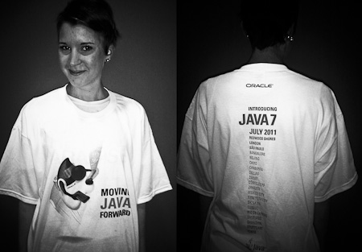

It would have been awesome :) 7/7/7 or something similar. But even if I believe, that the Oracle marketing guys fought until the last minute against M.Reinhold and A.Messinger they obviously lost. The final GA date for Java SE 7 is and will be the 7/28/11. But let's forget about this. Most important are the parties happening around the world.
 

 

 First and foremost the <a href="http://weblogs.java.net/blog/editor/archive/2011/07/06/java-user-groups-gear-celebrate-java-7-launch" target="_blank">Java User Groups Gear Up to Celebrate the Java 7 Launch</a> and there are other Oracle sponsored events or even better some mini conferences. <a href="http://www.oracle.com/webapps/events/ns/EventsDetail.jsp?p_eventId=134208" target="_blank">Introducing Java 7 Webcast: Moving Java Forward</a>. There should be time to attend. If you are reading this, there are still two more hours to go until the webcast starts.&nbsp;And here is my little contribution. Preparing a mini session about the new Java features hosted by my company, I decided to put up the slides. So, if you are into learning something new: Here you are. A comprehensive overview about Java 7!&nbsp;Like to read your comments! Have a great party!
 
 

 <strong style="display: block; margin: 12px 0 4px;"><a href="http://www.slideshare.net/myfear/introducing-java-7" target="_blank" title="Introducing Java 7">Introducing Java 7</a></strong> <iframe frameborder="0" height="355" marginheight="0" marginwidth="0" scrolling="no" src="http://www.slideshare.net/slideshow/embed_code/8529192" width="425"></iframe>
  
 

  View more <a href="" target="_blank">presentations</a> from <a href="http://www.slideshare.net/myfear" target="_blank">Markus Eisele</a>
   
   
   UPDATE 7/8/11:
   
   
   Here are the slides for the session on:
   <a href="http://blogs.oracle.com/darcy/resource/ProjectCoin/CoinLaunch.pdf" target="_blank">Making Heads and Tails of Project Coin: Small Language Changes in JDK 7</a> (PDF, 500KB)
   
   <a href="http://www.oracle.com/us/technologies/java/file-system-api-428204.pdf">The New File System API in JDK 7</a>&nbsp;(PDF, 473 KB)
   
   <a href="http://www.oracle.com/us/technologies/java/fork-join-framework-428206.pdf">Divide and Conquer Parallelism with the Fork/Join Framework</a>&nbsp;(PDF, 1632 KB)
   
   <a href="http://www.oracle.com/us/technologies/java/java7-renaissance-vm-428200.pdf" target="_blank">A Renaissance VM: One Platform, Many Languages</a> (PDF, 802KB)
   
   
   Oracle is committed to Java: the technology, the community, the Java Community Process (JCP), and the entire ecosystem focused on moving Java forward.
   
   Watch this Webcast to find out more about the features of Java 7, hear from technologists at companies that use Java technology, and learn through a series of technical presentations and a panel discussion.
   
   <a href="http://www.oracle.com/us/corporate/events/java7/index.html?bcpid=105865195001&amp;bckey=AQ~~,AAAAAFcSbzI~,OkyYKKfkn3wFV2hivdZZkE9L9SPGC-Ca&amp;bclid=0&amp;bctid=991640925001" target="_blank">The Webcast reply is available in the meantime:</a>
   
   
  

   
  

   
 

 